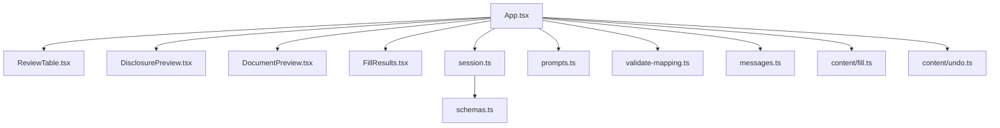
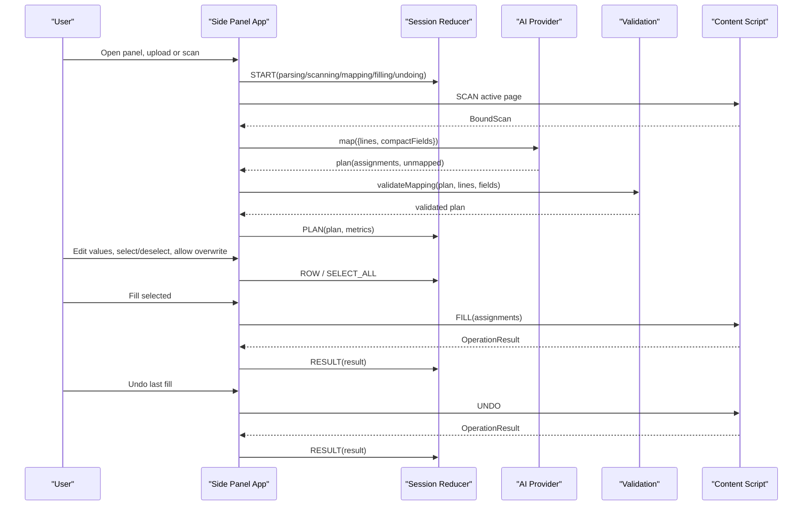
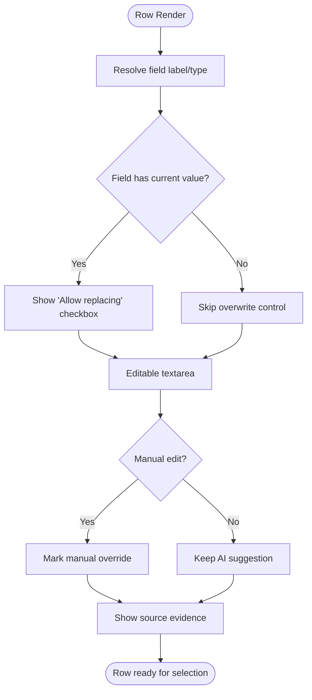
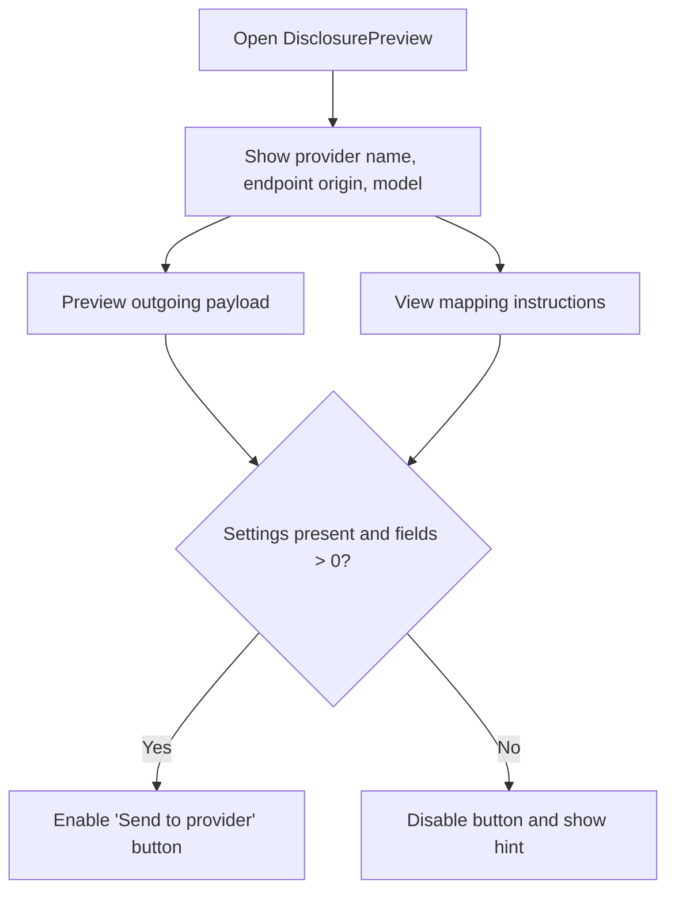
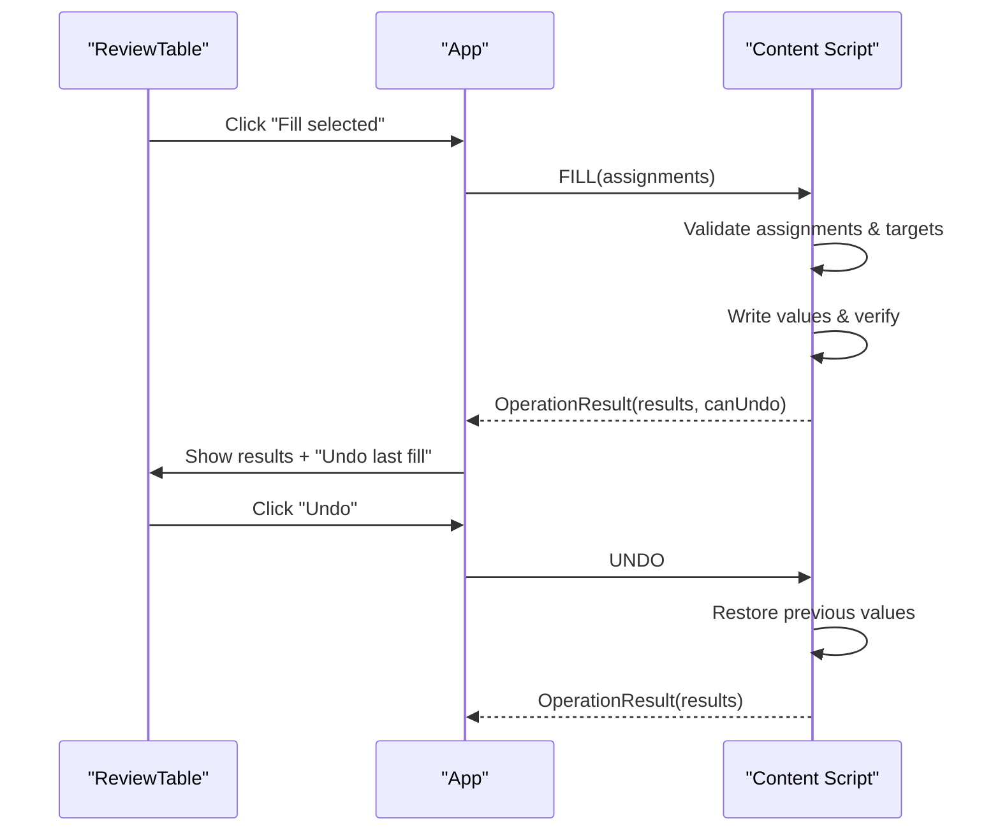
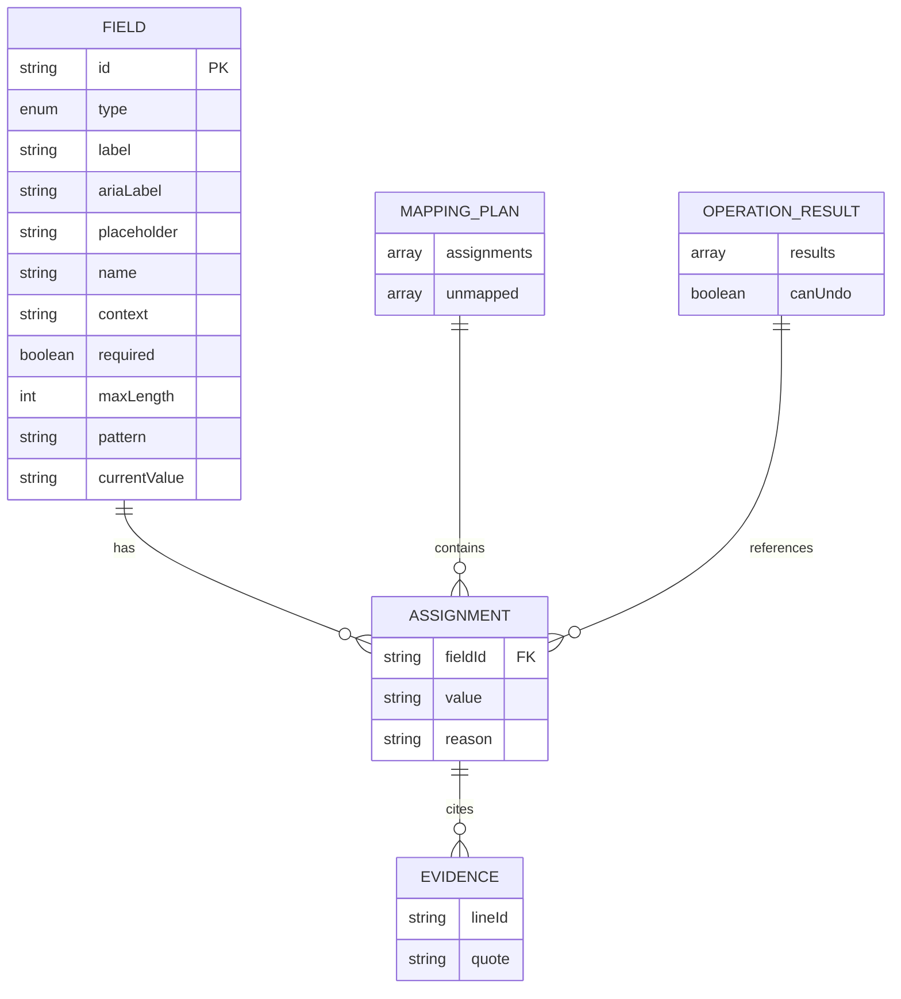
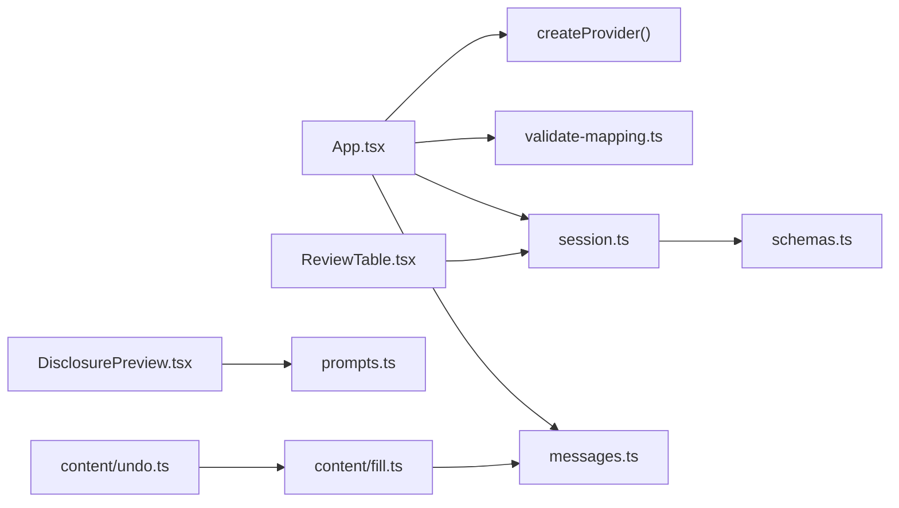

# Review Interface

<cite>
**Referenced Files in This Document**
- [App.tsx](file://src/sidepanel/App.tsx)
- [ReviewTable.tsx](file://src/sidepanel/components/ReviewTable.tsx)
- [DisclosurePreview.tsx](file://src/sidepanel/components/DisclosurePreview.tsx)
- [DocumentPreview.tsx](file://src/sidepanel/components/DocumentPreview.tsx)
- [FillResults.tsx](file://src/sidepanel/components/FillResults.tsx)
- [session.ts](file://src/sidepanel/session.ts)
- [schemas.ts](file://src/shared/schemas.ts)
- [messages.ts](file://src/shared/messages.ts)
- [prompts.ts](file://src/ai/prompts.ts)
- [validate-mapping.ts](file://src/ai/validate-mapping.ts)
- [fill.ts](file://src/content/fill.ts)
- [undo.ts](file://src/content/undo.ts)
- [main.tsx](file://src/sidepanel/main.tsx)
</cite>

## Table of Contents
1. Introduction
2. Project Structure
3. Core Components
4. Architecture Overview
5. Detailed Component Analysis
6. Dependency Analysis
7. Performance Considerations
8. Troubleshooting Guide
9. Conclusion

## Introduction
This document explains the review interface that lets users examine and modify AI-generated field mappings before filling a web form. It covers:
- The interactive table showing field names, suggested values, confidence indicators, and source evidence
- User interactions for selective inclusion, manual overrides, and bulk operations
- The disclosure preview system that shows what data will be sent to the AI provider
- Session state management tracking user changes, undo capabilities, and persistence across interactions
- Guidelines for effective workflows, keyboard accessibility, and troubleshooting common issues

## Project Structure
The review interface is implemented as a React side panel with a clear separation between UI components, session state, and content-script execution on the target page.



**Diagram sources**
- [App.tsx:1-127](file://src/sidepanel/App.tsx#L1-L127)
- [ReviewTable.tsx:1-30](file://src/sidepanel/components/ReviewTable.tsx#L1-L30)
- [DisclosurePreview.tsx:1-19](file://src/sidepanel/components/DisclosurePreview.tsx#L1-L19)
- [DocumentPreview.tsx:1-9](file://src/sidepanel/components/DocumentPreview.tsx#L1-L9)
- [FillResults.tsx:1-13](file://src/sidepanel/components/FillResults.tsx#L1-L13)
- [session.ts:1-86](file://src/sidepanel/session.ts#L1-L86)
- [schemas.ts:1-39](file://src/shared/schemas.ts#L1-L39)
- [prompts.ts:1-26](file://src/ai/prompts.ts#L1-L26)
- [validate-mapping.ts:1-33](file://src/ai/validate-mapping.ts#L1-L33)
- [messages.ts:1-20](file://src/shared/messages.ts#L1-L20)
- [fill.ts:1-82](file://src/content/fill.ts#L1-L82)
- [undo.ts:1-29](file://src/content/undo.ts#L1-L29)

**Section sources**
- [App.tsx:1-127](file://src/sidepanel/App.tsx#L1-L127)
- [session.ts:1-86](file://src/sidepanel/session.ts#L1-L86)

## Core Components
- ReviewTable: Interactive table of mapping suggestions with selection, editing, overwrite controls, and source evidence.
- DisclosurePreview: Consent screen that previews outgoing data and provider details before generating mappings.
- DocumentPreview: Shows parsed PDF metadata and extracted text lines for verification.
- FillResults: Displays per-field fill outcomes and provides an undo action when available.
- Session state (useReducer): Manages phases, rows, results, errors, and transitions between steps.

Key responsibilities:
- Present AI-suggested mappings with evidence and reasons
- Allow selective inclusion and manual value edits
- Enforce overwrite safety for existing values
- Track user actions via actions dispatched to the reducer
- Coordinate scanning, mapping, filling, and undo flows

**Section sources**
- [ReviewTable.tsx:1-30](file://src/sidepanel/components/ReviewTable.tsx#L1-L30)
- [DisclosurePreview.tsx:1-19](file://src/sidepanel/components/DisclosurePreview.tsx#L1-L19)
- [DocumentPreview.tsx:1-9](file://src/sidepanel/components/DocumentPreview.tsx#L1-L9)
- [FillResults.tsx:1-13](file://src/sidepanel/components/FillResults.tsx#L1-L13)
- [session.ts:1-86](file://src/sidepanel/session.ts#L1-L86)

## Architecture Overview
The review flow spans three layers:
- Side panel UI (React) orchestrates user interactions and displays state-driven views
- Session reducer manages phase transitions and row-level edits
- Content scripts execute on the target page to scan fields, fill values, and support undo



**Diagram sources**
- [App.tsx:64-107](file://src/sidepanel/App.tsx#L64-L107)
- [session.ts:26-41](file://src/sidepanel/session.ts#L26-L41)
- [prompts.ts:18-25](file://src/ai/prompts.ts#L18-L25)
- [validate-mapping.ts:7-31](file://src/ai/validate-mapping.ts#L7-L31)
- [fill.ts:42-81](file://src/content/fill.ts#L42-L81)
- [undo.ts:6-28](file://src/content/undo.ts#L6-L28)

## Detailed Component Analysis

### ReviewTable: Interactive Mapping Review
- Displays each suggested assignment with:
  - Field label derived from metadata
  - Type indicator
  - Proposed value editable by the user
  - Manual override badge when edited
  - Overwrite control when the field already has a value
  - Source evidence block with line tags and quotes
  - Reason explaining the mapping decision
- Selection and bulk operations:
  - Select all supported suggestions
  - Clear selection
  - Checkbox per row to include/exclude
- Safety constraints:
  - If a field already has a value, overwrite must be explicitly allowed
  - Manual edits mark the row as manually overridden
- Disabled states during busy phases prevent accidental edits



**Diagram sources**
- [ReviewTable.tsx:4-25](file://src/sidepanel/components/ReviewTable.tsx#L4-L25)

**Section sources**
- [ReviewTable.tsx:1-30](file://src/sidepanel/components/ReviewTable.tsx#L1-L30)

### DisclosurePreview: Data Sharing Consent
- Explains what data leaves the browser (extracted text and field metadata)
- Shows destination provider origin and model
- Provides a preview of the exact payload constructed for the provider
- Displays mapping instructions used by the provider
- Disables generation until settings are configured and fields exist



**Diagram sources**
- [DisclosurePreview.tsx:6-17](file://src/sidepanel/components/DisclosurePreview.tsx#L6-L17)
- [prompts.ts:18-25](file://src/ai/prompts.ts#L18-L25)

**Section sources**
- [DisclosurePreview.tsx:1-19](file://src/sidepanel/components/DisclosurePreview.tsx#L1-L19)
- [prompts.ts:1-26](file://src/ai/prompts.ts#L1-L26)

### Session State Management
- Phases: idle, parsing, scanning, ready, mapping, review, filling, complete, undoing
- Rows: Each mapping suggestion becomes a ReviewRow with selection, overwrite, and manual flags
- Actions:
  - START, PROGRESS, DOCUMENT, SCAN, PLAN, ROW, SELECT_ALL, RESULT, ERROR, INVALIDATE, PROVIDER_CHANGED
- Busy guard prevents concurrent operations and invalid state transitions
- Tab/page change detection invalidates sessions to avoid stale fills

```mermaid
stateDiagram-v2
[*] --> Idle
Idle --> Parsing : "START(parsing)"
Parsing --> Ready : "DOCUMENT"
Ready --> Scanning : "START(scanning)"
Scanning --> Ready : "SCAN"
Ready --> Mapping : "START(mapping)"
Mapping --> Review : "PLAN"
Review --> Filling : "START(filling)"
Filling --> Complete : "RESULT"
Complete --> Review : "INVALIDATE"
Review --> Idle : "RESET"
Note over Idle,Complete : "Busy phases : parsing, scanning, mapping, filling, undoing"
```

**Diagram sources**
- [session.ts:7-42](file://src/sidepanel/session.ts#L7-L42)
- [App.tsx:50-63](file://src/sidepanel/App.tsx#L50-L63)

**Section sources**
- [session.ts:1-86](file://src/sidepanel/session.ts#L1-L86)
- [App.tsx:15-107](file://src/sidepanel/App.tsx#L15-L107)

### Fill Execution and Undo Flow
- Pre-flight validation ensures:
  - All targets exist and match expected values
  - Overwrite permissions are explicit when needed
  - Values satisfy native constraints
- Execution writes values using native setters and verifies persistence
- Undo restores previous values while preserving later edits



**Diagram sources**
- [App.tsx:84-95](file://src/sidepanel/App.tsx#L84-L95)
- [fill.ts:42-81](file://src/content/fill.ts#L42-L81)
- [undo.ts:6-28](file://src/content/undo.ts#L6-L28)

**Section sources**
- [fill.ts:1-82](file://src/content/fill.ts#L1-L82)
- [undo.ts:1-29](file://src/content/undo.ts#L1-L29)
- [App.tsx:84-95](file://src/sidepanel/App.tsx#L84-L95)

### Data Models and Constraints
- Field descriptors include type, labels, placeholders, required flag, length limits, and patterns
- Mapping plans contain assignments with evidence and unmapped fields with reasons
- Limits enforce safe sizes for documents, fields, responses, and values
- Messages define typed communication between side panel and content scripts



**Diagram sources**
- [schemas.ts:4-38](file://src/shared/schemas.ts#L4-L38)
- [messages.ts:4-17](file://src/shared/messages.ts#L4-L17)

**Section sources**
- [schemas.ts:1-39](file://src/shared/schemas.ts#L1-L39)
- [messages.ts:1-20](file://src/shared/messages.ts#L1-L20)

## Dependency Analysis
- App coordinates:
  - Provider creation and mapping calls
  - Validation of mapping output
  - Session transitions and error handling
  - Page messaging for scan/fill/undo
- ReviewTable depends on session rows and field metadata
- DisclosurePreview constructs payloads using prompts utilities
- Fill/Undo depend on registry assertions and native value APIs
- Shared schemas ensure consistent contracts across boundaries



**Diagram sources**
- [App.tsx:64-107](file://src/sidepanel/App.tsx#L64-L107)
- [session.ts:1-86](file://src/sidepanel/session.ts#L1-L86)
- [prompts.ts:18-25](file://src/ai/prompts.ts#L18-L25)
- [validate-mapping.ts:1-33](file://src/ai/validate-mapping.ts#L1-L33)
- [fill.ts:1-82](file://src/content/fill.ts#L1-L82)
- [undo.ts:1-29](file://src/content/undo.ts#L1-L29)

**Section sources**
- [App.tsx:1-127](file://src/sidepanel/App.tsx#L1-L127)
- [session.ts:1-86](file://src/sidepanel/session.ts#L1-L86)

## Performance Considerations
- Local PDF parsing avoids network overhead and keeps sensitive bytes out of provider payloads
- Compact field metadata reduces request size while retaining necessary context
- Response byte limits protect against oversized model outputs
- Verification delays after writing help detect asynchronous page mutations
- Bulk selection and single-fill minimize repeated round-trips

[No sources needed since this section provides general guidance]

## Troubleshooting Guide
Common issues and resolutions:
- Target tab changed or URL mismatch:
  - The session invalidates; rescan and review again
- Page connection lost:
  - Reopen the extension toolbar icon on the form page and retry
- Missing API host permission:
  - Re-enable the provider to grant required origins
- Model output invalid or exceeds limits:
  - The mapping fails validation; adjust provider/model or reduce input size
- Field changed during fill:
  - The operation stops to preserve consistency; review again
- Overwrite not allowed:
  - Explicitly enable "Allow replacing" when a field already has a value
- Undo unavailable:
  - Only available if the last operation recorded restore points; reset or rescan clears undo

Accessibility notes:
- Error messages use alert roles for screen readers
- Results list includes accessible labels
- Buttons and inputs are disabled appropriately during busy phases

Error boundary:
- If the panel crashes, close and reopen it to start fresh

**Section sources**
- [session.ts:44-69](file://src/sidepanel/session.ts#L44-L69)
- [App.tsx:23-48](file://src/sidepanel/App.tsx#L23-L48)
- [App.tsx:50-63](file://src/sidepanel/App.tsx#L50-L63)
- [fill.ts:42-81](file://src/content/fill.ts#L42-L81)
- [undo.ts:6-28](file://src/content/undo.ts#L6-L28)
- [main.tsx:6-14](file://src/sidepanel/main.tsx#L6-L14)

## Conclusion
The review interface provides a transparent, user-controlled workflow for mapping AI suggestions to form fields. Users can inspect evidence, edit values, selectively include mappings, and safely handle overwrites. Session state ensures robust transitions and recovery from page changes. The disclosure preview maintains privacy by clearly showing what data leaves the browser. Undo offers a safety net for local changes, while strict validation protects against inconsistent or unsafe fills.

[No sources needed since this section summarizes without analyzing specific files]