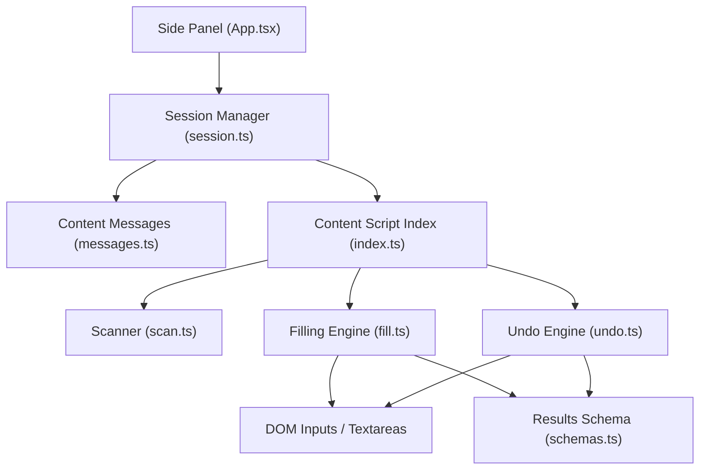
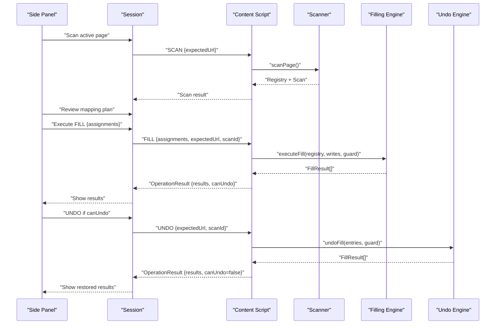
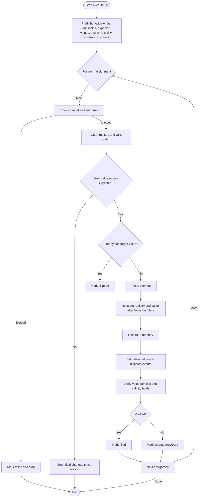
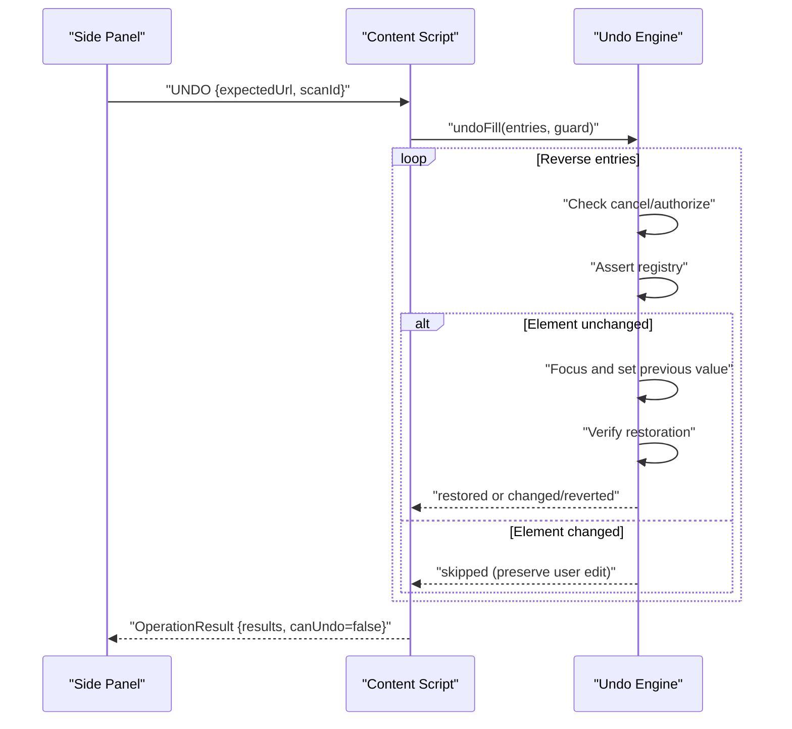
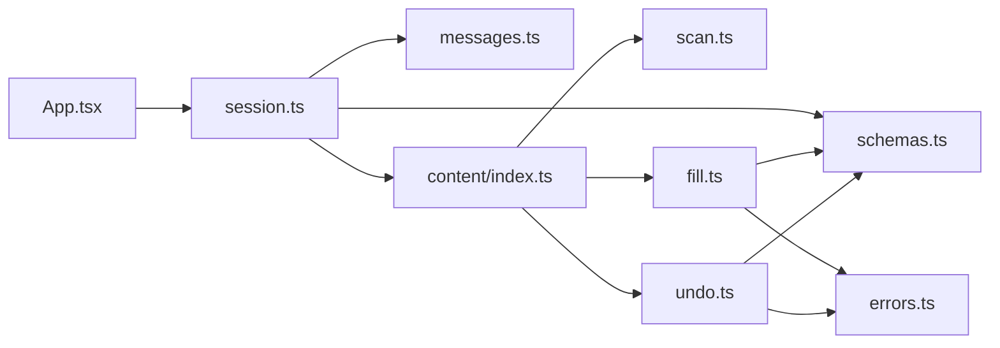

# Safe Form Filling

<cite>
**Referenced Files in This Document**
- [fill.ts](file://src/content/fill.ts)
- [undo.ts](file://src/content/undo.ts)
- [scan.ts](file://src/content/scan.ts)
- [index.ts](file://src/content/index.ts)
- [schemas.ts](file://src/shared/schemas.ts)
- [messages.ts](file://src/shared/messages.ts)
- [errors.ts](file://src/shared/errors.ts)
- [App.tsx](file://src/sidepanel/App.tsx)
- [FillResults.tsx](file://src/sidepanel/components/FillResults.tsx)
- [session.ts](file://src/sidepanel/session.ts)
- [filler.test.ts](file://tests/integration/filler.test.ts)
</cite>

## Table of Contents
1. [Introduction](#introduction)
2. [Project Structure](#project-structure)
3. [Core Components](#core-components)
4. [Architecture Overview](#architecture-overview)
5. [Detailed Component Analysis](#detailed-component-analysis)
6. [Dependency Analysis](#dependency-analysis)
7. [Performance Considerations](#performance-considerations)
8. [Troubleshooting Guide](#troubleshooting-guide)
9. [Conclusion](#conclusion)
10. [Appendices](#appendices)

## Introduction
This document explains the safe form filling system that populates web forms with validated data, verifies successful writes, and supports undoing changes safely. It covers:
- The filling algorithm for different input types
- Event triggering to satisfy page-side validation
- Verification mechanisms to confirm persistence
- Undo functionality that preserves previous states and reverses changes
- Safety checks to prevent accidental overwrites and resolve conflicts when multiple values target the same field
- Result reporting with feedback on success and failure, retry guidance, and logging aids
- Practical examples for complex and dynamic forms
- Troubleshooting common filling failures

## Project Structure
The safe fill system is implemented as a content script running in the target page, coordinated by the side panel. Key responsibilities:
- Scanning and describing form fields safely
- Validating assignments before writing
- Executing fills with guards against cancellation or tab changes
- Verifying written values and reporting results
- Supporting undo to restore previous values safely

**Diagram sources**
- [App.tsx:84-95](file://src/sidepanel/App.tsx#L84-L95)
- [session.ts:55-85](file://src/sidepanel/session.ts#L55-L85)
- [index.ts:22-53](file://src/content/index.ts#L22-L53)
- [scan.ts:62-87](file://src/content/scan.ts#L62-L87)
- [fill.ts:42-81](file://src/content/fill.ts#L42-L81)
- [undo.ts:6-28](file://src/content/undo.ts#L6-L28)
- [schemas.ts:25-38](file://src/shared/schemas.ts#L25-L38)

**Section sources**
- [index.ts:1-72](file://src/content/index.ts#L1-L72)
- [App.tsx:1-127](file://src/sidepanel/App.tsx#L1-L127)
- [session.ts:1-86](file://src/sidepanel/session.ts#L1-L86)

## Core Components
- Scanner: Safely enumerates eligible text controls, describes them, and enforces safety limits and exclusions.
- Filling Engine: Validates assignments, executes native value writes, triggers events, and verifies persistence.
- Undo Engine: Restores previous values while preserving subsequent user edits and verifying restoration.
- Content Script Orchestrator: Manages lifecycle, connections, cancellation, and message routing between side panel and content.
- Shared Schemas and Messages: Define typed contracts for scans, mappings, assignments, and operation results.
- Side Panel UI: Presents scan results, mapping review, execution progress, and final results with undo support.

**Section sources**
- [scan.ts:1-88](file://src/content/scan.ts#L1-L88)
- [fill.ts:1-82](file://src/content/fill.ts#L1-L82)
- [undo.ts:1-29](file://src/content/undo.ts#L1-L29)
- [index.ts:1-72](file://src/content/index.ts#L1-L72)
- [schemas.ts:1-39](file://src/shared/schemas.ts#L1-L39)
- [messages.ts:1-20](file://src/shared/messages.ts#L1-L20)
- [App.tsx:84-95](file://src/sidepanel/App.tsx#L84-L95)
- [FillResults.tsx:1-13](file://src/sidepanel/components/FillResults.tsx#L1-L13)

## Architecture Overview
The workflow proceeds through scanning, mapping/review, filling, and optional undo. Each phase validates context to ensure the correct page and form state.

**Diagram sources**
- [session.ts:55-85](file://src/sidepanel/session.ts#L55-L85)
- [index.ts:22-53](file://src/content/index.ts#L22-L53)
- [scan.ts:62-87](file://src/content/scan.ts#L62-L87)
- [fill.ts:42-81](file://src/content/fill.ts#L42-L81)
- [undo.ts:6-28](file://src/content/undo.ts#L6-L28)

## Detailed Component Analysis

### Scanner: Safe Field Discovery and Description
- Enumerates input and textarea elements, enforcing limits on total fields and values.
- Excludes disabled, read-only, hidden, authentication/payment-related, and sensitive controls.
- Describes each field with label, aria-label, placeholder, name, context (heading/fieldset), required flag, maxLength, pattern, and current value.
- Produces a fingerprint per field to detect later DOM changes.
- Validates registry integrity before any write via assertRegistry.

Key behaviors:
- Visibility checks include computed styles and bounding rectangles.
- Label extraction avoids nested control contents to prevent leaking private values into metadata.
- Safety limits protect against large pages and oversized patterns/values.

**Section sources**
- [scan.ts:10-87](file://src/content/scan.ts#L10-L87)
- [schemas.ts:1-31](file://src/shared/schemas.ts#L1-L31)

### Filling Algorithm: Validation, Execution, and Verification
Pre-flight validation:
- Rejects unknown or duplicate field IDs.
- Ensures no field changed since review (current value matches expected).
- Prevents overwriting existing values unless explicitly allowed.
- Validates length constraints and browser normalization; rejects invalid types/patterns/required constraints.

Execution loop:
- For each assignment:
  - Check cancellation and authorization (active tab check).
  - Reassert registry validity and recheck field value.
  - Skip if already contains the selected value.
  - Focus the element, then reassert registry and value after focus handlers run.
  - Record an undo entry with previous and written values.
  - Set native value using the native setter to trigger proper event chains.
  - Verify persistence across frames and short delays; mark status accordingly.

Event handling:
- Uses native value setter to dispatch input and change events, then blurs the element.
- Avoids form submission; only updates values.

Verification:
- Waits for rendering and stability, then confirms value and validity persist.

Conflict resolution:
- Preflight ensures one write per field; duplicates are rejected early.
- If a field changes during execution, remaining writes are skipped and reported.

Error handling:
- Errors are captured per-field; subsequent writes are marked skipped.
- User-facing messages are derived from error utilities.

**Section sources**
- [fill.ts:8-81](file://src/content/fill.ts#L8-L81)
- [schemas.ts:32-38](file://src/shared/schemas.ts#L32-L38)
- [errors.ts:1-10](file://src/shared/errors.ts#L1-L10)

#### Filling Flowchart

**Diagram sources**
- [fill.ts:42-81](file://src/content/fill.ts#L42-L81)

### Undo Engine: Safe Restoration with Preservation
- Iterates undo entries in reverse order to restore most recent first.
- Skips restoration if the element was disconnected or its value changed (preserving user edits).
- Focuses the element, reasserts registry, and restores previous value using native setter.
- Verifies restoration without strict validity checks to accommodate controlled components.
- Reports per-field status: restored, changed/reverted, or failed.

Safety guarantees:
- Does not overwrite subsequent user edits.
- Stops on errors and reports failure.

**Section sources**
- [undo.ts:6-28](file://src/content/undo.ts#L6-L28)
- [fill.ts:17-26](file://src/content/fill.ts#L17-L26)

#### Undo Sequence

**Diagram sources**
- [undo.ts:6-28](file://src/content/undo.ts#L6-L28)
- [fill.ts:17-26](file://src/content/fill.ts#L17-L26)

### Content Script Orchestration: Lifecycle, Guards, and Messaging
- Initializes once per page and tracks connections from the trusted side panel.
- Handles messages: SCAN, FILL, UNDO, CLEAR, CANCEL.
- Maintains a registry snapshot and undo stack for the session.
- Provides a guard that checks cancellation and active tab authorization.
- Enforces busy state to avoid concurrent operations.
- Cleans up on page hide.

Security and trust:
- Only accepts messages from the extension’s side panel origin.
- Validates message schemas before processing.

**Section sources**
- [index.ts:7-72](file://src/content/index.ts#L7-L72)
- [messages.ts:1-20](file://src/shared/messages.ts#L1-L20)
- [errors.ts:1-10](file://src/shared/errors.ts#L1-L10)

### Side Panel Integration: Review, Execute, and Report
- Initiates scanning, generates mapping plans, and presents a review table.
- Executes FILL with selected assignments and displays results.
- Offers UNDO when available and shows detailed per-field outcomes.
- Monitors tab activity and invalidates sessions on changes.

User feedback:
- Progress indicators and cancel actions.
- Clear warnings about local verification and need to rescan.

**Section sources**
- [App.tsx:69-95](file://src/sidepanel/App.tsx#L69-L95)
- [FillResults.tsx:1-13](file://src/sidepanel/components/FillResults.tsx#L1-L13)
- [session.ts:44-85](file://src/sidepanel/session.ts#L44-L85)

## Dependency Analysis
High-level dependencies among modules:

**Diagram sources**
- [App.tsx:1-127](file://src/sidepanel/App.tsx#L1-L127)
- [session.ts:1-86](file://src/sidepanel/session.ts#L1-L86)
- [messages.ts:1-20](file://src/shared/messages.ts#L1-L20)
- [schemas.ts:1-39](file://src/shared/schemas.ts#L1-L39)
- [index.ts:1-72](file://src/content/index.ts#L1-L72)
- [scan.ts:1-88](file://src/content/scan.ts#L1-L88)
- [fill.ts:1-82](file://src/content/fill.ts#L1-L82)
- [undo.ts:1-29](file://src/content/undo.ts#L1-L29)
- [errors.ts:1-10](file://src/shared/errors.ts#L1-L10)

**Section sources**
- [schemas.ts:1-39](file://src/shared/schemas.ts#L1-L39)
- [messages.ts:1-20](file://src/shared/messages.ts#L1-L20)

## Performance Considerations
- Preflight validation prevents unnecessary writes and reduces round-trips.
- Native value setting minimizes overhead compared to synthetic events.
- Short waits during verification balance responsiveness with reliability.
- Limits on fields, values, and patterns protect against heavy pages.
- Busy gating avoids contention and race conditions.

[No sources needed since this section provides general guidance]

## Troubleshooting Guide
Common issues and resolutions:

- Unknown or duplicate field ID:
  - Cause: Mapping references a non-existent or repeated field.
  - Resolution: Rescan and regenerate mapping; ensure unique assignments.

- Field changed since review:
  - Cause: User or page modified the field after mapping.
  - Resolution: Rescan and review again before filling.

- Overwrite protection triggered:
  - Cause: Attempting to replace an existing value without explicit approval.
  - Resolution: Enable allowOverwrite for that assignment in the review step.

- Invalid value (length/type/pattern):
  - Cause: Value violates maxlength, minlength, type, pattern, or required constraints.
  - Resolution: Adjust the value to meet constraints or update mapping evidence.

- Page structure changed:
  - Cause: DOM replaced or added fields after scanning.
  - Resolution: Rescan to capture the current form structure.

- Tab authorization failed or cancellation:
  - Cause: Target tab changed or operation canceled.
  - Resolution: Ensure the intended tab is active; retry the operation.

- Values reverted by page:
  - Cause: Page-side logic clears or modifies values after input events.
  - Resolution: Inspect the field manually; consider adjusting page interactions or mapping.

- Undo did not restore:
  - Cause: Subsequent user edits or page effects prevented restoration.
  - Resolution: Accept that user edits are preserved; rescan and refill if necessary.

**Section sources**
- [fill.ts:42-81](file://src/content/fill.ts#L42-L81)
- [undo.ts:6-28](file://src/content/undo.ts#L6-L28)
- [scan.ts:62-87](file://src/content/scan.ts#L62-L87)
- [errors.ts:1-10](file://src/shared/errors.ts#L1-L10)
- [filler.test.ts:47-129](file://tests/integration/filler.test.ts#L47-L129)

## Conclusion
The safe form filling system combines rigorous preflight validation, guarded execution, and post-write verification to reliably populate forms while protecting user data and page integrity. Undo support preserves previous states and respects subsequent edits. The side panel provides clear feedback and controls throughout the process. By adhering to the safety checks and following the troubleshooting steps, users can confidently fill complex and dynamic forms.

[No sources needed since this section summarizes without analyzing specific files]

## Appendices

### Data Models and Contracts
- Field descriptors include id, type, label, ariaLabel, placeholder, name, context, required, maxLength, pattern, and currentValue.
- Assignments specify fieldId, value, expectedValue, and allowOverwrite.
- Operation results report per-field status and detail.

**Section sources**
- [schemas.ts:1-39](file://src/shared/schemas.ts#L1-L39)
- [messages.ts:1-20](file://src/shared/messages.ts#L1-L20)

### Example Scenarios
- Complex multi-section forms:
  - Use context (fieldset legend or nearest heading) to disambiguate fields with similar labels.
  - Validate each assignment individually; enable overwrite only where appropriate.

- Dynamic forms with reactive updates:
  - Rely on verification to detect reverts caused by page logic.
  - If verification fails, inspect the field and adjust mapping or page interaction.

- Controlled inputs (e.g., React-managed textareas):
  - Native value setter triggers input/change events; verification accounts for synchronization quirks.

**Section sources**
- [scan.ts:20-46](file://src/content/scan.ts#L20-L46)
- [filler.test.ts:114-123](file://tests/integration/filler.test.ts#L114-L123)