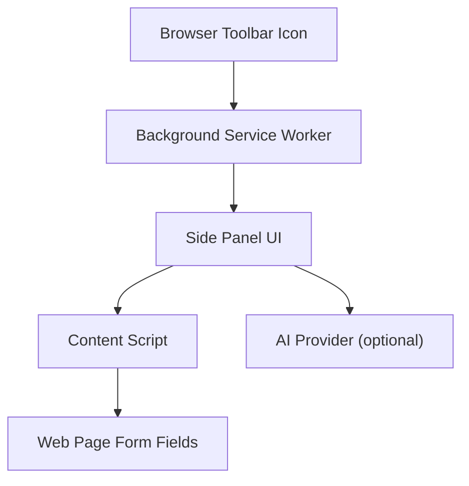
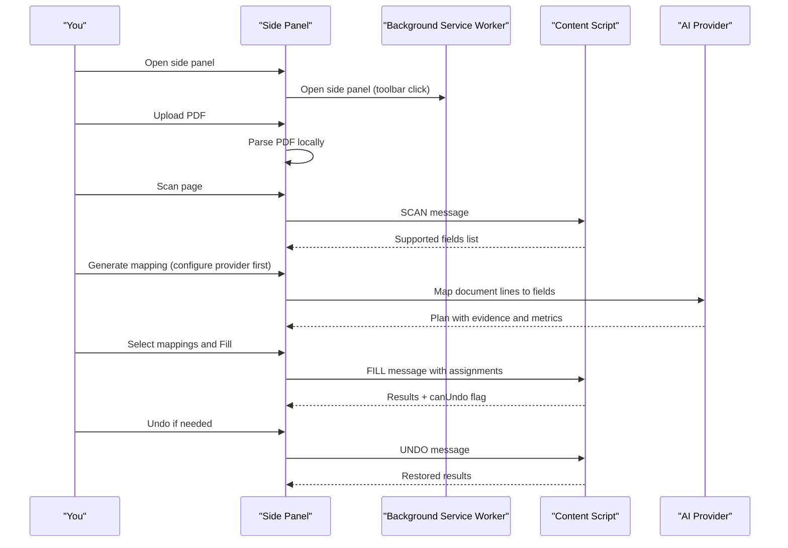
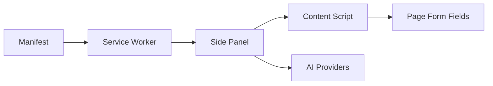

# Getting Started

<cite>
**Referenced Files in This Document**
- [manifest.json](file://src/manifest.json)
- [service-worker.ts](file://src/background/service-worker.ts)
- [App.tsx](file://src/sidepanel/App.tsx)
- [DropZone.tsx](file://src/sidepanel/components/DropZone.tsx)
- [ReviewTable.tsx](file://src/sidepanel/components/ReviewTable.tsx)
- [ProviderSettings.tsx](file://src/sidepanel/components/ProviderSettings.tsx)
- [index.ts (content script)](file://src/content/index.ts)
- [registry.ts](file://src/ai/registry.ts)
- [errors.ts](file://src/shared/errors.ts)
</cite>

## Table of Contents
1. Introduction
2. Project Structure
3. Core Components
4. Architecture Overview
5. Detailed Component Analysis
6. Dependency Analysis
7. Performance Considerations
8. Troubleshooting Guide
9. Conclusion

## Introduction
Help Me Fill is a browser extension that helps you fill web forms using information from your PDF documents. It works by:
- Extracting text from your PDF locally
- Scanning the current web page for supported form fields
- Using an AI provider to suggest how to map document content to form fields
- Letting you review and approve mappings before filling the page
- Filling only the fields you select, with an undo option when possible

This guide walks you through installing the extension on Chrome or Edge, setting it up for the first time, and completing your first fill workflow.

## Project Structure
At a high level, the extension consists of:
- A background service worker that manages permissions and opens the side panel
- A side panel UI where you upload a PDF, scan a page, review AI suggestions, and fill fields
- A content script injected into the active tab to perform scanning and field filling
- Optional AI provider integrations for generating mapping suggestions

**Diagram sources**
- [service-worker.ts:1-29](file://src/background/service-worker.ts#L1-L29)
- [App.tsx:108-125](file://src/sidepanel/App.tsx#L108-L125)
- [index.ts (content script):1-72](file://src/content/index.ts#L1-L72)
- [registry.ts:1-13](file://src/ai/registry.ts#L1-L13)

**Section sources**
- [manifest.json:1-19](file://src/manifest.json#L1-L19)
- [service-worker.ts:1-29](file://src/background/service-worker.ts#L1-L29)

## Core Components
- Side panel user interface: Upload PDF, scan page, review mappings, fill fields
- Content script: Scans supported fields and executes fill/undo operations
- Background service worker: Opens side panel, validates active tab context
- AI provider settings: Configure provider, model, and API key; request host permission

Key responsibilities:
- Local PDF parsing and progress reporting
- Field scanning and exclusion reasons
- AI-driven mapping generation with evidence and metrics
- Safe filling with validation warnings and undo support

**Section sources**
- [App.tsx:15-125](file://src/sidepanel/App.tsx#L15-L125)
- [DropZone.tsx:1-21](file://src/sidepanel/components/DropZone.tsx#L1-L21)
- [ReviewTable.tsx:1-30](file://src/sidepanel/components/ReviewTable.tsx#L1-L30)
- [ProviderSettings.tsx:1-70](file://src/sidepanel/components/ProviderSettings.tsx#L1-L70)
- [index.ts (content script):1-72](file://src/content/index.ts#L1-L72)

## Architecture Overview
The extension uses a side panel workflow:
1. You open the side panel via the toolbar icon
2. Upload a PDF to extract text locally
3. Scan the current page to find supported fields
4. Generate AI mapping suggestions (requires provider configuration)
5. Review and edit suggested values
6. Fill selected fields and optionally undo changes

**Diagram sources**
- [service-worker.ts:8-14](file://src/background/service-worker.ts#L8-L14)
- [App.tsx:64-95](file://src/sidepanel/App.tsx#L64-L95)
- [index.ts (content script):22-52](file://src/content/index.ts#L22-L52)
- [registry.ts:1-13](file://src/ai/registry.ts#L1-L13)

## Detailed Component Analysis

### Installation and First Launch
- Install the built extension in Chrome or Edge using Developer Mode
- After installation, click the extension toolbar icon to open the side panel
- The background service worker configures storage access levels and opens the side panel

What you will see:
- A header with branding and Reset session button
- A step indicator showing Document → Review → Fill
- A provider settings section to enable an LLM provider
- A drop zone to upload a PDF
- A Current form section to scan the page
- A Review suggestions table after mapping
- A Fill results area with undo capability

**Section sources**
- [service-worker.ts:1-14](file://src/background/service-worker.ts#L1-L14)
- [App.tsx:108-125](file://src/sidepanel/App.tsx#L108-L125)

### Initial Setup: Configure an AI Provider
Before generating mapping suggestions, you must enable a provider:
- Choose a provider (OpenAI, DeepSeek, Anthropic, Google Gemini)
- Enter a model ID from your provider account
- Enter an API key (stored for this browser session only)
- Enable the provider to request host permission for the chosen provider’s API origin
- Optionally revoke host permission later from the same settings

Notes:
- Keys are stored in session storage; they are not persisted across sessions
- Host permission is required to call the provider’s API endpoint
- No backend or subscription is included; charges depend on your provider account

**Section sources**
- [ProviderSettings.tsx:1-70](file://src/sidepanel/components/ProviderSettings.tsx#L1-L70)
- [registry.ts:1-13](file://src/ai/registry.ts#L1-L13)

### Step-by-Step Workflow

#### Step 1: Upload Your PDF
- Drag and drop a PDF into the Drop Zone or click Choose PDF
- Only text-based PDFs are supported, with size and page limits indicated in the UI
- The extension parses the PDF locally and shows a progress message while reading pages

What you will see:
- A drop zone with instructions and file picker
- Progress messages during local parsing
- A document preview once parsed

**Section sources**
- [DropZone.tsx:1-21](file://src/sidepanel/components/DropZone.tsx#L1-L21)
- [App.tsx:64-68](file://src/sidepanel/App.tsx#L64-L68)

#### Step 2: Scan the Web Page
- Navigate to the form page you want to fill
- Click the extension toolbar icon to ensure the side panel is attached to the correct tab
- Click Scan page in the Current form section
- The content script scans for supported top-frame text fields and reports exclusions

What you will see:
- Origin URL of the scanned page
- Number of supported fields found
- An expandable list of fields and exclusions

Important limitations:
- Top-frame text fields only
- Authentication/payment filtering is best-effort
- No iframes, custom widgets, or form submission

**Section sources**
- [App.tsx:69-72](file://src/sidepanel/App.tsx#L69-L72)
- [App.tsx:117-119](file://src/sidepanel/App.tsx#L117-L119)
- [index.ts (content script):22-31](file://src/content/index.ts#L22-L31)

#### Step 3: Generate Mapping Suggestions
- Ensure a provider is enabled and host permission is granted
- Click Generate mapping in the Disclosure Preview section
- The extension sends extracted text and field metadata to your provider and returns a plan with evidence and usage metrics

What you will see:
- A Review suggestions table with proposed values
- Evidence blocks showing source quotes and line IDs
- Unmapped fields with reasons
- Metrics including provider name, model, request count, elapsed time, and optional usage

**Section sources**
- [App.tsx:73-83](file://src/sidepanel/App.tsx#L73-L83)
- [ReviewTable.tsx:1-30](file://src/sidepanel/components/ReviewTable.tsx#L1-L30)
- [registry.ts:1-13](file://src/ai/registry.ts#L1-L13)

#### Step 4: Review and Edit Mappings
- Select only the mappings you want to apply
- Edit proposed values directly in the table
- For fields that already have values, you can choose whether to allow overwriting
- Manual overrides are highlighted for careful review

What you will see:
- Checkboxes to select mappings
- Text areas to edit values
- Overwrite prompts for existing values
- Source evidence details

**Section sources**
- [ReviewTable.tsx:1-30](file://src/sidepanel/components/ReviewTable.tsx#L1-L30)

#### Step 5: Fill Selected Fields
- Click Fill selected to apply changes to the page
- The content script writes values to supported fields and verifies them
- If any server-side effects occur, undo cannot reverse them

What you will see:
- A Fill results area with outcomes
- An Undo button if changes were recorded and can be restored

Warnings:
- Filling may trigger site validation, autosave, or network requests
- The extension never clicks Submit
- Undo cannot reverse server-side effects

**Section sources**
- [App.tsx:84-95](file://src/sidepanel/App.tsx#L84-L95)
- [index.ts (content script):42-52](file://src/content/index.ts#L42-L52)
- [ReviewTable.tsx:22-27](file://src/sidepanel/components/ReviewTable.tsx#L22-L27)

#### Step 6: Undo Changes (if available)
- If the result indicates undo is possible, click Undo to restore unchanged values
- The content script restores previous values based on recorded entries

What you will see:
- Undo results indicating restoration status

**Section sources**
- [App.tsx:91-95](file://src/sidepanel/App.tsx#L91-L95)
- [index.ts (content script):48-52](file://src/content/index.ts#L48-L52)

## Dependency Analysis
The extension coordinates several components:
- Manifest declares permissions and side panel behavior
- Background service worker handles action clicks and active tab checks
- Side panel orchestrates PDF parsing, scanning, mapping, and filling
- Content script performs scanning and field manipulation
- AI providers are optional and require explicit host permissions

**Diagram sources**
- [manifest.json:1-19](file://src/manifest.json#L1-L19)
- [service-worker.ts:1-29](file://src/background/service-worker.ts#L1-L29)
- [App.tsx:108-125](file://src/sidepanel/App.tsx#L108-L125)
- [index.ts (content script):1-72](file://src/content/index.ts#L1-L72)
- [registry.ts:1-13](file://src/ai/registry.ts#L1-L13)

**Section sources**
- [manifest.json:1-19](file://src/manifest.json#L1-L19)
- [service-worker.ts:1-29](file://src/background/service-worker.ts#L1-L29)

## Performance Considerations
- PDF parsing runs locally and reports progress per page
- Scanning and filling operate on top-frame text fields only, which reduces complexity
- AI mapping calls include metrics such as request count and elapsed time
- Canceling operations abort ongoing work and clear pending tasks

[No sources needed since this section provides general guidance]

## Troubleshooting Guide

### Common Installation Issues
- The side panel does not open:
  - Click the extension toolbar icon to explicitly open the side panel
  - Ensure the background service worker is running and has configured storage access levels
- Active tab mismatch:
  - Switching tabs requires rescanning and regenerating mappings
  - The extension validates the expected URL before filling

What to check:
- Permissions declared in the manifest include sidePanel, scripting, activeTab, and storage
- Optional host permissions are requested when enabling a provider

**Section sources**
- [service-worker.ts:1-14](file://src/background/service-worker.ts#L1-L14)
- [manifest.json:1-19](file://src/manifest.json#L1-L19)
- [App.tsx:34-48](file://src/sidepanel/App.tsx#L34-L48)

### Permission Requirements
- Required permissions:
  - sidePanel: to display the side panel
  - scripting: to inject and communicate with content scripts
  - activeTab: to interact with the current tab
  - storage: to store preferences and session keys
- Optional host permissions:
  - One of the provider origins is requested when you enable a provider
  - You can revoke host permission at any time from the provider settings

What you will see:
- A prompt to grant host permission when enabling a provider
- A Revoke API host permission button in provider settings

**Section sources**
- [manifest.json:6-12](file://src/manifest.json#L6-L12)
- [ProviderSettings.tsx:32-44](file://src/sidepanel/components/ProviderSettings.tsx#L32-L44)
- [ProviderSettings.tsx:62-64](file://src/sidepanel/components/ProviderSettings.tsx#L62-L64)

### First-Time User Tips
- Start with a simple text-based PDF under the stated size and page limits
- Use a standard web form with top-frame text inputs for best results
- Review evidence before selecting mappings to ensure accuracy
- Be cautious when allowing overwrites for fields that already contain values
- Remember that undo cannot reverse server-side effects

**Section sources**
- [DropZone.tsx:15-18](file://src/sidepanel/components/DropZone.tsx#L15-L18)
- [App.tsx:117-119](file://src/sidepanel/App.tsx#L117-L119)
- [ReviewTable.tsx:13-20](file://src/sidepanel/components/ReviewTable.tsx#L13-L20)
- [ReviewTable.tsx:22-27](file://src/sidepanel/components/ReviewTable.tsx#L22-L27)

### Error Handling and Recovery
- User-friendly error messages distinguish between cancellations and failures
- If an operation fails, reset the session and try again
- If the page changes during a workflow, rescan and regenerate mappings

Common messages:
- Canceled: no new request was started
- Operation could not complete: reset session and retry
- Invalid extension message: indicates a communication issue

**Section sources**
- [errors.ts:1-10](file://src/shared/errors.ts#L1-L10)
- [App.tsx:50-63](file://src/sidepanel/App.tsx#L50-L63)
- [App.tsx:102-107](file://src/sidepanel/App.tsx#L102-L107)

## Conclusion
You now have everything you need to install Help Me Fill, configure an AI provider, and complete your first form-filling workflow. Remember to:
- Keep your provider settings updated and host permissions granted
- Review mappings carefully before filling
- Use undo when available and understand its limitations
- Rescan and regenerate mappings whenever the page or document changes

[No sources needed since this section summarizes without analyzing specific files]