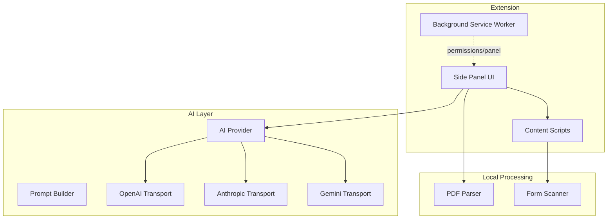
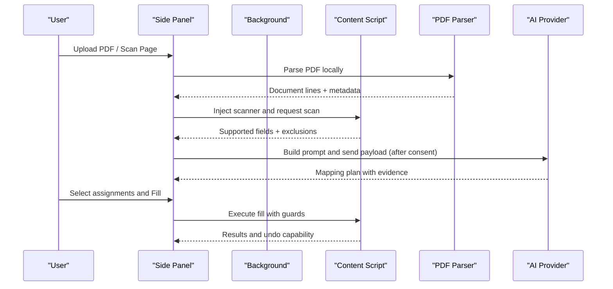
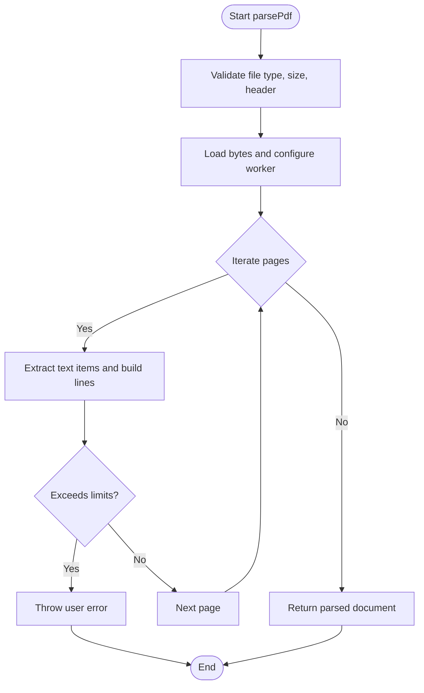
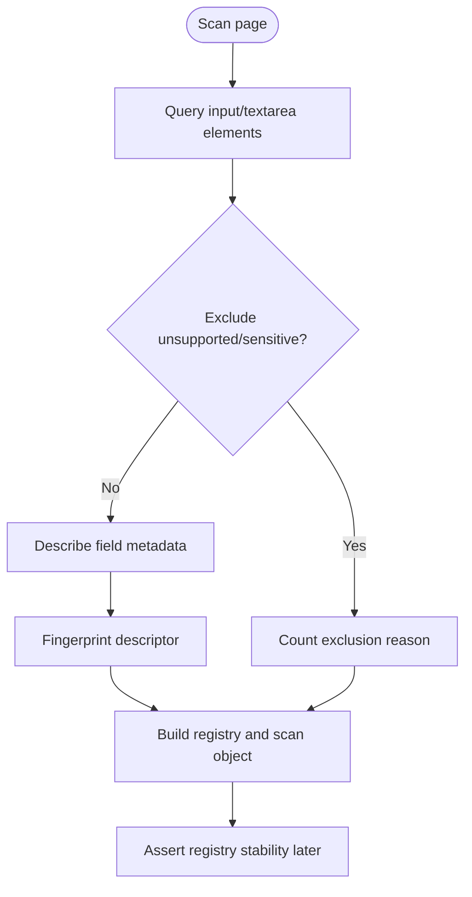
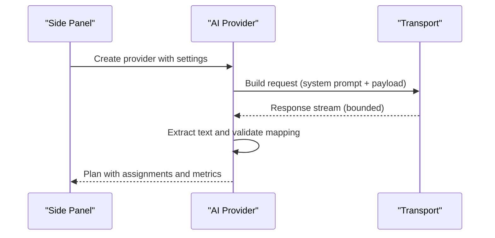
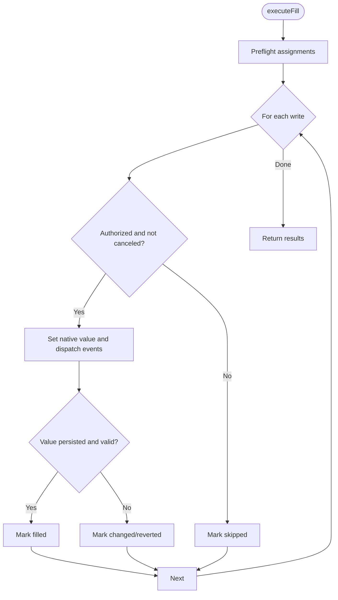
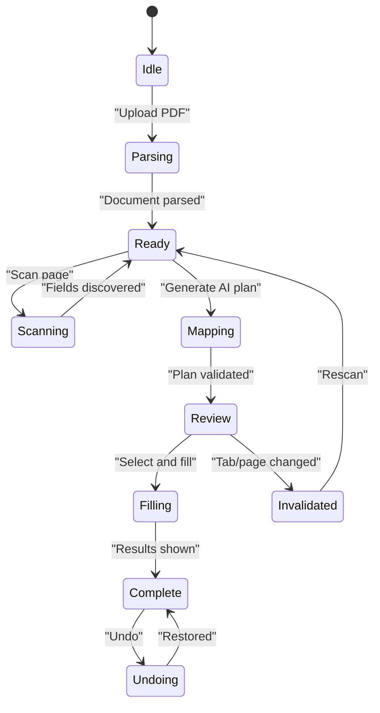
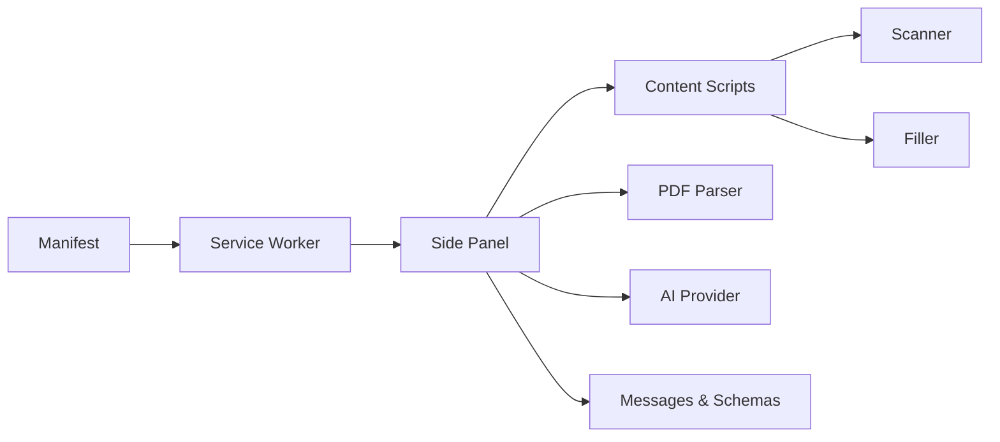

# Project Overview

<cite>
**Referenced Files in This Document**
- [package.json](file://package.json)
- [manifest.json](file://src/manifest.json)
- [service-worker.ts](file://src/background/service-worker.ts)
- [index.ts](file://src/content/index.ts)
- [scan.ts](file://src/content/scan.ts)
- [fill.ts](file://src/content/fill.ts)
- [pdf.ts](file://src/parsers/pdf.ts)
- [provider.ts](file://src/ai/provider.ts)
- [prompts.ts](file://src/ai/prompts.ts)
- [App.tsx](file://src/sidepanel/App.tsx)
- [session.ts](file://src/sidepanel/session.ts)
- [messages.ts](file://src/shared/messages.ts)
- [schemas.ts](file://src/shared/schemas.ts)
</cite>

## Table of Contents
1. [Introduction](#introduction)
2. [Project Structure](#project-structure)
3. [Core Components](#core-components)
4. [Architecture Overview](#architecture-overview)
5. [Detailed Component Analysis](#detailed-component-analysis)
6. [Dependency Analysis](#dependency-analysis)
7. [Performance Considerations](#performance-considerations)
8. [Troubleshooting Guide](#troubleshooting-guide)
9. [Conclusion](#conclusion)

## Introduction
Help Me Fill is a privacy-first browser extension that helps professionals quickly fill web forms using evidence from PDF documents. It combines local PDF text extraction with AI-powered field mapping to propose values for supported form fields, while keeping user data under control. The extension parses PDFs locally and only sends extracted text and minimal field metadata to an AI provider after explicit user consent. This approach reduces manual data entry without compromising security or user oversight.

Target audience:
- Professionals who frequently copy information from PDFs into web forms (e.g., applications, registrations, procurement, compliance).
- Teams seeking faster, more accurate form completion while maintaining control over what leaves the browser.

How it differs from traditional form fillers:
- Traditional tools often rely on static templates or heuristics. Help Me Fill uses AI to understand document context and map relevant content to specific form fields, citing exact quotes as evidence.
- Privacy-first design: PDF parsing runs entirely in the browser; AI calls are opt-in and require explicit permission and consent.

Core value proposition:
- Reduce repetitive data entry by proposing accurate, source-backed values for form fields.
- Maintain security and user control through local processing, strict limits, and explicit approval before any network requests or field writes.

**Section sources**
- [manifest.json:1-19](file://src/manifest.json#L1-L19)
- [App.tsx:108-125](file://src/sidepanel/App.tsx#L108-L125)
- [pdf.ts:7-13](file://src/parsers/pdf.ts#L7-L13)
- [provider.ts:52-105](file://src/ai/provider.ts#L52-L105)

## Project Structure
The project is organized by feature and layer:
- Background service worker manages permissions and panel behavior.
- Content scripts run on target pages to scan and fill forms safely.
- Side panel UI orchestrates the workflow: upload PDF, scan page, review AI suggestions, and execute fills.
- Parsers extract text from PDFs locally.
- AI module builds prompts and communicates with providers via transports.
- Shared schemas and messages define contracts and safety limits.

**Diagram sources**
- [service-worker.ts:1-29](file://src/background/service-worker.ts#L1-L29)
- [App.tsx:64-95](file://src/sidepanel/App.tsx#LL64-L95)
- [pdf.ts:40-86](file://src/parsers/pdf.ts#L40-L86)
- [scan.ts:62-87](file://src/content/scan.ts#L62-L87)
- [provider.ts:19-26](file://src/ai/provider.ts#L19-L26)

**Section sources**
- [package.json:1-38](file://package.json#L1-L38)
- [manifest.json:1-19](file://src/manifest.json#L1-L19)

## Core Components
- Local PDF parser: Extracts text lines from PDFs within size and page limits, ensuring no external network calls.
- Page scanner: Identifies supported text fields, captures metadata, and excludes sensitive or unsupported controls.
- AI mapping: Builds a constrained prompt with document lines and field descriptors, validates responses, and returns a plan with evidence citations.
- Form filler: Preflights assignments, writes values safely, verifies persistence, supports undo, and enforces guardrails against tab changes.
- Side panel workflow: Guides users through Document → Review → Fill phases with progress, cancellation, and reset capabilities.

Key responsibilities:
- Safety: Enforce input/output limits, validate types, and abort long-running operations.
- Consent: Require explicit permission for each provider origin before making API calls.
- Traceability: Provide evidence quotes and reasons for each proposed assignment.

**Section sources**
- [pdf.ts:7-13](file://src/parsers/pdf.ts#L7-L13)
- [pdf.ts:40-86](file://src/parsers/pdf.ts#L40-L86)
- [scan.ts:32-57](file://src/content/scan.ts#L32-L57)
- [scan.ts:62-87](file://src/content/scan.ts#L62-L87)
- [prompts.ts:4-16](file://src/ai/prompts.ts#L4-L16)
- [provider.ts:52-105](file://src/ai/provider.ts#L52-L105)
- [fill.ts:42-81](file://src/content/fill.ts#L42-L81)
- [App.tsx:64-95](file://src/sidepanel/App.tsx#L64-L95)

## Architecture Overview
The extension follows a layered architecture with clear separation between UI, background, content, and AI layers. All PDF parsing occurs locally. AI calls are initiated only after user consent and explicit action.

**Diagram sources**
- [App.tsx:64-95](file://src/sidepanel/App.tsx#L64-L95)
- [pdf.ts:40-86](file://src/parsers/pdf.ts#L40-L86)
- [session.ts:55-84](file://src/sidepanel/session.ts#L55-L84)
- [provider.ts:52-105](file://src/ai/provider.ts#L52-L105)
- [fill.ts:42-81](file://src/content/fill.ts#L42-L81)

## Detailed Component Analysis

### Local PDF Parsing
- Validates file type, size, and header.
- Uses a local worker to extract text items and reconstruct lines per page.
- Enforces limits on pages and total characters to protect performance and memory.
- Rejects password-protected or image-only PDFs with clear guidance.

**Diagram sources**
- [pdf.ts:7-13](file://src/parsers/pdf.ts#L7-L13)
- [pdf.ts:15-38](file://src/parsers/pdf.ts#L15-L38)
- [pdf.ts:40-86](file://src/parsers/pdf.ts#L40-L86)

**Section sources**
- [pdf.ts:7-13](file://src/parsers/pdf.ts#L7-L13)
- [pdf.ts:40-86](file://src/parsers/pdf.ts#L40-L86)

### Page Scanning and Field Discovery
- Scans top-frame text inputs and textareas.
- Captures labels, aria attributes, placeholders, names, context, and constraints.
- Excludes disabled, hidden, authentication/payment-related, and overly large controls.
- Fingerprinting ensures the form structure remains stable during filling.

**Diagram sources**
- [scan.ts:32-57](file://src/content/scan.ts#L32-L57)
- [scan.ts:62-87](file://src/content/scan.ts#L62-L87)

**Section sources**
- [scan.ts:32-57](file://src/content/scan.ts#L32-L57)
- [scan.ts:62-87](file://src/content/scan.ts#L62-L87)

### AI Mapping and Prompting
- Builds a system prompt instructing the model to return JSON with assignments and unmapped fields, including evidence quotes and reasons.
- Compacts field descriptors to exclude current values and URLs from the payload.
- Sends requests to configured providers with timeouts, response size limits, and retry-on-validation logic.
- Validates returned mappings against strict schemas before presenting to the user.

**Diagram sources**
- [prompts.ts:4-25](file://src/ai/prompts.ts#L4-L25)
- [provider.ts:19-26](file://src/ai/provider.ts#L19-L26)
- [provider.ts:52-105](file://src/ai/provider.ts#L52-L105)

**Section sources**
- [prompts.ts:4-25](file://src/ai/prompts.ts#L4-L25)
- [provider.ts:19-26](file://src/ai/provider.ts#L19-L26)
- [provider.ts:52-105](file://src/ai/provider.ts#L52-L105)

### Form Filling and Undo
- Preflights all assignments to ensure targets exist, values match expectations, and constraints are satisfied.
- Writes values using native setters and dispatches events to trigger page handlers.
- Verifies persistence across frames and handles dynamic DOM changes.
- Supports undo by restoring previous values when possible.

**Diagram sources**
- [fill.ts:8-16](file://src/content/fill.ts#L8-L16)
- [fill.ts:17-26](file://src/content/fill.ts#L17-L26)
- [fill.ts:27-41](file://src/content/fill.ts#L27-L41)
- [fill.ts:42-81](file://src/content/fill.ts#L42-L81)

**Section sources**
- [fill.ts:8-16](file://src/content/fill.ts#L8-L16)
- [fill.ts:17-26](file://src/content/fill.ts#L17-L26)
- [fill.ts:27-41](file://src/content/fill.ts#L27-L41)
- [fill.ts:42-81](file://src/content/fill.ts#L42-L81)

### Side Panel Workflow and Session Management
- Orchestrates phases: parsing, scanning, mapping, review, filling, undoing.
- Manages state transitions, progress updates, and error handling.
- Ensures active tab consistency and invalidates sessions when tabs change or pages update.
- Provides clear messaging about local parsing and optional AI usage.

**Diagram sources**
- [session.ts:6-41](file://src/sidepanel/session.ts#L6-L41)
- [App.tsx:50-101](file://src/sidepanel/App.tsx#L50-L101)

**Section sources**
- [session.ts:6-41](file://src/sidepanel/session.ts#L6-L41)
- [App.tsx:50-101](file://src/sidepanel/App.tsx#L50-L101)

## Dependency Analysis
- Manifest declares MV3 permissions and optional host permissions for AI providers.
- Background service worker configures storage access levels and opens the side panel on action click.
- Content scripts communicate with the side panel via message passing and ports, enforcing trust boundaries.
- Shared schemas enforce consistent contracts across modules and limit sizes to prevent abuse.

**Diagram sources**
- [manifest.json:1-19](file://src/manifest.json#L1-L19)
- [service-worker.ts:1-29](file://src/background/service-worker.ts#L1-L29)
- [messages.ts:1-20](file://src/shared/messages.ts#L1-L20)
- [schemas.ts:1-39](file://src/shared/schemas.ts#L1-L39)

**Section sources**
- [manifest.json:1-19](file://src/manifest.json#L1-L19)
- [service-worker.ts:1-29](file://src/background/service-worker.ts#L1-L29)
- [messages.ts:1-20](file://src/shared/messages.ts#L1-L20)
- [schemas.ts:1-39](file://src/shared/schemas.ts#L1-L39)

## Performance Considerations
- Local PDF parsing enforces page and character limits to avoid memory pressure.
- AI requests include timeouts and response size caps to prevent hangs and excessive bandwidth use.
- Field scanning limits the number of controls and excludes heavy or unsupported elements.
- Preflight checks reduce unnecessary writes and failures during filling.

[No sources needed since this section provides general guidance]

## Troubleshooting Guide
Common issues and resolutions:
- Provider errors: Authentication, rate limits, or model support problems surface as user-friendly messages; verify API keys, quotas, and model IDs.
- Network or permission issues: Ensure optional host permissions are granted for the selected provider origin.
- Page changes: If the active tab or URL changes mid-operation, the session invalidates; rescan and review again.
- Unsupported PDFs: Password-protected or image-only PDFs are rejected; use unprotected, text-based PDFs.
- Too many controls: Pages with excessive inputs or complex widgets may be excluded; simplify the form or focus on supported fields.

**Section sources**
- [provider.ts:77-83](file://src/ai/provider.ts#L77-L83)
- [provider.ts:95-100](file://src/ai/provider.ts#L95-L100)
- [session.ts:44-69](file://src/sidepanel/session.ts#L44-L69)
- [pdf.ts:7-13](file://src/parsers/pdf.ts#L7-L13)
- [pdf.ts:76-81](file://src/parsers/pdf.ts#L76-L81)
- [scan.ts:62-87](file://src/content/scan.ts#L62-L87)

## Conclusion
Help Me Fill offers a secure, efficient path to reducing manual data entry by combining local PDF processing with intelligent, consent-driven AI mapping. Its privacy-first design keeps sensitive parsing on-device, while still leveraging modern AI to propose accurate, evidence-backed values for web forms. Users retain full control at every step: they choose whether to call AI, review suggested mappings, and approve any changes before fields are filled. This balance of automation and oversight makes it well-suited for professionals who need speed without sacrificing security or accuracy.

[No sources needed since this section summarizes without analyzing specific files]