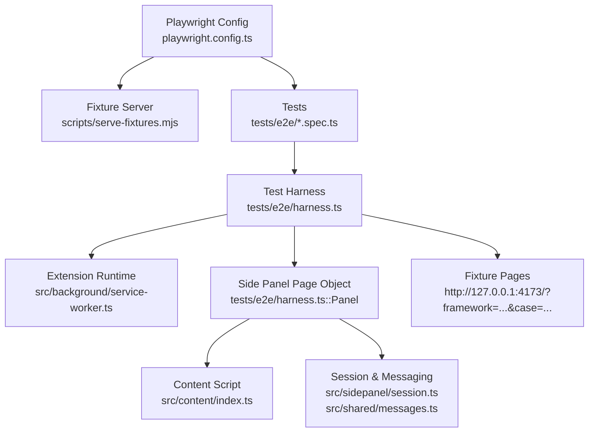
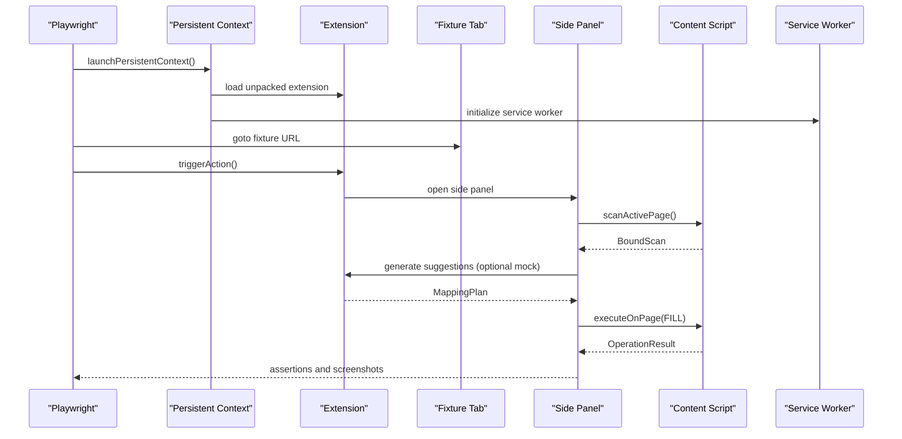
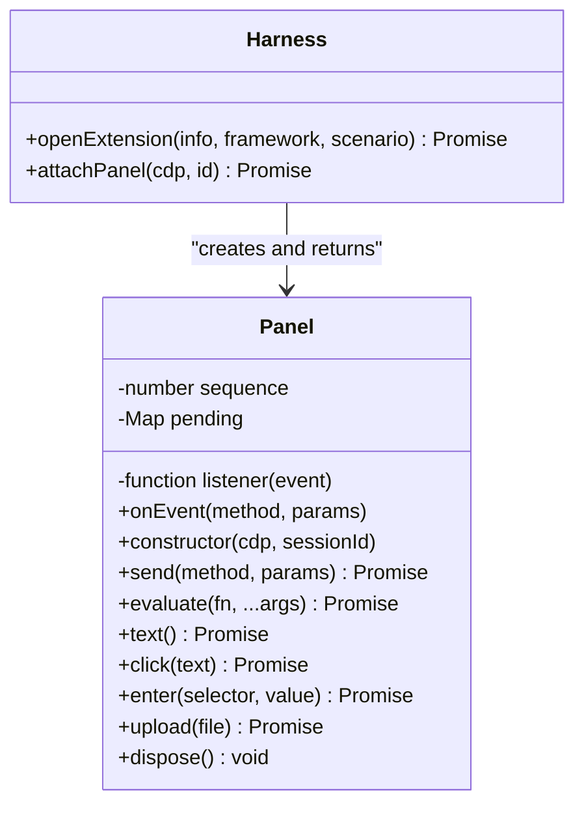
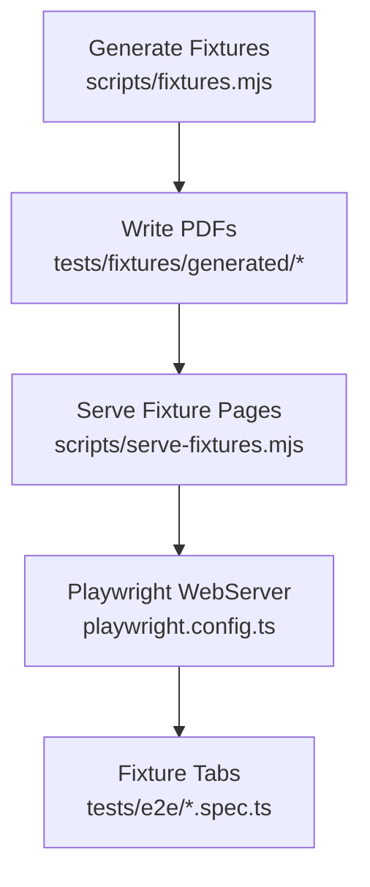
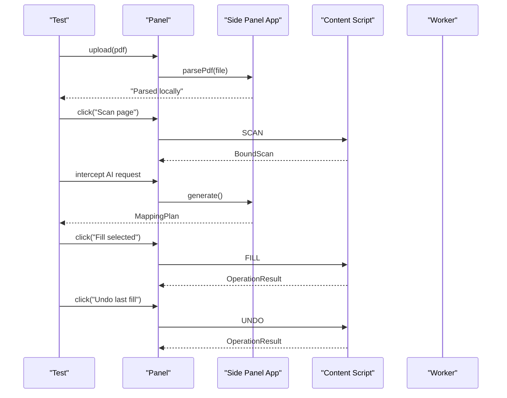
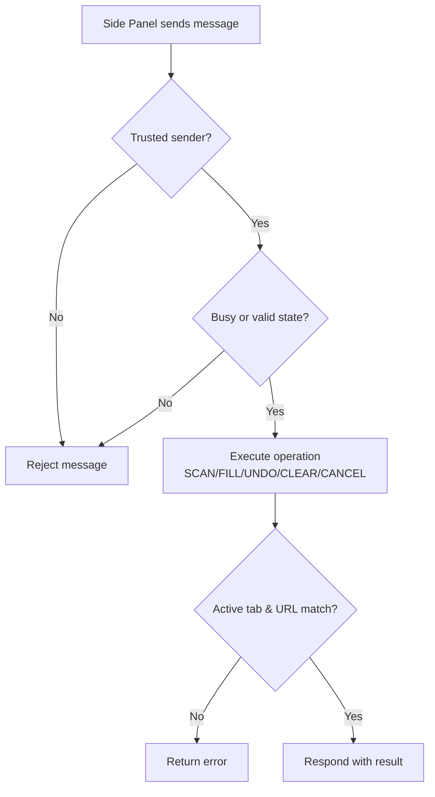
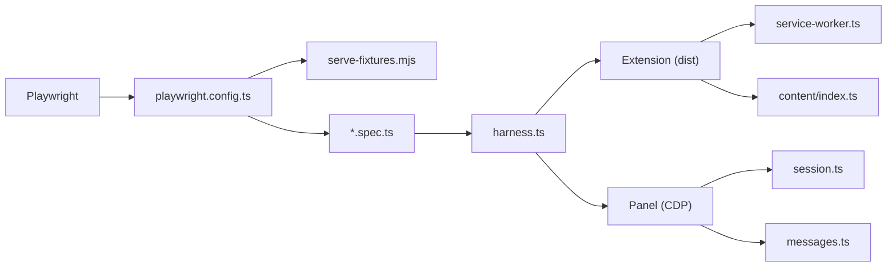

# End-to-End Testing

<cite>
**Referenced Files in This Document**
- [playwright.config.ts](file://playwright.config.ts)
- [harness.ts](file://tests/e2e/harness.ts)
- [extension.spec.ts](file://tests/e2e/extension.spec.ts)
- [workflow.spec.ts](file://tests/e2e/workflow.spec.ts)
- [cases.ts](file://tests/fixtures/cases.ts)
- [fixtures.mjs](file://scripts/fixtures.mjs)
- [serve-fixtures.mjs](file://scripts/serve-fixtures.mjs)
- [session.ts](file://src/sidepanel/session.ts)
- [messages.ts](file://src/shared/messages.ts)
- [index.ts](file://src/content/index.ts)
- [service-worker.ts](file://src/background/service-worker.ts)
- [App.tsx](file://src/sidepanel/App.tsx)
- [package.json](file://package.json)
</cite>

## Table of Contents
1. [Introduction](#introduction)
2. [Project Structure](#project-structure)
3. [Core Components](#core-components)
4. [Architecture Overview](#architecture-overview)
5. [Detailed Component Analysis](#detailed-component-analysis)
6. [Dependency Analysis](#dependency-analysis)
7. [Performance Considerations](#performance-considerations)
8. [Troubleshooting Guide](#troubleshooting-guide)
9. [Conclusion](#conclusion)
10. [Appendices](#appendices)

## Introduction
This document explains how to set up and run end-to-end tests for the Help Me Fill extension using Playwright. It covers the test harness, browser automation strategies, fixture management, realistic user workflows (PDF upload, form scanning, AI interaction, field filling), page object patterns for interacting with the extension UI, cross-context communication, file uploads, real-time updates, parallelization, screenshots for debugging, CI/CD integration, and testing error scenarios including network failures and user intervention points.

## Project Structure
The E2E suite lives under tests/e2e and is orchestrated by a Playwright configuration that:
- Runs tests from tests/e2e with a 90-second timeout per test
- Uses two projects targeting Chrome and Edge channels
- Starts a local fixtures server via scripts/serve-fixtures.mjs on http://127.0.0.1:4173
- Produces list and HTML reporters

**Diagram sources**
- [playwright.config.ts:1-14](file://playwright.config.ts#L1-L14)
- [serve-fixtures.mjs:1-6](file://scripts/serve-fixtures.mjs#L1-L6)
- [harness.ts:1-90](file://tests/e2e/harness.ts#L1-L90)
- [service-worker.ts:1-29](file://src/background/service-worker.ts#L1-L29)
- [index.ts:1-72](file://src/content/index.ts#L1-L72)
- [session.ts:1-86](file://src/sidepanel/session.ts#L1-L86)
- [messages.ts:1-20](file://src/shared/messages.ts#L1-L20)

**Section sources**
- [playwright.config.ts:1-14](file://playwright.config.ts#L1-L14)
- [package.json:7-15](file://package.json#L7-L15)

## Core Components
- Test harness: Launches a persistent Chromium context, loads the unpacked extension, waits for service worker readiness, opens a fixture page, triggers the extension action, and attaches a CDP session to interact with the side panel as a separate target.
- Panel page object: Provides methods to evaluate expressions, click buttons, enter values into inputs, and upload files within the side panel via CDP.
- Fixture generation: Creates synthetic PDFs and edge-case fixtures used across tests.
- Fixture server: Serves the test forms and pages required by the extension during tests.
- Side panel session and messaging: Encapsulates scanning, execution, and validation logic between the side panel and content script.
- Content script: Validates messages, enforces trust, manages lifecycle, and executes fill/undo operations on the active form.
- Background service worker: Grants permissions, configures side panel behavior, and validates active tab context.

**Section sources**
- [harness.ts:1-90](file://tests/e2e/harness.ts#L1-L90)
- [fixtures.mjs:1-35](file://scripts/fixtures.mjs#L1-L35)
- [serve-fixtures.mjs:1-6](file://scripts/serve-fixtures.mjs#L1-L6)
- [session.ts:1-86](file://src/sidepanel/session.ts#L1-L86)
- [messages.ts:1-20](file://src/shared/messages.ts#L1-L20)
- [index.ts:1-72](file://src/content/index.ts#L1-L72)
- [service-worker.ts:1-29](file://src/background/service-worker.ts#L1-L29)

## Architecture Overview
The E2E flow simulates a complete user workflow:
1. Start a persistent browser profile with the extension loaded.
2. Open a fixture page representing a real form.
3. Trigger the extension toolbar icon to open the side panel.
4. Upload a PDF to parse locally.
5. Scan the current tab to discover supported fields.
6. Optionally send extracted data to an AI provider (mocked in tests).
7. Review suggestions and fill selected fields.
8. Validate results and persistence; optionally undo changes.

**Diagram sources**
- [harness.ts:54-89](file://tests/e2e/harness.ts#L54-L89)
- [session.ts:55-85](file://src/sidepanel/session.ts#L55-L85)
- [index.ts:22-69](file://src/content/index.ts#L22-L69)
- [service-worker.ts:1-29](file://src/background/service-worker.ts#L1-L29)

## Detailed Component Analysis

### Test Harness and Browser Automation
- Persistent context: Ensures extension state persists across tests and allows loading unpacked extensions.
- CDP-based side panel interaction: Because side panels are not regular Playwright pages, the harness attaches a CDP session to the panel target and exposes a Panel class to evaluate, click, type, and upload files.
- Extension activation: Waits for the service worker to be ready and verifies expected side panel behavior before opening the fixture page and triggering the action.

**Diagram sources**
- [harness.ts:6-53](file://tests/e2e/harness.ts#L6-L53)
- [harness.ts:54-89](file://tests/e2e/harness.ts#L54-L89)

**Section sources**
- [harness.ts:1-90](file://tests/e2e/harness.ts#L1-L90)

### Fixture Management
- Synthetic PDFs: Generated using pdf-lib to create bilingual documents and edge cases (no text, too many pages, too much text, corrupt, too large, empty, wrong header).
- Fixture server: Starts a Vite server serving the test forms at http://127.0.0.1:4173.
- Benchmark cases: Define expected fields and values for each scenario, enabling deterministic assertions.

**Diagram sources**
- [fixtures.mjs:1-35](file://scripts/fixtures.mjs#L1-L35)
- [serve-fixtures.mjs:1-6](file://scripts/serve-fixtures.mjs#L1-L6)
- [playwright.config.ts:9-12](file://playwright.config.ts#L9-L12)
- [cases.ts:1-27](file://tests/fixtures/cases.ts#L1-L27)

**Section sources**
- [fixtures.mjs:1-35](file://scripts/fixtures.mjs#L1-L35)
- [serve-fixtures.mjs:1-6](file://scripts/serve-fixtures.mjs#L1-L6)
- [cases.ts:1-27](file://tests/fixtures/cases.ts#L1-L27)

### Simulating Complete User Workflows
- PDF upload and parsing: Tests upload generated PDFs and assert local parsing success and preview content.
- Form scanning: The harness triggers scanning and asserts discovery of supported fields.
- AI interaction: Network interception mocks the AI provider response, ensuring no secrets leak and validating payload structure.
- Field filling and undo: Tests select suggestions, fill fields, verify persistence, and validate undo behavior while preserving user edits.

**Diagram sources**
- [workflow.spec.ts:6-78](file://tests/e2e/workflow.spec.ts#L6-L78)
- [App.tsx:64-95](file://src/sidepanel/App.tsx#L64-L95)
- [session.ts:55-85](file://src/sidepanel/session.ts#L55-L85)
- [index.ts:22-69](file://src/content/index.ts#L22-L69)

**Section sources**
- [workflow.spec.ts:6-78](file://tests/e2e/workflow.spec.ts#L6-L78)
- [App.tsx:15-127](file://src/sidepanel/App.tsx#L15-L127)

### Page Object Patterns for Extension UI
- Panel class abstracts CDP interactions:
  - evaluate: Execute arbitrary code in the side panel context.
  - click: Find and click buttons by visible text safely.
  - enter: Programmatically set input values and dispatch events.
  - upload: Use CDP DOM APIs to set file input files.
  - dispose: Clean up event listeners.
- Harness functions encapsulate extension lifecycle:
  - openExtension: Launch context, load extension, wait for readiness, navigate to fixture, trigger action, attach panel.
  - attachPanel: Poll until side panel target exists, attach CDP session, enable runtime/DOM, and verify initial text.

**Section sources**
- [harness.ts:6-89](file://tests/e2e/harness.ts#L6-L89)

### Cross-Context Communication and Real-Time Updates
- Message schema: Strictly typed messages for SCAN, FILL, UNDO, CLEAR, CANCEL ensure safe inter-process communication.
- Content script guards: Validates trusted sender, checks busy state, ensures active tab and URL match, and maintains connection lifecycle via ports.
- Session validation: Side panel asserts active target before sending messages and handles timeouts/disconnects gracefully.

**Diagram sources**
- [messages.ts:1-20](file://src/shared/messages.ts#L1-L20)
- [index.ts:22-69](file://src/content/index.ts#L22-L69)
- [session.ts:44-85](file://src/sidepanel/session.ts#L44-L85)

**Section sources**
- [messages.ts:1-20](file://src/shared/messages.ts#L1-L20)
- [index.ts:1-72](file://src/content/index.ts#L1-L72)
- [session.ts:1-86](file://src/sidepanel/session.ts#L1-L86)

### Testing Error Scenarios, Network Failures, and User Intervention Points
- Invalid/stale targets: Tests assert that fills refuse unconfirmed, invalid, stale, or overwritten targets and do not modify form fields.
- Interruptions: Cancel, tab switch, and panel close stop remaining writes; tests verify partial fills and recovery behavior.
- Network failures: Interceptor can fail requests to simulate provider errors; tests assert graceful handling without leaking secrets.
- Fixture edge cases: Tests cover corrupt, too-large, empty, wrong-header, and other malformed PDFs to ensure robust parsing and user feedback.

**Section sources**
- [extension.spec.ts:7-173](file://tests/e2e/extension.spec.ts#L7-L173)
- [workflow.spec.ts:6-78](file://tests/e2e/workflow.spec.ts#L6-L78)

## Dependency Analysis
The E2E suite depends on:
- Playwright for browser automation and reporting
- Unpacked extension built from src/
- Fixture server serving test forms
- Synthetic PDFs for deterministic assertions
- CDP for side panel interaction and network interception

**Diagram sources**
- [playwright.config.ts:1-14](file://playwright.config.ts#L1-L14)
- [serve-fixtures.mjs:1-6](file://scripts/serve-fixtures.mjs#L1-L6)
- [harness.ts:1-90](file://tests/e2e/harness.ts#L1-L90)
- [session.ts:1-86](file://src/sidepanel/session.ts#L1-L86)
- [messages.ts:1-20](file://src/shared/messages.ts#L1-L20)
- [service-worker.ts:1-29](file://src/background/service-worker.ts#L1-L29)
- [index.ts:1-72](file://src/content/index.ts#L1-L72)

**Section sources**
- [playwright.config.ts:1-14](file://playwright.config.ts#L1-L14)
- [package.json:17-36](file://package.json#L17-L36)

## Performance Considerations
- Single worker mode: Tests run sequentially to avoid flakiness when interacting with the same extension instance and tabs.
- Timeouts: Generous test timeout accommodates PDF parsing and AI calls; expect timeouts kept reasonable for assertions.
- Fixture reuse: Pre-generate PDFs once to reduce overhead; serve them via a lightweight Vite server.
- Network interception: Mocking AI responses avoids external latency and nondeterminism.

[No sources needed since this section provides general guidance]

## Troubleshooting Guide
Common issues and resolutions:
- Side panel not found: Ensure the harness waits for the side panel target and that the extension action was triggered on the correct tab.
- Permission denied for scripting: Confirm the fixture page is HTTP(S) and not a restricted origin; re-trigger the toolbar icon to grant access.
- Stale scans after reload/tab switch: Re-scan after navigation; tests assert invalidation and require fresh scans.
- Provider host permission missing: Add the declared optional host permission programmatically in tests to avoid native dialogs.
- Network interceptor errors: Verify request patterns and fulfill/fail logic; ensure payloads do not contain secrets.

**Section sources**
- [harness.ts:54-89](file://tests/e2e/harness.ts#L54-L89)
- [session.ts:44-85](file://src/sidepanel/session.ts#L44-L85)
- [workflow.spec.ts:32-44](file://tests/e2e/workflow.spec.ts#L32-L44)

## Conclusion
The E2E suite provides comprehensive coverage of the Help Me Fill extension’s core workflows using Playwright and CDP. It validates PDF parsing, form scanning, AI-assisted mapping, field filling, undo behavior, and robust error handling. The harness and page object patterns simplify complex interactions with the extension’s side panel, while fixture generation and mocking ensure deterministic and fast tests suitable for CI/CD.

[No sources needed since this section summarizes without analyzing specific files]

## Appendices

### Running Tests Locally
- Build the extension and generate fixtures if needed.
- Run the full E2E suite using the provided script.

**Section sources**
- [package.json:7-15](file://package.json#L7-L15)

### CI/CD Integration Tips
- Use the existing Playwright configuration which starts the fixture server automatically.
- Keep workers at 1 to avoid race conditions with the extension instance.
- Capture screenshots and artifacts for failed tests using the harness’s screenshot capture and Playwright attachments.

**Section sources**
- [playwright.config.ts:1-14](file://playwright.config.ts#L1-L14)
- [extension.spec.ts:16-19](file://tests/e2e/extension.spec.ts#L16-L19)
- [workflow.spec.ts:72-74](file://tests/e2e/workflow.spec.ts#L72-L74)