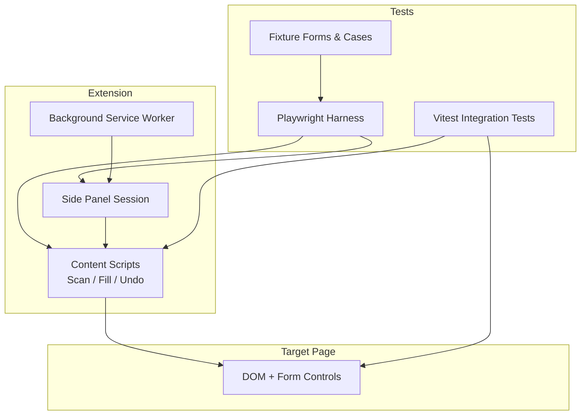
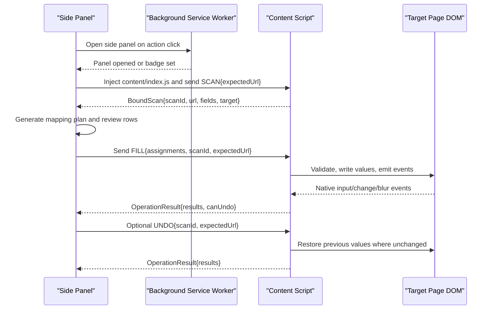
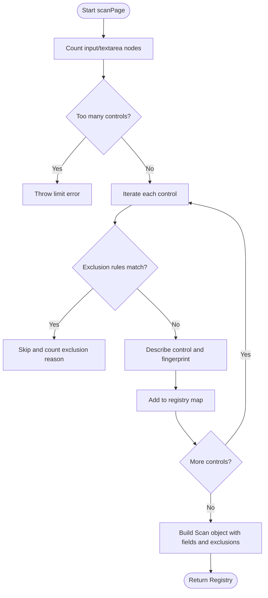
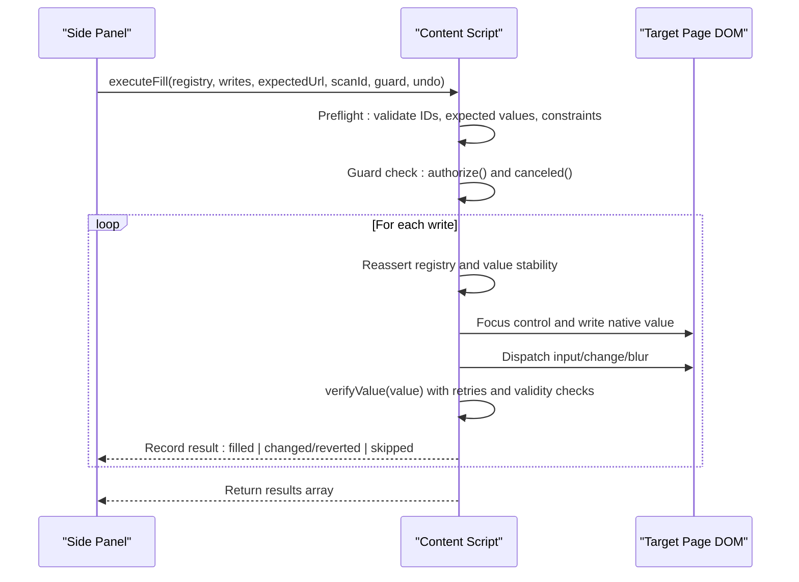
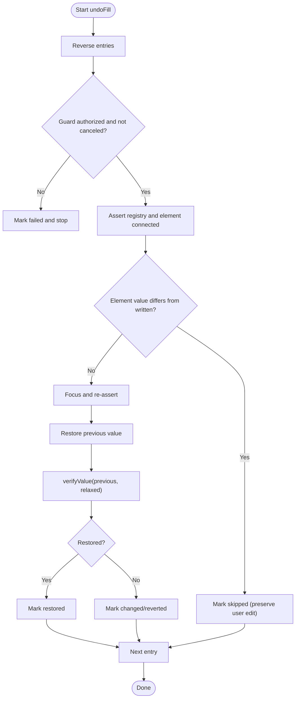
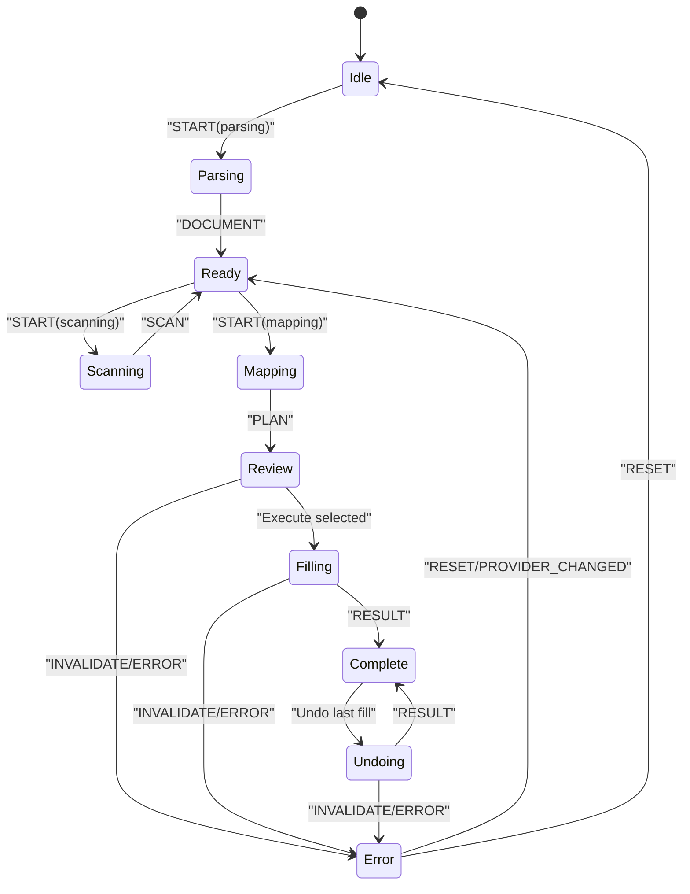
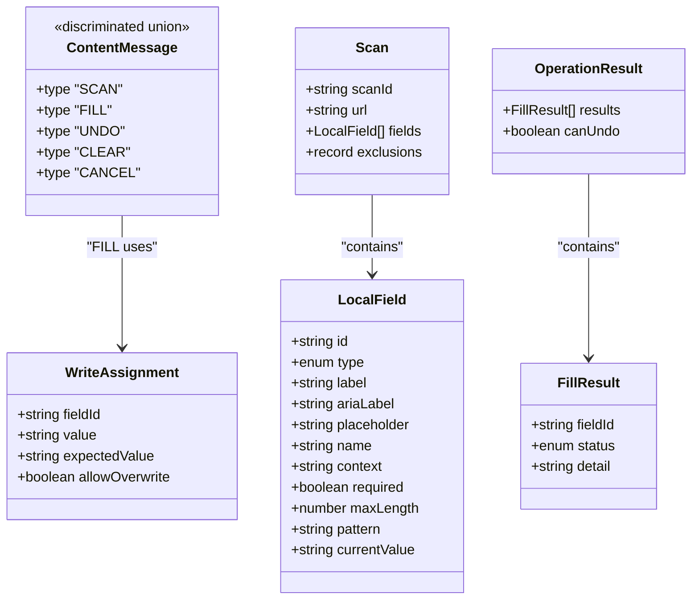
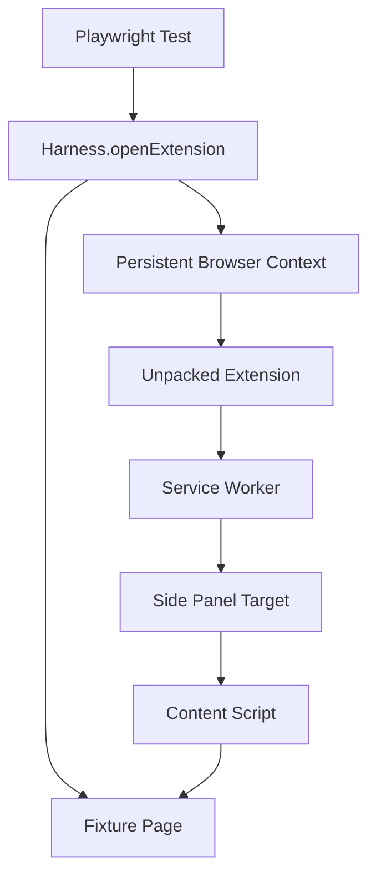
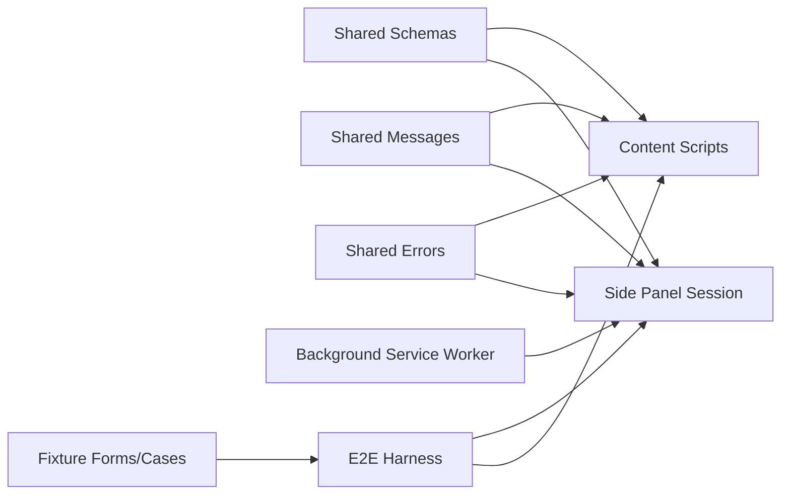

# Integration Testing

<cite>
**Referenced Files in This Document**
- [filler.test.ts](file://tests/integration/filler.test.ts)
- [extension.spec.ts](file://tests/e2e/extension.spec.ts)
- [workflow.spec.ts](file://tests/e2e/workflow.spec.ts)
- [harness.ts](file://tests/e2e/harness.ts)
- [fill.ts](file://src/content/fill.ts)
- [scan.ts](file://src/content/scan.ts)
- [undo.ts](file://src/content/undo.ts)
- [messages.ts](file://src/shared/messages.ts)
- [schemas.ts](file://src/shared/schemas.ts)
- [session.ts](file://src/sidepanel/session.ts)
- [service-worker.ts](file://src/background/service-worker.ts)
- [forms.tsx](file://tests/fixtures/forms.tsx)
- [cases.ts](file://tests/fixtures/cases.ts)
- [playwright.config.ts](file://playwright.config.ts)
- [vitest.config.ts](file://vitest.config.ts)
</cite>

## Table of Contents
1. Introduction
2. Project Structure
3. Core Components
4. Architecture Overview
5. Detailed Component Analysis
6. Dependency Analysis
7. Performance Considerations
8. Troubleshooting Guide
9. Conclusion
10. Appendices

## Introduction
This document provides comprehensive integration testing guidance for the Help Me Fill extension, focusing on cross-module interactions across the background service worker, side panel UI, content script, and target web page. It covers end-to-end workflows from PDF upload through field population, session state management, message passing between extension contexts, and robust strategies to validate data flow and error propagation across module boundaries. It also includes environment setup for simulating browser extension APIs, mocking DOM interactions, validating state transitions, handling asynchronous operations, verifying side effects, debugging integration failures, and performance considerations when running tests.

## Project Structure
The repository separates concerns into:
- Content scripts that scan and fill forms, and support undo
- Shared schemas and messages used by all modules
- Side panel session state machine orchestrating scanning, mapping, review, filling, and undo
- Background service worker managing permissions and active tab checks
- E2E harness that loads the unpacked extension, attaches to the side panel via CDP, and drives a fixture form page
- Integration tests using jsdom to exercise content logic with mocked DOM and timers
- Fixtures that generate synthetic scenarios and serve a test form page

**Diagram sources**
- [service-worker.ts:1-29](file://src/background/service-worker.ts#L1-L29)
- [session.ts:1-86](file://src/sidepanel/session.ts#L1-L86)
- [scan.ts:1-88](file://src/content/scan.ts#L1-L88)
- [fill.ts:1-82](file://src/content/fill.ts#L1-L82)
- [undo.ts:1-29](file://src/content/undo.ts#L1-L29)
- [harness.ts:1-90](file://tests/e2e/harness.ts#L1-L90)
- [filler.test.ts:1-130](file://tests/integration/filler.test.ts#L1-L130)
- [forms.tsx:1-48](file://tests/fixtures/forms.tsx#L1-L48)

**Section sources**
- [playwright.config.ts:1-14](file://playwright.config.ts#L1-L14)
- [vitest.config.ts:1-3](file://vitest.config.ts#L1-L3)
- [harness.ts:1-90](file://tests/e2e/harness.ts#L1-L90)
- [filler.test.ts:1-130](file://tests/integration/filler.test.ts#L1-L130)

## Core Components
- Content scanner: discovers eligible text controls, builds descriptors, fingerprints fields, and enforces safety limits and exclusions.
- Filler: validates assignments, executes writes safely, emits native events, verifies persistence, and records undo entries.
- Undo: restores previous values while preserving subsequent user edits and guarding against changes during execution.
- Side panel session: manages phases (idle, parsing, scanning, ready, mapping, review, filling, complete, undoing), sends typed messages to content, and validates responses.
- Background service worker: configures storage access levels, opens side panel on action click, and validates active tab context.
- Shared schemas and messages: define strict contracts for scans, mappings, assignments, results, and inter-context messages.

Key responsibilities and interactions are validated by:
- Integration tests that mock DOM and timers to assert safe execution paths and error conditions
- E2E tests that drive real extension behavior across background, side panel, and content scripts with a live fixture page

**Section sources**
- [scan.ts:1-88](file://src/content/scan.ts#L1-L88)
- [fill.ts:1-82](file://src/content/fill.ts#L1-L82)
- [undo.ts:1-29](file://src/content/undo.ts#L1-L29)
- [session.ts:1-86](file://src/sidepanel/session.ts#L1-L86)
- [service-worker.ts:1-29](file://src/background/service-worker.ts#L1-L29)
- [messages.ts:1-20](file://src/shared/messages.ts#L1-L20)
- [schemas.ts:1-39](file://src/shared/schemas.ts#L1-L39)

## Architecture Overview
The end-to-end workflow spans multiple extension contexts:
- The side panel initiates scanning by injecting the content script and sending a SCAN message to the active tab’s document
- The content script returns a bound scan including a unique document identity and URL
- Mapping generates assignment proposals; the user reviews and selects fields to fill
- The side panel sends a FILL message with assignments; the content script executes writes safely and returns per-field results
- Undo reverses successful writes while preserving later user edits

**Diagram sources**
- [service-worker.ts:1-29](file://src/background/service-worker.ts#L1-L29)
- [session.ts:44-86](file://src/sidepanel/session.ts#L44-L86)
- [messages.ts:1-20](file://src/shared/messages.ts#L1-L20)
- [fill.ts:42-82](file://src/content/fill.ts#L42-L82)
- [undo.ts:6-29](file://src/content/undo.ts#L6-L29)

## Detailed Component Analysis

### Content Scanner Integration
The scanner enumerates eligible text controls, constructs descriptors, excludes sensitive or unsupported controls, and enforces limits. It produces a registry containing both serialized field descriptors and live references for later validation.

**Diagram sources**
- [scan.ts:62-76](file://src/content/scan.ts#L62-L76)
- [scan.ts:32-61](file://src/content/scan.ts#L32-L61)

**Section sources**
- [scan.ts:1-88](file://src/content/scan.ts#L1-L88)
- [filler.test.ts:22-46](file://tests/integration/filler.test.ts#L22-L46)

### Filler Execution and Validation
The filler performs preflight validation, ensures no stale or changed targets, applies values safely, emits native events, verifies persistence, and records undo entries. It supports authorization and cancellation guards and reports granular per-field results.

**Diagram sources**
- [fill.ts:8-41](file://src/content/fill.ts#L8-L41)
- [fill.ts:42-82](file://src/content/fill.ts#L42-L82)

**Section sources**
- [fill.ts:1-82](file://src/content/fill.ts#L1-L82)
- [filler.test.ts:47-113](file://tests/integration/filler.test.ts#L47-L113)

### Undo Flow
Undo iterates recorded entries in reverse, revalidates the registry and element state, restores previous values only if unchanged, and preserves subsequent user edits.

**Diagram sources**
- [undo.ts:6-29](file://src/content/undo.ts#L6-L29)
- [fill.ts:28-41](file://src/content/fill.ts#L28-L41)

**Section sources**
- [undo.ts:1-29](file://src/content/undo.ts#L1-L29)
- [filler.test.ts:109-128](file://tests/integration/filler.test.ts#L109-L128)

### Side Panel Session State Machine
The side panel maintains a phase-based session that transitions through parsing, scanning, ready, mapping, review, filling, complete, and undoing. It validates active targets, sends typed messages, and parses responses strictly.

**Diagram sources**
- [session.ts:8-42](file://src/sidepanel/session.ts#L8-L42)

**Section sources**
- [session.ts:1-86](file://src/sidepanel/session.ts#L1-L86)

### Message Contracts and Data Models
Messages and schemas enforce strict contracts for scanning, filling, and undo operations, limiting payload sizes and ensuring type safety across contexts.

**Diagram sources**
- [messages.ts:1-20](file://src/shared/messages.ts#L1-L20)
- [schemas.ts:1-39](file://src/shared/schemas.ts#L1-L39)

**Section sources**
- [messages.ts:1-20](file://src/shared/messages.ts#L1-L20)
- [schemas.ts:1-39](file://src/shared/schemas.ts#L1-L39)

### E2E Harness and Fixture Environment
The Playwright harness launches a persistent browser context, loads the unpacked extension, attaches to the side panel via CDP, and drives a fixture form page. It exposes methods to interact with the panel, upload files, evaluate expressions, and capture screenshots. Fixture forms render native, React, and Vue variants based on query parameters and provide controlled inputs and outputs for assertions.

**Diagram sources**
- [harness.ts:1-90](file://tests/e2e/harness.ts#L1-L90)
- [forms.tsx:1-48](file://tests/fixtures/forms.tsx#L1-L48)

**Section sources**
- [harness.ts:1-90](file://tests/e2e/harness.ts#L1-L90)
- [forms.tsx:1-48](file://tests/fixtures/forms.tsx#L1-L48)
- [cases.ts:1-27](file://tests/fixtures/cases.ts#L1-L27)
- [playwright.config.ts:1-14](file://playwright.config.ts#L1-L14)

## Dependency Analysis
- Content scripts depend on shared schemas and errors for validation and messaging
- Side panel depends on background service worker for permissions and active tab checks, and on content scripts for scanning and filling
- E2E tests depend on the harness to orchestrate extension lifecycle and fixture pages
- Integration tests depend on jsdom and fake timers to simulate DOM and async behavior

**Diagram sources**
- [schemas.ts:1-39](file://src/shared/schemas.ts#L1-L39)
- [messages.ts:1-20](file://src/shared/messages.ts#L1-L20)
- [service-worker.ts:1-29](file://src/background/service-worker.ts#L1-L29)
- [session.ts:1-86](file://src/sidepanel/session.ts#L1-L86)
- [harness.ts:1-90](file://tests/e2e/harness.ts#L1-L90)

**Section sources**
- [schemas.ts:1-39](file://src/shared/schemas.ts#L1-L39)
- [messages.ts:1-20](file://src/shared/messages.ts#L1-L20)
- [service-worker.ts:1-29](file://src/background/service-worker.ts#L1-L29)
- [session.ts:1-86](file://src/sidepanel/session.ts#L1-L86)
- [harness.ts:1-90](file://tests/e2e/harness.ts#L1-L90)

## Performance Considerations
- Use jsdom and fake timers in integration tests to avoid real DOM layout thrashing and to deterministically advance async flows
- Limit scanned fields and values according to schema limits to prevent excessive memory usage during tests
- Prefer targeted assertions over full-page snapshots; capture screenshots only when necessary for diagnostics
- Run E2E tests sequentially with a single worker to reduce flakiness and resource contention
- Avoid unnecessary re-renders in fixture forms; use controlled rerender buttons to isolate state changes

[No sources needed since this section provides general guidance]

## Troubleshooting Guide
Common integration issues and how to diagnose them:
- Stale scan or changed document: ensure scanId and expectedUrl match current tab; re-scan after reloads or route changes
- Unknown or duplicate field ID: validate assignments against the latest registry; reject unknown IDs before any writes
- Overwrite protection: require explicit allowOverwrite when existing values are present
- Constraint violations: pre-validate length, pattern, and type constraints before writing
- Authorization and cancellation: implement guard.authorize and guard.canceled to block unsafe or interrupted operations
- Reverted values: verify persisted values after a short delay and detect page-side reversion
- Undo preservation: confirm that subsequent user edits are preserved during undo

Debugging techniques:
- Capture screenshots at key points in E2E tests to visualize state
- Log operation results and details to identify which fields failed and why
- Use CDP to inspect side panel and content script targets and messages
- In integration tests, stub requestAnimationFrame and timers to control async timing precisely

**Section sources**
- [filler.test.ts:47-128](file://tests/integration/filler.test.ts#L47-L128)
- [extension.spec.ts:99-173](file://tests/e2e/extension.spec.ts#L99-L173)
- [fill.ts:42-82](file://src/content/fill.ts#L42-L82)
- [undo.ts:6-29](file://src/content/undo.ts#L6-L29)
- [session.ts:44-86](file://src/sidepanel/session.ts#L44-L86)

## Conclusion
The Help Me Fill extension employs strict contracts and layered validation to ensure safe, reversible form filling across extension contexts. Integration tests using jsdom validate content logic under controlled DOM and timer environments, while E2E tests exercise production behaviors including permission checks, message routing, and side panel state transitions. By combining schema-driven messaging, guarded execution, and robust verification, the system reliably handles complex workflows, asynchronous operations, and error propagation. The provided harness and fixtures enable repeatable, observable testing of the entire pipeline from PDF upload to field population and undo.

[No sources needed since this section summarizes without analyzing specific files]

## Appendices

### Test Environment Setup
- Integration tests: run under jsdom with restoreMocks enabled; stub DOM APIs and timers to simulate realistic interactions deterministically
- E2E tests: launch Chromium-based browsers with extensions enabled; load unpacked dist; attach to side panel via CDP; serve fixture forms locally

**Section sources**
- [vitest.config.ts:1-3](file://vitest.config.ts#L1-L3)
- [playwright.config.ts:1-14](file://playwright.config.ts#L1-L14)
- [harness.ts:1-90](file://tests/e2e/harness.ts#L1-L90)

### Examples of Complex Workflows
- Full workflow: upload PDF, parse locally, scan page, generate suggestions, review, fill selected fields, verify results, perform conditional undo, and persist state without leaking secrets
- Interruption handling: cancel, tab switch, or panel close should stop remaining writes and preserve partial results

**Section sources**
- [workflow.spec.ts:6-78](file://tests/e2e/workflow.spec.ts#L6-L78)
- [extension.spec.ts:129-173](file://tests/e2e/extension.spec.ts#L129-L173)

### Asynchronous Operations and Side Effects
- Native event emission: ensure input, change, and blur events fire when writing values
- Verification delays: wait for frame callbacks and short sleeps to confirm persistence and validity
- Port acknowledgments: side panel waits for content script readiness before sending FILL/UNDO

**Section sources**
- [fill.ts:17-41](file://src/content/fill.ts#L17-L41)
- [session.ts:71-86](file://src/sidepanel/session.ts#L71-L86)