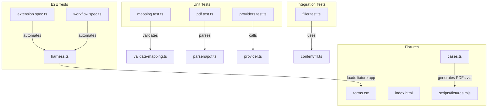
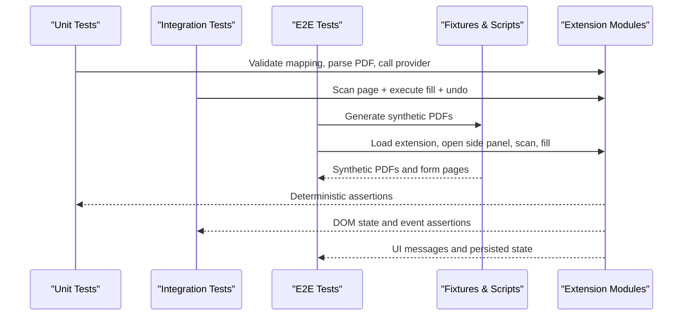
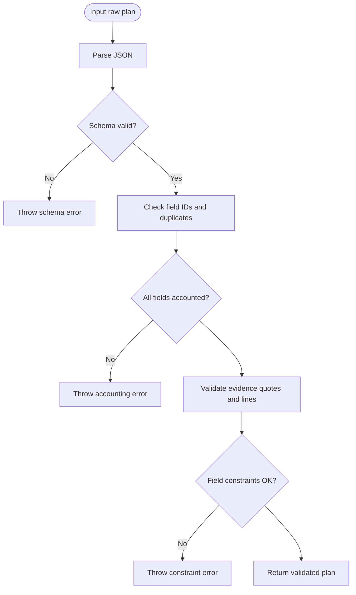
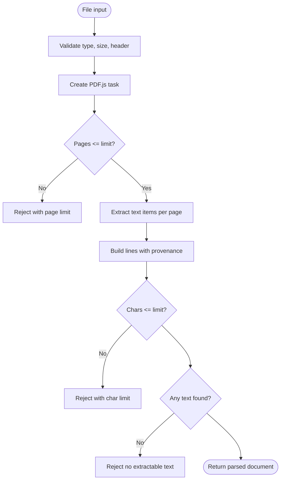
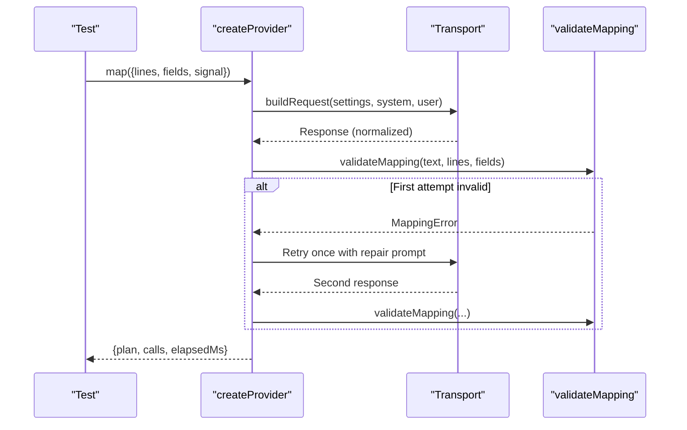
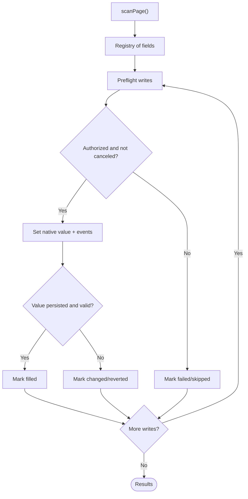
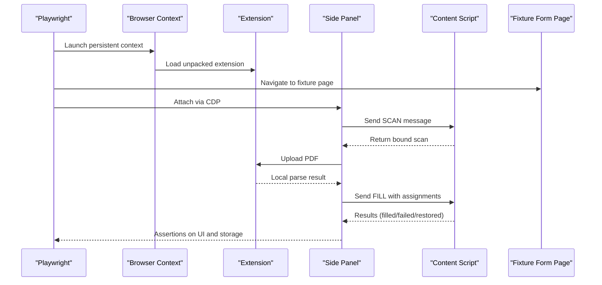
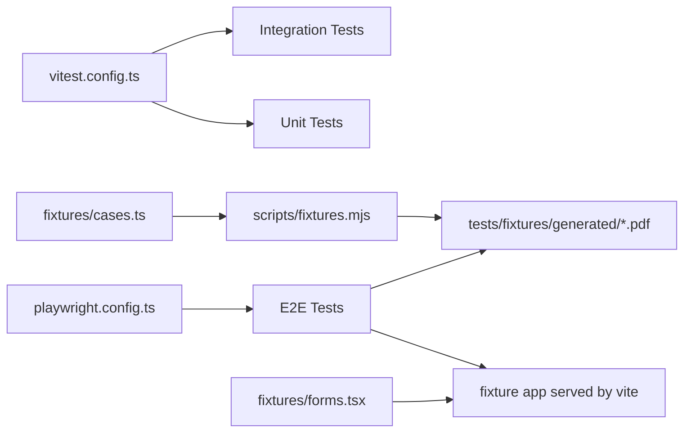

# Testing

<cite>
**Referenced Files in This Document**
- [package.json](file://package.json)
- [vitest.config.ts](file://vitest.config.ts)
- [playwright.config.ts](file://playwright.config.ts)
- [tests/unit/mapping.test.ts](file://tests/unit/mapping.test.ts)
- [tests/unit/pdf.test.ts](file://tests/unit/pdf.test.ts)
- [tests/unit/providers.test.ts](file://tests/unit/providers.test.ts)
- [tests/integration/filler.test.ts](file://tests/integration/filler.test.ts)
- [tests/e2e/extension.spec.ts](file://tests/e2e/extension.spec.ts)
- [tests/e2e/workflow.spec.ts](file://tests/e2e/workflow.spec.ts)
- [tests/e2e/harness.ts](file://tests/e2e/harness.ts)
- [tests/fixtures/cases.ts](file://tests/fixtures/cases.ts)
- [tests/fixtures/forms.tsx](file://tests/fixtures/forms.tsx)
- [tests/fixtures/index.html](file://tests/fixtures/index.html)
- [scripts/fixtures.mjs](file://scripts/fixtures.mjs)
- [src/ai/validate-mapping.ts](file://src/ai/validate-mapping.ts)
- [src/parsers/pdf.ts](file://src/parsers/pdf.ts)
- [src/ai/provider.ts](file://src/ai/provider.ts)
- [src/content/fill.ts](file://src/content/fill.ts)
</cite>

## Table of Contents
1. Introduction
2. Project Structure
3. Core Components
4. Architecture Overview
5. Detailed Component Analysis
6. Dependency Analysis
7. Performance Considerations
8. Troubleshooting Guide
9. Conclusion
10. Appendices

## Introduction
This document explains the testing strategy for the Help Me Fill extension across unit, integration, and end-to-end layers. It covers fixtures setup, mocking strategies for external dependencies (AI providers and PDF parsing), browser automation with Playwright, utilities and assertion patterns, debugging techniques, guidance for writing new tests, running suites, interpreting results, and continuous integration considerations.

## Project Structure
The repository organizes tests by layer:
- Unit tests under tests/unit validate isolated modules such as mapping validation, PDF parsing, and AI provider transport behavior.
- Integration tests under tests/integration exercise cross-module flows like scanning a page and executing safe fills with undo support.
- End-to-end tests under tests/e2e automate a real extension installed into a persistent Chromium context, exercising the side panel, content scripts, and messaging.

**Diagram sources**
- [tests/unit/mapping.test.ts:1-64](file://tests/unit/mapping.test.ts#L1-L64)
- [tests/unit/pdf.test.ts:1-45](file://tests/unit/pdf.test.ts#L1-L45)
- [tests/unit/providers.test.ts:1-69](file://tests/unit/providers.test.ts#L1-L69)
- [tests/integration/filler.test.ts:1-130](file://tests/integration/filler.test.ts#L1-L130)
- [tests/e2e/extension.spec.ts:1-173](file://tests/e2e/extension.spec.ts#L1-L173)
- [tests/e2e/workflow.spec.ts:1-78](file://tests/e2e/workflow.spec.ts#L1-L78)
- [tests/e2e/harness.ts:1-90](file://tests/e2e/harness.ts#L1-L90)
- [tests/fixtures/cases.ts:1-27](file://tests/fixtures/cases.ts#L1-L27)
- [tests/fixtures/forms.tsx:1-48](file://tests/fixtures/forms.tsx#L1-L48)
- [tests/fixtures/index.html:1-4](file://tests/fixtures/index.html#L1-L4)
- [scripts/fixtures.mjs:1-35](file://scripts/fixtures.mjs#L1-L35)
- [src/ai/validate-mapping.ts:1-33](file://src/ai/validate-mapping.ts#L1-L33)
- [src/parsers/pdf.ts:1-87](file://src/parsers/pdf.ts#L1-L87)
- [src/ai/provider.ts:1-107](file://src/ai/provider.ts#L1-L107)
- [src/content/fill.ts:1-82](file://src/content/fill.ts#L1-L82)

**Section sources**
- [package.json:7-15](file://package.json#L7-L15)
- [vitest.config.ts:1-3](file://vitest.config.ts#L1-L3)
- [playwright.config.ts:1-14](file://playwright.config.ts#L1-L14)

## Core Components
- Mapping validation: Ensures model outputs are valid JSON, conform to schema, account for all fields, cite evidence correctly, respect field constraints, and avoid extra properties.
- PDF parsing: Validates file type and size, enforces page and character limits, reconstructs lines with provenance, handles cancellation, password protection, and OCR absence.
- AI provider: Builds per-provider requests, normalizes responses, validates mapping output, retries once on schema errors without leaking untrusted text, enforces timeouts and response size limits, and avoids retrying transient network failures.
- Content fill execution: Preflights writes, verifies target stability, sets native values safely, emits events, re-validates after DOM changes, supports undo, and stops on interruptions.

**Section sources**
- [src/ai/validate-mapping.ts:1-33](file://src/ai/validate-mapping.ts#L1-L33)
- [src/parsers/pdf.ts:1-87](file://src/parsers/pdf.ts#L1-L87)
- [src/ai/provider.ts:1-107](file://src/ai/provider.ts#L1-L107)
- [src/content/fill.ts:1-82](file://src/content/fill.ts#L1-L82)

## Architecture Overview
The test architecture spans three layers:

**Diagram sources**
- [tests/unit/mapping.test.ts:1-64](file://tests/unit/mapping.test.ts#L1-L64)
- [tests/unit/pdf.test.ts:1-45](file://tests/unit/pdf.test.ts#L1-L45)
- [tests/unit/providers.test.ts:1-69](file://tests/unit/providers.test.ts#L1-L69)
- [tests/integration/filler.test.ts:1-130](file://tests/integration/filler.test.ts#L1-L130)
- [tests/e2e/extension.spec.ts:1-173](file://tests/e2e/extension.spec.ts#L1-L173)
- [tests/e2e/workflow.spec.ts:1-78](file://tests/e2e/workflow.spec.ts#L1-L78)
- [scripts/fixtures.mjs:1-35](file://scripts/fixtures.mjs#L1-L35)

## Detailed Component Analysis

### Unit Tests: Mapping Validation
- Purpose: Verify that model-generated mapping plans are strictly validated against schema, field constraints, and cited evidence.
- Key behaviors tested:
  - Preserves Unicode and exact source evidence.
  - Rejects non-JSON, extra properties, unknown or duplicate field IDs, missing accounting for all fields, fabricated values, wrong line citations, whitespace-only values, and maxlength violations.
  - Confirms compacting fields does not leak current values.
  - Benchmarks ensure synthetic oracle integrity and review defaults.

**Diagram sources**
- [src/ai/validate-mapping.ts:1-33](file://src/ai/validate-mapping.ts#L1-L33)
- [tests/unit/mapping.test.ts:1-64](file://tests/unit/mapping.test.ts#L1-L64)

**Section sources**
- [tests/unit/mapping.test.ts:1-64](file://tests/unit/mapping.test.ts#L1-L64)
- [src/ai/validate-mapping.ts:1-33](file://src/ai/validate-mapping.ts#L1-L33)

### Unit Tests: PDF Parsing
- Purpose: Validate guards and provenance for PDF extraction using pdfjs-dist.
- Key behaviors tested:
  - Rejects non-PDF, oversized, empty files.
  - Reconstructs lines with page references and preserves Unicode/zeros.
  - Enforces page limit and destroys tasks.
  - Rejects no-text PDFs without pretending OCR happened.
  - Rejects text limits without truncation.
  - Honors cancellation before creating a task.
  - Rejects password prompts instead of waiting indefinitely.

**Diagram sources**
- [src/parsers/pdf.ts:1-87](file://src/parsers/pdf.ts#L1-L87)
- [tests/unit/pdf.test.ts:1-45](file://tests/unit/pdf.test.ts#L1-L45)

**Section sources**
- [tests/unit/pdf.test.ts:1-45](file://tests/unit/pdf.test.ts#L1-L45)
- [src/parsers/pdf.ts:1-87](file://src/parsers/pdf.ts#L1-L87)

### Unit Tests: AI Provider Transport
- Purpose: Ensure request construction, response normalization, safety, and failure handling across OpenAI-compatible, Anthropic, and Gemini transports.
- Key behaviors tested:
  - Uses fixed host and header credentials; never leaks API keys in URL/body.
  - Normalizes provider-specific responses and validates mapping.
  - Stops after two invalid JSON responses; repairs schema once without sending untrusted output back.
  - Does not retry HTTP errors or network failures; respects abort signals and timeouts.
  - Rejects refusal/truncated responses and oversized payloads.

**Diagram sources**
- [src/ai/provider.ts:1-107](file://src/ai/provider.ts#L1-L107)
- [tests/unit/providers.test.ts:1-69](file://tests/unit/providers.test.ts#L1-L69)

**Section sources**
- [tests/unit/providers.test.ts:1-69](file://tests/unit/providers.test.ts#L1-L69)
- [src/ai/provider.ts:1-107](file://src/ai/provider.ts#L1-L107)

### Integration Tests: Scanner and Safe Fill
- Purpose: Validate scanning of a live DOM and safe execution of fills with undo, including edge cases like changed labels, replaced elements, added fields, and controlled inputs.
- Key behaviors tested:
  - Extracts labels, roles, IDs, and context; prefers aria-labelledby; excludes hidden/disabled/password/readonly/payment controls.
  - Rejects too many fields without partial results.
  - Fills native inputs, emits events, and avoids submitting forms.
  - Preflights writes to prevent partial mutations on later invalid fields.
  - Detects value changes, structure changes, and post-render reversion.
  - Undo restores only unchanged writes and tolerates controlled synchronization.

**Diagram sources**
- [tests/integration/filler.test.ts:1-130](file://tests/integration/filler.test.ts#L1-L130)
- [src/content/fill.ts:1-82](file://src/content/fill.ts#L1-L82)

**Section sources**
- [tests/integration/filler.test.ts:1-130](file://tests/integration/filler.test.ts#L1-L130)
- [src/content/fill.ts:1-82](file://src/content/fill.ts#L1-L82)

### End-to-End Tests: Extension Automation
- Purpose: Exercise the full user workflow in a real browser with the unpacked extension loaded, including PDF upload, local parsing, tab scanning, AI-driven suggestions, consent, filling, undo, and persistence checks.
- Harness capabilities:
  - Launches a persistent Chromium context with extensions enabled.
  - Loads the unpacked extension and attaches to the side panel via CDP.
  - Provides helpers to click buttons, enter values, upload files, evaluate panel code, and capture screenshots.
- Scenarios covered:
  - Production sidebar parses a bilingual PDF and scans the real tab.
  - Packaged PDF worker extracts every benchmark case and rejects known failure fixtures.
  - Reload and tab switches invalidate scans without retargeting.
  - Production executor refuses unconfirmed, invalid, stale, overwritten targets.
  - Interruptions (cancel, tab switch, panel close) stop remaining writes.
  - Full workflow: enable provider, upload PDF, scan, send to AI, review, fill selected, verify values, undo, and confirm secrets are not persisted.

**Diagram sources**
- [tests/e2e/harness.ts:1-90](file://tests/e2e/harness.ts#L1-L90)
- [tests/e2e/extension.spec.ts:1-173](file://tests/e2e/extension.spec.ts#L1-L173)
- [tests/e2e/workflow.spec.ts:1-78](file://tests/e2e/workflow.spec.ts#L1-L78)

**Section sources**
- [tests/e2e/harness.ts:1-90](file://tests/e2e/harness.ts#L1-L90)
- [tests/e2e/extension.spec.ts:1-173](file://tests/e2e/extension.spec.ts#L1-L173)
- [tests/e2e/workflow.spec.ts:1-78](file://tests/e2e/workflow.spec.ts#L1-L78)

## Dependency Analysis
- Test configuration:
  - Vitest runs unit and integration tests in jsdom with mock restoration.
  - Playwright config defines projects for Chrome and Edge, a web server serving fixtures, and appropriate timeouts/reporters.
- Fixtures:
  - Synthetic benchmark cases define expected fields and contexts.
  - Fixture generator creates synthetic PDFs and failure fixtures used by both unit and e2e tests.
  - Fixture app renders native, React, and Vue forms for consistent scanning and filling.

**Diagram sources**
- [vitest.config.ts:1-3](file://vitest.config.ts#L1-L3)
- [playwright.config.ts:1-14](file://playwright.config.ts#L1-L14)
- [tests/fixtures/cases.ts:1-27](file://tests/fixtures/cases.ts#L1-L27)
- [scripts/fixtures.mjs:1-35](file://scripts/fixtures.mjs#L1-L35)
- [tests/fixtures/forms.tsx:1-48](file://tests/fixtures/forms.tsx#L1-L48)

**Section sources**
- [vitest.config.ts:1-3](file://vitest.config.ts#L1-L3)
- [playwright.config.ts:1-14](file://playwright.config.ts#L1-L14)
- [tests/fixtures/cases.ts:1-27](file://tests/fixtures/cases.ts#L1-L27)
- [scripts/fixtures.mjs:1-35](file://scripts/fixtures.mjs#L1-L35)
- [tests/fixtures/forms.tsx:1-48](file://tests/fixtures/forms.tsx#L1-L48)

## Performance Considerations
- Use jsdom for fast unit tests; keep heavy operations mocked where possible.
- Limit PDF parsing in tests to small synthetic documents; enforce page and character limits to avoid slow runs.
- For e2e, run one worker at a time to avoid flakiness when interacting with the same fixture page.
- Avoid unnecessary retries in provider tests; assert single attempts for network failures and specific HTTP statuses.

[No sources needed since this section provides general guidance]

## Troubleshooting Guide
- Common issues and how tests handle them:
  - Invalid or oversized model output: Mapping validation throws descriptive errors; provider tests assert rejection paths and limited retries.
  - No extractable text or password-protected PDFs: Parser tests assert explicit rejections and resource cleanup.
  - Target instability during fill: Integration tests assert detection of changed labels, replaced elements, added fields, and reverted values; e2e tests cover reload and tab switch invalidation.
  - Interruptions: E2E tests simulate cancel, tab switch, and panel close to ensure remaining writes stop.
- Debugging tips:
  - E2E screenshots: Tests capture screenshots of the sidebar and verified workflow for visual inspection.
  - Persistent profiles: Playwright harness uses a persistent context directory per test run to isolate state.
  - CDP session: Harness attaches to the side panel via CDP to interact with extension internals without modifying shipped code.
  - Fake timers: Integration tests use fake timers to control async flows deterministically.

**Section sources**
- [tests/e2e/extension.spec.ts:1-173](file://tests/e2e/extension.spec.ts#L1-L173)
- [tests/e2e/workflow.spec.ts:1-78](file://tests/e2e/workflow.spec.ts#L1-L78)
- [tests/integration/filler.test.ts:1-130](file://tests/integration/filler.test.ts#L1-L130)
- [tests/unit/providers.test.ts:1-69](file://tests/unit/providers.test.ts#L1-L69)
- [tests/unit/pdf.test.ts:1-45](file://tests/unit/pdf.test.ts#L1-L45)

## Conclusion
The testing strategy combines deterministic unit tests, realistic integration tests over a simulated DOM, and robust end-to-end automation of the extension’s full workflow. Fixtures and generators provide reproducible inputs, while mocks and harnesses isolate external dependencies. The suite validates correctness, safety, resilience, and privacy across all layers.

[No sources needed since this section summarizes without analyzing specific files]

## Appendices

### Running Tests
- Unit and integration tests:
  - Run the full suite: npm test
  - Watch mode: npm run test:watch
- End-to-end tests:
  - Build and run: npm run test:e2e
  - Generate fixtures: npm run fixtures
  - Serve fixture app locally: npm run fixtures:serve

**Section sources**
- [package.json:7-15](file://package.json#L7-L15)

### Writing New Tests
- Unit tests:
  - Place under tests/unit and import from src modules.
  - Mock external libraries (e.g., pdfjs-dist) and globals (e.g., chrome) as needed.
  - Assert both success and failure paths, including error messages and side effects.
- Integration tests:
  - Set up a minimal DOM in beforeEach and stub layout APIs if necessary.
  - Use fake timers to control async flows and ensure deterministic assertions.
  - Validate scanner behavior and safe execution, including undo.
- E2E tests:
  - Use harness helpers to open the extension, attach to the side panel, and interact with it.
  - Leverage generated PDFs and fixture forms for consistent scenarios.
  - Capture screenshots and attach artifacts for failing runs.

**Section sources**
- [tests/unit/pdf.test.ts:1-45](file://tests/unit/pdf.test.ts#L1-L45)
- [tests/integration/filler.test.ts:1-130](file://tests/integration/filler.test.ts#L1-L130)
- [tests/e2e/harness.ts:1-90](file://tests/e2e/harness.ts#L1-L90)
- [scripts/fixtures.mjs:1-35](file://scripts/fixtures.mjs#L1-L35)

### Continuous Integration and Coverage
- CI recommendations:
  - Install dependencies and generate fixtures before running e2e tests.
  - Run unit and integration tests first for quick feedback.
  - Run e2e tests with a single worker to reduce flakiness.
  - Persist Playwright HTML reports and screenshots as artifacts.
- Coverage:
  - Configure Vitest coverage for unit and integration tests to track module coverage.
  - Exclude vendor and generated directories from coverage thresholds.
  - Enforce minimum coverage thresholds in CI to maintain quality.

[No sources needed since this section provides general guidance]