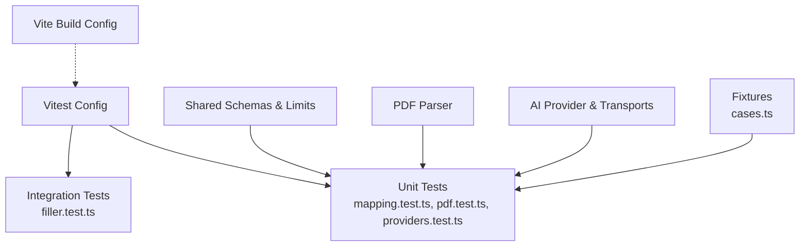
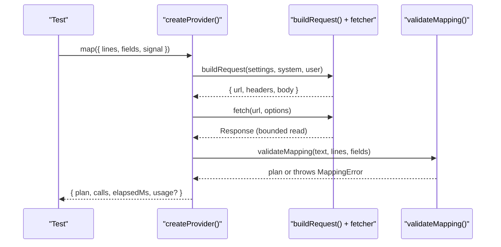
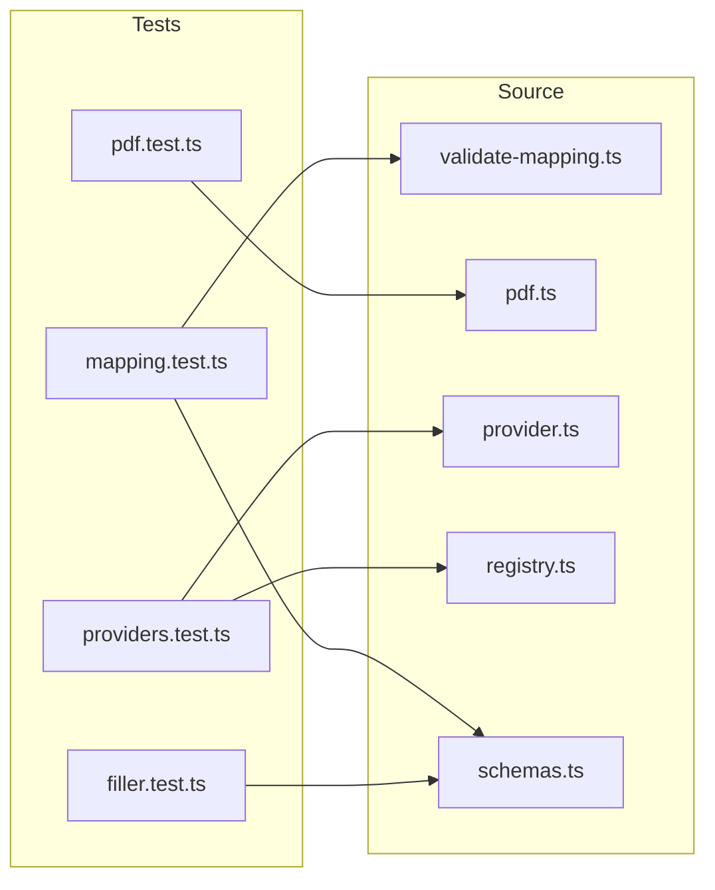

# Unit Testing

<cite>
**Referenced Files in This Document**
- [vitest.config.ts](file://vitest.config.ts)
- [package.json](file://package.json)
- [vite.config.ts](file://vite.config.ts)
- [tests/unit/mapping.test.ts](file://tests/unit/mapping.test.ts)
- [tests/unit/pdf.test.ts](file://tests/unit/pdf.test.ts)
- [tests/unit/providers.test.ts](file://tests/unit/providers.test.ts)
- [tests/integration/filler.test.ts](file://tests/integration/filler.test.ts)
- [tests/fixtures/cases.ts](file://tests/fixtures/cases.ts)
- [src/ai/validate-mapping.ts](file://src/ai/validate-mapping.ts)
- [src/parsers/pdf.ts](file://src/parsers/pdf.ts)
- [src/ai/provider.ts](file://src/ai/provider.ts)
- [src/ai/registry.ts](file://src/ai/registry.ts)
- [src/shared/schemas.ts](file://src/shared/schemas.ts)
</cite>

## Table of Contents
1. [Introduction](#introduction)
2. [Project Structure](#project-structure)
3. [Core Components](#core-components)
4. [Architecture Overview](#architecture-overview)
5. [Detailed Component Analysis](#detailed-component-analysis)
6. [Dependency Analysis](#dependency-analysis)
7. [Performance Considerations](#performance-considerations)
8. [Troubleshooting Guide](#troubleshooting-guide)
9. [Conclusion](#conclusion)
10. [Appendices](#appendices)

## Introduction
This document explains how unit testing is set up and used in the Help Me Fill extension. It covers Vitest configuration, test organization, mocking strategies for external dependencies (AI providers and PDF parsing), patterns for writing effective tests for mapping validation, provider integrations, and PDF processing functions. It also documents fixtures, assertion patterns, isolation techniques, async and error handling scenarios, and how to run and maintain tests.

## Project Structure
The project uses Vitest for unit and integration tests with a jsdom environment. Tests are organized under:
- tests/unit: isolated unit tests for AI mapping validation, PDF parsing, and provider transport behavior
- tests/integration: end-to-end-like flows that exercise content scripts against a synthetic DOM
- tests/fixtures: shared benchmark cases and UI fixtures used by tests

**Diagram sources**
- [vitest.config.ts:1-3](file://vitest.config.ts#L1-L3)
- [vite.config.ts:1-23](file://vite.config.ts#L1-L23)

**Section sources**
- [vitest.config.ts:1-3](file://vitest.config.ts#L1-L3)
- [package.json:7-15](file://package.json#L7-L15)
- [vite.config.ts:1-23](file://vite.config.ts#L1-L23)

## Core Components
- Mapping validation: validates model output against schema and source evidence constraints
- PDF parsing: validates files, extracts text lines, enforces limits, handles cancellation and errors
- AI provider abstraction: builds requests per provider, reads bounded responses, normalizes outputs, retries once on schema repair without leaking untrusted content
- Integration filler: scans DOM, executes safe fills, supports undo, and validates state changes

Key implementation references:
- Mapping validation logic and error types
- PDF parsing pipeline and guards
- Provider request building, response reading, retry and safety checks
- Integration filler flow over a controlled DOM

**Section sources**
- [src/ai/validate-mapping.ts:1-33](file://src/ai/validate-mapping.ts#L1-L33)
- [src/parsers/pdf.ts:1-87](file://src/parsers/pdf.ts#L1-L87)
- [src/ai/provider.ts:1-107](file://src/ai/provider.ts#L1-L107)
- [tests/integration/filler.test.ts:1-130](file://tests/integration/filler.test.ts#L1-L130)

## Architecture Overview
The testing architecture isolates units from external systems using mocks and stubs:
- External HTTP calls to AI providers are intercepted via a custom fetcher passed into createProvider
- PDF.js is mocked at module level to control document parsing outcomes
- DOM interactions are simulated in jsdom with spies and fake timers

**Diagram sources**
- [src/ai/provider.ts:19-107](file://src/ai/provider.ts#L19-L107)
- [src/ai/validate-mapping.ts:7-32](file://src/ai/validate-mapping.ts#L7-L32)

## Detailed Component Analysis

### Mapping Validation Tests
Focus areas:
- JSON validity and schema conformance
- Evidence integrity: quotes must exist on cited lines
- Field accounting: every field must be assigned or explicitly unmapped
- Constraints: length limits, whitespace-only rejection, duplicate detection
- Privacy: compacting fields removes sensitive current values before sending to providers
- Benchmark integrity: frozen synthetic cases ensure stable expectations

Patterns:
- Use describe/it blocks to group behaviors
- Construct minimal FieldDescriptor and MappingPlan inputs
- Assert exact equality for valid plans and specific error messages for invalid ones
- Leverage benchmarkCases to assert structural properties and oracle consistency

Example references:
- Validating Chinese characters and leading zeros preservation
- Rejecting prose, unknown field IDs, duplicates, unsupported values, wrong line citations, maxlength violations
- Ensuring private values are not sent to providers
- Verifying benchmark case counts and unique opportunities

**Section sources**
- [tests/unit/mapping.test.ts:1-64](file://tests/unit/mapping.test.ts#L1-L64)
- [src/ai/validate-mapping.ts:7-32](file://src/ai/validate-mapping.ts#L7-L32)
- [tests/fixtures/cases.ts:1-27](file://tests/fixtures/cases.ts#L1-L27)
- [src/shared/schemas.ts:1-39](file://src/shared/schemas.ts#L1-L39)

### PDF Parsing Tests
Focus areas:
- File validation: reject non-PDF, oversized, empty files
- Line extraction: reconstruct lines with page references, preserve Unicode and identifiers
- Page limit enforcement and task destruction
- Rejection of no-text PDFs without implying OCR
- Text character limit enforcement without truncation
- Cancellation before creating tasks
- Password-protected PDF handling

Mocking strategy:
- Mock pdfjs-dist module to provide getDocument and GlobalWorkerOptions
- Stub chrome.runtime.getURL to return extension URLs
- Provide synthetic TextItem structures to simulate PDF content

Async and error handling:
- AbortController signals to cancel operations
- Promise-based API with explicit rejections for unsupported states
- Ensure cleanup via destroy calls even on error paths

**Section sources**
- [tests/unit/pdf.test.ts:1-45](file://tests/unit/pdf.test.ts#L1-L45)
- [src/parsers/pdf.ts:7-87](file://src/parsers/pdf.ts#L7-L87)

### Provider Integration Tests
Focus areas:
- Per-provider transport correctness: fixed host, header credentials, body sanitization
- Normalization and validation of provider responses across OpenAI-compatible, Anthropic, and Gemini formats
- Safety: never send untrusted model output back; repair once with diagnostic only
- Failure modes: HTTP errors, network failures, timeouts, refusal/truncation, oversized responses
- Cancellation and timing controls

Mocking strategy:
- Pass a custom fetcher to createProvider to intercept HTTP calls
- Return structured envelopes matching each provider’s response shape
- Use vi.fn to assert call counts and request options
- Fake timers to simulate timeouts without real delays

Async and error handling:
- AbortController to prevent starting canceled requests
- Timeouts enforced via AbortController and timer advancement
- No automatic retries beyond one schema repair attempt

**Section sources**
- [tests/unit/providers.test.ts:1-69](file://tests/unit/providers.test.ts#L1-L69)
- [src/ai/provider.ts:15-107](file://src/ai/provider.ts#L15-L107)
- [src/ai/registry.ts:1-13](file://src/ai/registry.ts#L1-L13)

### Integration Filler Tests
Focus areas:
- Scanner behavior: extracting labels, roles, IDs, context; respecting accessibility attributes; excluding hidden/disabled/password/readonly/payment controls
- Safe execution: filling native inputs, emitting events, avoiding form submission
- Integrity checks: rejecting unknown fields, outdated scan IDs, changed labels/replaced elements, added fields
- Overwrite policy: require explicit approval to overwrite nonempty values
- Post-review edits detection and undo functionality
- Controlled textarea synchronization and subsequent user edit preservation

Isolation and timing:
- jsdom setup with synthetic DOM forms
- Spies on geometry APIs and animation frame utilities
- Fake timers to flush asynchronous work deterministically

**Section sources**
- [tests/integration/filler.test.ts:1-130](file://tests/integration/filler.test.ts#L1-L130)

## Dependency Analysis
External dependencies and their test-time treatment:
- pdfjs-dist: mocked to control document parsing and avoid heavy WASM initialization
- chrome runtime APIs: stubbed to return predictable URLs for worker and resources
- fetch: replaced with a custom fetcher to control responses and verify request options
- DOM APIs: spied/stubbed to stabilize layout measurements and event timing

Coupling and cohesion:
- Tests isolate modules by injecting dependencies (e.g., fetcher) rather than altering global state
- Shared schemas and limits centralize constraints, reducing duplication across tests
- Fixtures encapsulate reusable data shapes and scenarios

**Diagram sources**
- [tests/unit/mapping.test.ts:1-64](file://tests/unit/mapping.test.ts#L1-L64)
- [tests/unit/pdf.test.ts:1-45](file://tests/unit/pdf.test.ts#L1-L45)
- [tests/unit/providers.test.ts:1-69](file://tests/unit/providers.test.ts#L1-L69)
- [tests/integration/filler.test.ts:1-130](file://tests/integration/filler.test.ts#L1-L130)
- [src/ai/validate-mapping.ts:1-33](file://src/ai/validate-mapping.ts#L1-L33)
- [src/parsers/pdf.ts:1-87](file://src/parsers/pdf.ts#L1-L87)
- [src/ai/provider.ts:1-107](file://src/ai/provider.ts#L1-L107)
- [src/ai/registry.ts:1-13](file://src/ai/registry.ts#L1-L13)
- [src/shared/schemas.ts:1-39](file://src/shared/schemas.ts#L1-L39)

**Section sources**
- [tests/unit/mapping.test.ts:1-64](file://tests/unit/mapping.test.ts#L1-L64)
- [tests/unit/pdf.test.ts:1-45](file://tests/unit/pdf.test.ts#L1-L45)
- [tests/unit/providers.test.ts:1-69](file://tests/unit/providers.test.ts#L1-L69)
- [tests/integration/filler.test.ts:1-130](file://tests/integration/filler.test.ts#L1-L130)

## Performance Considerations
- Keep unit tests fast by mocking heavy libraries (PDF.js) and avoiding real network calls
- Use fake timers to control async flows deterministically and avoid flaky waits
- Limit fixture sizes; use synthetic data and small payloads where possible
- Prefer targeted assertions over broad snapshots to reduce maintenance overhead

[No sources needed since this section provides general guidance]

## Troubleshooting Guide
Common issues and resolutions:
- Flaky async tests: ensure all timers are flushed using fake timers and await promises fully resolved
- Network-related failures: confirm fetcher is properly injected and returns expected envelopes
- PDF parsing errors: verify mock structure matches pdfjs-dist types and that destroy is called on error paths
- Chrome API dependencies: ensure chrome.runtime.getURL is stubbed consistently in tests that rely on it
- Assertion mismatches: check schema constraints and limits to understand why validation fails

**Section sources**
- [tests/unit/pdf.test.ts:1-45](file://tests/unit/pdf.test.ts#L1-L45)
- [tests/unit/providers.test.ts:1-69](file://tests/unit/providers.test.ts#L1-L69)
- [tests/integration/filler.test.ts:1-130](file://tests/integration/filler.test.ts#L1-L130)

## Conclusion
The test suite demonstrates robust isolation of units through careful mocking and stubbing of external dependencies. Mapping validation, PDF parsing, and provider integrations are covered with focused tests that emphasize safety, error handling, and deterministic behavior. The integration tests validate end-to-end flows within a controlled DOM. Following these patterns ensures reliable, maintainable tests aligned with the application’s constraints and security posture.

[No sources needed since this section summarizes without analyzing specific files]

## Appendices

### How to Run Tests
- Run all tests: npm test
- Watch mode: npm run test:watch
- E2E tests (separate): npm run test:e2e

**Section sources**
- [package.json:7-15](file://package.json#L7-L15)

### Vitest Configuration Summary
- Environment: jsdom
- Include patterns: tests/unit/**/*.test.ts, tests/integration/**/*.test.ts
- Restore mocks between tests for isolation

**Section sources**
- [vitest.config.ts:1-3](file://vitest.config.ts#L1-L3)

### Test Organization Patterns
- Group related behaviors with describe blocks
- Use beforeEach/afterEach to set up and tear down globals and timers
- Centralize shared data in fixtures to keep tests concise and consistent

**Section sources**
- [tests/unit/mapping.test.ts:1-64](file://tests/unit/mapping.test.ts#L1-L64)
- [tests/unit/pdf.test.ts:1-45](file://tests/unit/pdf.test.ts#L1-L45)
- [tests/unit/providers.test.ts:1-69](file://tests/unit/providers.test.ts#L1-L69)
- [tests/integration/filler.test.ts:1-130](file://tests/integration/filler.test.ts#L1-L130)
- [tests/fixtures/cases.ts:1-27](file://tests/fixtures/cases.ts#L1-L27)

### Mocking Strategies
- Module-level mocks for pdfjs-dist to control document parsing
- Custom fetcher injection to intercept and assert HTTP requests/responses
- Stubs for chrome runtime APIs to simulate extension environment
- Spies on DOM APIs to stabilize layout-dependent logic

**Section sources**
- [tests/unit/pdf.test.ts:1-45](file://tests/unit/pdf.test.ts#L1-L45)
- [tests/unit/providers.test.ts:1-69](file://tests/unit/providers.test.ts#L1-L69)
- [tests/integration/filler.test.ts:1-130](file://tests/integration/filler.test.ts#L1-L130)

### Assertion Patterns
- Exact equality for valid mapping plans
- Specific error message assertions for invalid inputs and edge cases
- Call count and argument assertions for mocked functions
- State assertions after async operations using fake timers

**Section sources**
- [tests/unit/mapping.test.ts:1-64](file://tests/unit/mapping.test.ts#L1-L64)
- [tests/unit/providers.test.ts:1-69](file://tests/unit/providers.test.ts#L1-L69)
- [tests/integration/filler.test.ts:1-130](file://tests/integration/filler.test.ts#L1-L130)

### Best Practices for Isolating Units Under Test
- Inject dependencies (e.g., fetcher) instead of relying on globals
- Reset mocks and restore timers between tests
- Use fixtures for complex inputs to keep tests readable
- Validate both success and failure paths explicitly

**Section sources**
- [src/ai/provider.ts:52-107](file://src/ai/provider.ts#L52-L107)
- [tests/unit/providers.test.ts:1-69](file://tests/unit/providers.test.ts#L1-L69)