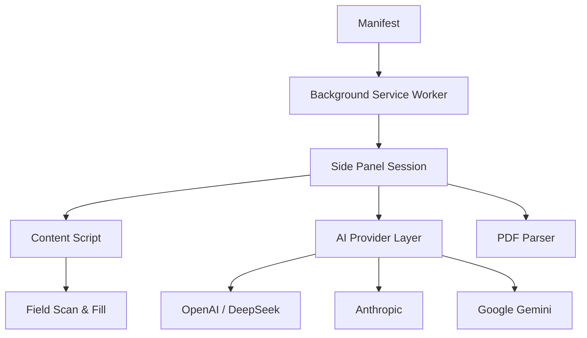
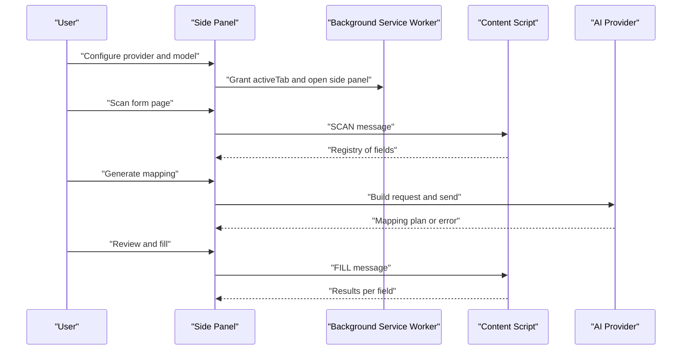
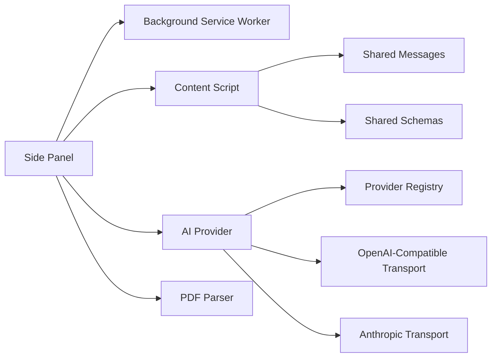

# Troubleshooting

<cite>
**Referenced Files in This Document**
- [manifest.json](file://src/manifest.json)
- [service-worker.ts](file://src/background/service-worker.ts)
- [index.ts](file://src/content/index.ts)
- [fill.ts](file://src/content/fill.ts)
- [session.ts](file://src/sidepanel/session.ts)
- [errors.ts](file://src/shared/errors.ts)
- [messages.ts](file://src/shared/messages.ts)
- [schemas.ts](file://src/shared/schemas.ts)
- [provider.ts](file://src/ai/provider.ts)
- [registry.ts](file://src/ai/registry.ts)
- [openai-compatible.ts](file://src/ai/transports/openai-compatible.ts)
- [anthropic.ts](file://src/ai/transports/anthropic.ts)
- [pdf.ts](file://src/parsers/pdf.ts)
- [ProviderSettings.tsx](file://src/sidepanel/components/ProviderSettings.tsx)
</cite>

## Table of Contents
1. Introduction
2. Project Structure
3. Core Components
4. Architecture Overview
5. Detailed Component Analysis
6. Dependency Analysis
7. Performance Considerations
8. Troubleshooting Guide
9. Conclusion
10. Appendices

## Introduction
This document provides comprehensive troubleshooting guidance for the Help Me Fill extension across installation, configuration, and usage. It covers common issues, error identification, debugging techniques, performance optimization, AI service connectivity problems, rate limiting, fallback strategies, diagnostic steps, browser-specific notes, and known limitations. The goal is to help you quickly identify root causes and resolve them with minimal friction.

## Project Structure
The extension follows a modular architecture:
- Manifest defines permissions, background service worker, side panel, and optional host permissions for AI providers.
- Background service worker configures storage access levels and handles action clicks and active tab checks.
- Content script runs on form pages to scan fields, execute fills, and manage undo/cancel operations.
- Side panel orchestrates sessions, communicates with content scripts, and manages provider settings.
- AI layer builds requests to supported providers and validates responses.
- PDF parser extracts text from documents with strict limits and progress reporting.
- Shared schemas and messages define contracts between components.

**Diagram sources**
- [manifest.json:1-19](file://src/manifest.json#L1-L19)
- [service-worker.ts:1-29](file://src/background/service-worker.ts#L1-L29)
- [session.ts:44-85](file://src/sidepanel/session.ts#L44-L85)
- [index.ts:22-69](file://src/content/index.ts#L22-L69)
- [provider.ts:52-106](file://src/ai/provider.ts#L52-L106)
- [registry.ts:1-13](file://src/ai/registry.ts#L1-L13)
- [pdf.ts:40-86](file://src/parsers/pdf.ts#L40-L86)

**Section sources**
- [manifest.json:1-19](file://src/manifest.json#L1-L19)
- [service-worker.ts:1-29](file://src/background/service-worker.ts#L1-L29)
- [index.ts:1-72](file://src/content/index.ts#L1-L72)
- [session.ts:1-86](file://src/sidepanel/session.ts#L1-L86)
- [provider.ts:1-107](file://src/ai/provider.ts#L1-L107)
- [pdf.ts:1-87](file://src/parsers/pdf.ts#L1-L87)

## Core Components
- Manifest: Declares MV3, permissions (sidePanel, scripting, activeTab, storage), optional host permissions for AI APIs, background service worker, and side panel entry point.
- Background Service Worker: Configures storage access levels, opens side panel on action click, and validates active tab context via message handling.
- Content Script: Manages lifecycle of scanning and filling, enforces busy state, cancels operations, validates page identity, and coordinates with side panel through ports and messages.
- Side Panel Session: Orchestrates phases (parsing, scanning, mapping, review, filling), sends messages to content scripts, and ensures target tab validity.
- AI Provider: Validates settings, constructs transport-specific requests, enforces timeouts and response size limits, retries once on validation failures, and maps provider responses to internal models.
- PDF Parser: Validates file type and size, checks PDF header, parses pages with progress callbacks, enforces page and character limits, and handles unsupported cases like password protection or scanned images.
- Shared Messages and Schemas: Define typed messages between side panel and content script, and enforce constraints for fields, values, and results.

**Section sources**
- [manifest.json:1-19](file://src/manifest.json#L1-L19)
- [service-worker.ts:1-29](file://src/background/service-worker.ts#L1-L29)
- [index.ts:1-72](file://src/content/index.ts#L1-L72)
- [session.ts:1-86](file://src/sidepanel/session.ts#L1-L86)
- [provider.ts:1-107](file://src/ai/provider.ts#L1-L107)
- [pdf.ts:1-87](file://src/parsers/pdf.ts#L1-L87)
- [messages.ts:1-20](file://src/shared/messages.ts#L1-L20)
- [schemas.ts:1-39](file://src/shared/schemas.ts#L1-L39)

## Architecture Overview
The extension uses a three-layer flow:
- Side Panel: User-driven orchestration, session state, and provider configuration.
- Content Script: Page-aware execution of scans and fills with safety guards and undo support.
- AI Layer: Direct browser-to-provider calls with robust error handling, timeouts, and bounded responses.

**Diagram sources**
- [service-worker.ts:8-15](file://src/background/service-worker.ts#L8-L15)
- [session.ts:55-85](file://src/sidepanel/session.ts#L55-L85)
- [index.ts:22-69](file://src/content/index.ts#L22-L69)
- [provider.ts:52-106](file://src/ai/provider.ts#L52-L106)

## Detailed Component Analysis

### Installation and Permissions
Common issues:
- Missing host permissions for AI providers cause direct network calls to fail.
- Side panel not opening due to missing activeTab permission or incorrect action behavior.
- Storage access level not set, preventing secure key storage.

Solutions:
- Ensure optional host permissions are granted for the selected provider origin.
- Click the toolbar icon on the target form page to grant activeTab and open the side panel.
- Confirm that storage access levels are configured by the background service worker during startup.

**Section sources**
- [manifest.json:6-17](file://src/manifest.json#L6-L17)
- [service-worker.ts:1-15](file://src/background/service-worker.ts#L1-L15)
- [ProviderSettings.tsx:32-44](file://src/sidepanel/components/ProviderSettings.tsx#L32-L44)

### Configuration
Common issues:
- Invalid model ID or API key format.
- Provider/model incompatible with JSON output mode.
- API host permission declined or revoked.

Solutions:
- Validate model ID and API key using built-in checks; remove spaces and ensure length limits.
- Use a supported text model that returns JSON objects.
- Re-enable provider and re-request host permissions when revoking or declining.

**Section sources**
- [provider.ts:15-22](file://src/ai/provider.ts#L15-L22)
- [openai-compatible.ts:4-13](file://src/ai/transports/openai-compatible.ts#L4-L13)
- [anthropic.ts:3-9](file://src/ai/transports/anthropic.ts#L3-L9)
- [ProviderSettings.tsx:32-44](file://src/sidepanel/components/ProviderSettings.tsx#L32-L44)

### Scanning and Filling
Common issues:
- Page changed during scan or fill.
- Field values changed since review.
- Overwriting existing values without explicit approval.
- Browser normalization or validation rejecting values.

Solutions:
- Re-scan after any page navigation or DOM changes.
- Ensure expected values match current field values before filling.
- Enable overwrite explicitly when necessary.
- Inspect field constraints (type, pattern, required) and adjust values accordingly.

**Section sources**
- [index.ts:22-69](file://src/content/index.ts#L22-L69)
- [fill.ts:42-81](file://src/content/fill.ts#L42-L81)
- [session.ts:44-85](file://src/sidepanel/session.ts#L44-L85)

### PDF Processing
Common issues:
- Unsupported file types or empty files.
- Password-protected or scanned/image-only PDFs.
- Exceeding page or character limits.
- Corrupt or unreadable PDFs.

Solutions:
- Use plain text PDFs under the size limit.
- Avoid password-protected or image-only documents.
- Split large documents into smaller ones to stay within limits.
- Verify PDF header integrity and encoding.

**Section sources**
- [pdf.ts:7-13](file://src/parsers/pdf.ts#L7-L13)
- [pdf.ts:40-86](file://src/parsers/pdf.ts#L40-L86)
- [schemas.ts:3](file://src/shared/schemas.ts#L3)

### AI Connectivity and Rate Limiting
Common issues:
- Network errors or unreachable provider endpoints.
- Authentication failures (401/403).
- Rate limiting or quota exhaustion (429).
- Model incompatibility or refusal/truncation.
- Response too large or invalid JSON.

Solutions:
- Check network access and ensure host permissions are granted.
- Verify API keys and account access.
- Wait and retry explicitly when rate limited.
- Choose a compatible text model that supports JSON output.
- Shorten documents if responses exceed limits or are truncated.

**Section sources**
- [provider.ts:63-104](file://src/ai/provider.ts#L63-L104)
- [openai-compatible.ts:14-21](file://src/ai/transports/openai-compatible.ts#L14-L21)
- [anthropic.ts:10-16](file://src/ai/transports/anthropic.ts#L10-L16)
- [registry.ts:1-13](file://src/ai/registry.ts#L1-L13)

### Error Handling and Diagnostics
Common issues:
- Generic “operation could not complete” messages.
- Aborted operations due to cancellation or timeout.
- Invalid extension messages or lost connections.

Solutions:
- Use the provided error message helper to normalize user-facing errors.
- Cancel long-running operations and restart fresh.
- Re-establish connection by reopening the side panel and resuming from scan.

**Section sources**
- [errors.ts:1-10](file://src/shared/errors.ts#L1-L10)
- [index.ts:54-69](file://src/content/index.ts#L54-L69)
- [session.ts:48-53](file://src/sidepanel/session.ts#L48-L53)

## Dependency Analysis
Key dependencies and relationships:
- Side panel depends on background service worker for permissions and active tab checks.
- Content script depends on shared messages and schemas for typed communication.
- AI provider depends on registry for endpoint selection and transports for request building/response parsing.
- PDF parser depends on pdfjs-dist and shared limits for constraints.

**Diagram sources**
- [session.ts:44-85](file://src/sidepanel/session.ts#L44-L85)
- [index.ts:1-72](file://src/content/index.ts#L1-L72)
- [messages.ts:1-20](file://src/shared/messages.ts#L1-L20)
- [schemas.ts:1-39](file://src/shared/schemas.ts#L1-L39)
- [provider.ts:1-107](file://src/ai/provider.ts#L1-L107)
- [registry.ts:1-13](file://src/ai/registry.ts#L1-L13)
- [openai-compatible.ts:1-22](file://src/ai/transports/openai-compatible.ts#L1-L22)
- [anthropic.ts:1-17](file://src/ai/transports/anthropic.ts#L1-L17)
- [pdf.ts:1-87](file://src/parsers/pdf.ts#L1-L87)

**Section sources**
- [session.ts:44-85](file://src/sidepanel/session.ts#L44-L85)
- [index.ts:1-72](file://src/content/index.ts#L1-L72)
- [provider.ts:1-107](file://src/ai/provider.ts#L1-L107)
- [registry.ts:1-13](file://src/ai/registry.ts#L1-L13)
- [pdf.ts:1-87](file://src/parsers/pdf.ts#L1-L87)

## Performance Considerations
- PDF processing speed: Large or complex PDFs can be slow; split documents to reduce pages and characters.
- Memory usage: The parser cleans up pages and destroys tasks; avoid keeping large buffers beyond parsing.
- AI response size: Responses are bounded; choose shorter documents or more concise prompts to stay within limits.
- Timeouts: Requests time out after a fixed duration; retry explicitly rather than relying on automatic retries.
- Browser compatibility: MV3 requires specific permissions and service worker behavior; test on Chrome/Edge production artifacts.

[No sources needed since this section provides general guidance]

## Troubleshooting Guide

### Installation Issues
Symptoms:
- Toolbar icon does not open side panel.
- Errors indicating missing permissions.

Steps:
- Confirm manifest declares sidePanel, scripting, activeTab, and storage permissions.
- Click the toolbar icon on the target form page to grant activeTab and open the side panel.
- Ensure background service worker sets storage access levels on install/startup.

**Section sources**
- [manifest.json:6-17](file://src/manifest.json#L6-L17)
- [service-worker.ts:1-15](file://src/background/service-worker.ts#L1-L15)

### Configuration Problems
Symptoms:
- “Enter a valid text-model ID” or “Enter a valid API key without spaces.”
- “API host permission was declined.”

Steps:
- Validate model ID and API key format; remove whitespace and respect length limits.
- Re-enable provider and request host permissions again.
- Remove stored keys if necessary and reconfigure.

**Section sources**
- [provider.ts:15-22](file://src/ai/provider.ts#L15-L22)
- [ProviderSettings.tsx:32-44](file://src/sidepanel/components/ProviderSettings.tsx#L32-L44)

### Scanning Failures
Symptoms:
- “The page changed. Scan again.”
- “Unknown or duplicate field ID.”
- “Overwriting an existing value requires explicit approval.”

Steps:
- Re-scan immediately after navigating or DOM updates.
- Ensure field IDs are unique and match the current registry.
- Approve overwrites when replacing existing values.

**Section sources**
- [index.ts:22-69](file://src/content/index.ts#L22-L69)
- [fill.ts:42-81](file://src/content/fill.ts#L42-L81)

### Filling Failures
Symptoms:
- “A field changed since review.”
- “Value exceeds the field length limit.”
- “Value does not satisfy the field type, pattern, or required constraint.”
- “The operation was canceled or the target tab is no longer active.”

Steps:
- Re-scan and re-review if fields change mid-process.
- Adjust values to meet field constraints (length, type, pattern, required).
- Retry after ensuring the target tab remains active and the session is valid.

**Section sources**
- [fill.ts:8-16](file://src/content/fill.ts#L8-L16)
- [fill.ts:42-81](file://src/content/fill.ts#L42-L81)
- [session.ts:44-85](file://src/sidepanel/session.ts#L44-L85)

### PDF Parsing Errors
Symptoms:
- “Choose a PDF file.”
- “This file is empty.”
- “Password-protected PDFs are not supported.”
- “No extractable text was found.”
- “PDFs may contain at most 20 pages.”
- “Extracted text exceeds 24,000 characters.”

Steps:
- Use plain text PDFs under the size limit.
- Avoid password-protected or scanned/image-only documents.
- Split large documents to reduce pages and total characters.

**Section sources**
- [pdf.ts:7-13](file://src/parsers/pdf.ts#L7-L13)
- [pdf.ts:40-86](file://src/parsers/pdf.ts#L40-L86)
- [schemas.ts:3](file://src/shared/schemas.ts#L3)

### AI Connectivity and Rate Limiting
Symptoms:
- “Could not reach the selected provider.”
- “Check your API key, account access, and browser-access policy.”
- “Rate limit or quota reached.”
- “The provider took longer than 60 seconds.”
- “The provider refused or truncated the response.”

Steps:
- Verify network access and host permissions for the provider origin.
- Check API keys and account status; wait and retry on rate limits.
- Choose a compatible text model that supports JSON output.
- Shorten documents if responses are too large or truncated.

**Section sources**
- [provider.ts:63-104](file://src/ai/provider.ts#L63-L104)
- [openai-compatible.ts:14-21](file://src/ai/transports/openai-compatible.ts#L14-L21)
- [anthropic.ts:10-16](file://src/ai/transports/anthropic.ts#L10-L16)

### Fallback Strategies
- Validation retry: If mapping validation fails once, the system retries with a repair prompt using original input data.
- Explicit retry: On timeouts or provider unavailability, users must retry explicitly; no automatic retries are performed beyond one validation repair attempt.
- Connection recovery: If the page connection closes or becomes invalid, re-scan to establish a new session.

**Section sources**
- [provider.ts:87-94](file://src/ai/provider.ts#L87-L94)
- [session.ts:48-53](file://src/sidepanel/session.ts#L48-L53)

### Diagnostic Tools and Commands
Useful actions for gathering information:
- Reproduce the issue while monitoring side panel phase transitions and error messages.
- Check whether host permissions are granted for the selected provider origin.
- Verify that the background service worker is running and storage access levels are set.
- Capture the exact error messages returned by the extension’s error helper.
- For PDF issues, confirm file type, size, and whether it contains extractable text.

[No sources needed since this section provides general guidance]

### Browser-Specific Notes
- Manifest V3 requires explicit permissions and service worker behavior; test on Chrome/Edge production artifacts.
- Some pages restrict scripting injection; if injection fails, try a normal HTTP(S) form page.
- Extension stores cannot be filled; use regular web forms.

**Section sources**
- [manifest.json:1-17](file://src/manifest.json#L1-L17)
- [session.ts:55-69](file://src/sidepanel/session.ts#L55-L69)

### Known Limitations
- Only plain text PDFs are supported; OCR and scanned images are not included.
- Password-protected PDFs are not supported.
- Maximum pages and characters are enforced to keep processing feasible.
- AI responses are bounded; very large outputs will be rejected.
- Direct browser-to-provider calls require host permissions and compatible models.

**Section sources**
- [pdf.ts:7-13](file://src/parsers/pdf.ts#L7-L13)
- [pdf.ts:40-86](file://src/parsers/pdf.ts#L40-L86)
- [schemas.ts:3](file://src/shared/schemas.ts#L3)
- [provider.ts:34-51](file://src/ai/provider.ts#L34-L51)

## Conclusion
By understanding the extension’s architecture and following the troubleshooting steps above, you can quickly diagnose and resolve common issues related to installation, configuration, scanning, filling, PDF processing, and AI connectivity. Use the provided diagnostics and browser-specific notes to streamline problem resolution and report bugs with precise context.

## Appendices

### Common Error Messages and Causes
- “Another operation is still running.” → A previous scan/fill has not completed; wait or cancel.
- “The page changed. Scan again.” → Navigation or DOM mutation invalidated the session; re-scan.
- “Unknown or duplicate field ID.” → Field registry mismatch; re-scan and re-review.
- “Overwriting an existing value requires explicit approval.” → Approve overwrite when replacing values.
- “The provider took longer than 60 seconds.” → Timeout; retry explicitly.
- “Rate limit or quota reached.” → Wait and retry later; check provider account.

**Section sources**
- [index.ts:22-69](file://src/content/index.ts#L22-L69)
- [fill.ts:42-81](file://src/content/fill.ts#L42-L81)
- [provider.ts:63-104](file://src/ai/provider.ts#L63-L104)