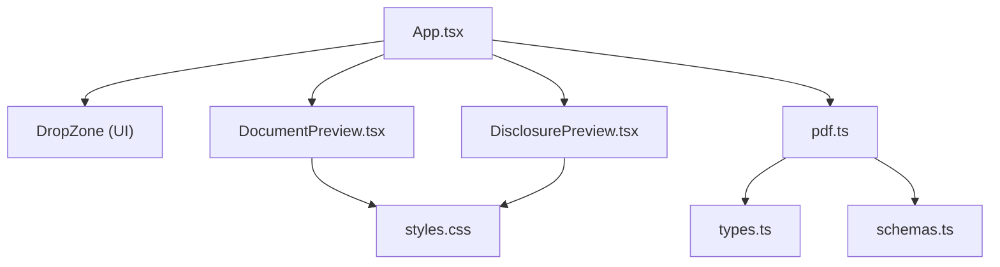
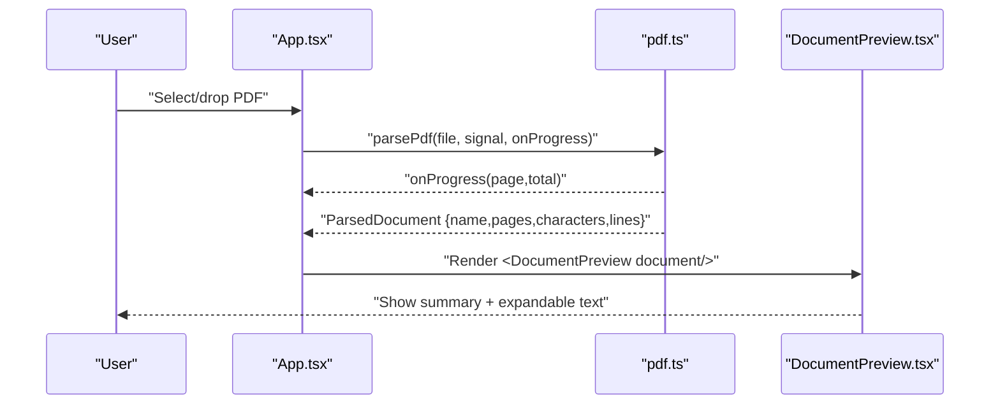
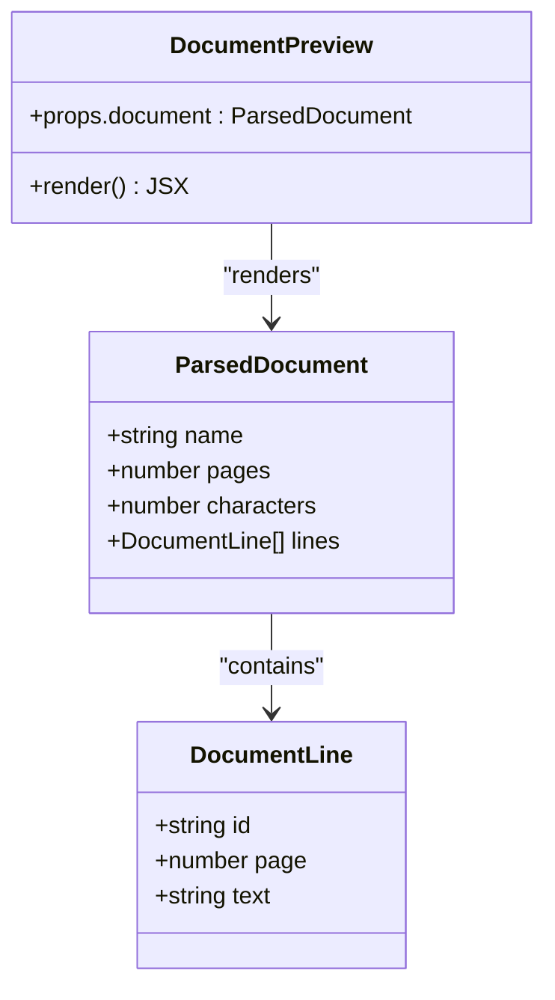
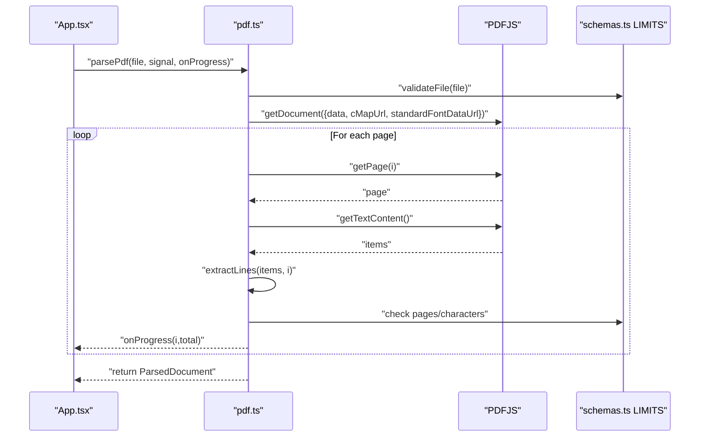
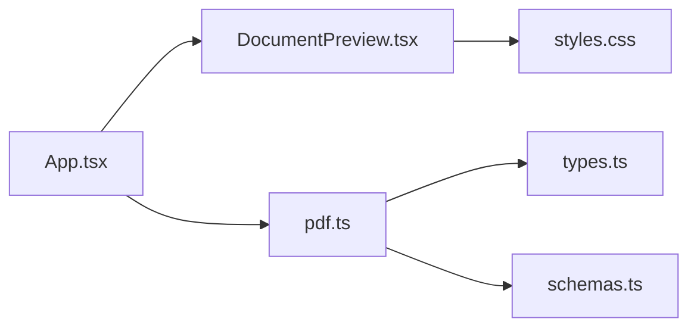

# Document Preview

<cite>
**Referenced Files in This Document**
- [DocumentPreview.tsx](file://src/sidepanel/components/DocumentPreview.tsx)
- [pdf.ts](file://src/parsers/pdf.ts)
- [types.ts](file://src/parsers/types.ts)
- [App.tsx](file://src/sidepanel/App.tsx)
- [DisclosurePreview.tsx](file://src/sidepanel/components/DisclosurePreview.tsx)
- [schemas.ts](file://src/shared/schemas.ts)
- [styles.css](file://src/sidepanel/styles.css)
- [pdf.test.ts](file://tests/unit/pdf.test.ts)
</cite>

## Table of Contents
1. [Introduction](#introduction)
2. [Project Structure](#project-structure)
3. [Core Components](#core-components)
4. [Architecture Overview](#architecture-overview)
5. [Detailed Component Analysis](#detailed-component-analysis)
6. [Dependency Analysis](#dependency-analysis)
7. [Performance Considerations](#performance-considerations)
8. [Troubleshooting Guide](#troubleshooting-guide)
9. [Conclusion](#conclusion)

## Introduction
This document explains the Document Preview component that displays parsed PDF content extracted locally from a user-selected PDF file. It covers how extracted text is rendered, how large documents are handled efficiently, and how users can navigate through document sections. It also details integration with the PDF parser, structured data presentation, performance optimizations for large documents, text selection capabilities, and responsive display patterns used by the side panel UI.

## Project Structure
The preview feature spans a small set of focused modules:
- Side panel components render the UI for uploaded documents and subsequent steps.
- The PDF parser extracts text lines per page using a local library and enforces size limits.
- Shared schemas define hard limits to keep processing safe and predictable.
- Styles provide a compact, accessible layout suitable for extension side panels.

**Diagram sources**
- [App.tsx:64-83](file://src/sidepanel/App.tsx#L64-L83)
- [DocumentPreview.tsx:1-9](file://src/sidepanel/components/DocumentPreview.tsx#L1-L9)
- [pdf.ts:40-86](file://src/parsers/pdf.ts#L40-L86)
- [types.ts:1-3](file://src/parsers/types.ts#L1-L3)
- [schemas.ts:1-39](file://src/shared/schemas.ts#L1-L39)
- [styles.css:1-73](file://src/sidepanel/styles.css#L1-L73)

**Section sources**
- [App.tsx:1-127](file://src/sidepanel/App.tsx#L1-L127)
- [DocumentPreview.tsx:1-9](file://src/sidepanel/components/DocumentPreview.tsx#L1-L9)
- [pdf.ts:1-87](file://src/parsers/pdf.ts#L1-L87)
- [types.ts:1-3](file://src/parsers/types.ts#L1-L3)
- [schemas.ts:1-39](file://src/shared/schemas.ts#L1-L39)
- [styles.css:1-73](file://src/sidepanel/styles.css#L1-L73)

## Core Components
- DocumentPreview: Renders a summary card for the parsed document, including filename, page count, character count, and an expandable section showing extracted lines with stable IDs.
- PDF Parser: Validates input, parses pages, reconstructs readable lines, enforces limits, and returns a structured ParsedDocument.
- App Orchestrator: Wires upload, parsing progress, error handling, and transitions between workflow phases.

Key responsibilities:
- Rendering: Display metadata and a collapsible list of extracted lines.
- Parsing: Extract text per page, assemble into line objects with page references, and enforce safety limits.
- Integration: Provide structured data to downstream review and mapping flows.

**Section sources**
- [DocumentPreview.tsx:1-9](file://src/sidepanel/components/DocumentPreview.tsx#L1-L9)
- [pdf.ts:7-13](file://src/parsers/pdf.ts#L7-L13)
- [pdf.ts:15-38](file://src/parsers/pdf.ts#L15-L38)
- [pdf.ts:40-86](file://src/parsers/pdf.ts#L40-L86)
- [App.tsx:64-83](file://src/sidepanel/App.tsx#L64-L83)

## Architecture Overview
The end-to-end flow starts when a user drops or selects a PDF file. The app validates and parses it locally, then renders the DocumentPreview. Users can inspect extracted text and proceed to AI-assisted mapping after consent.

**Diagram sources**
- [App.tsx:64-68](file://src/sidepanel/App.tsx#L64-L68)
- [pdf.ts:40-86](file://src/parsers/pdf.ts#L40-L86)
- [DocumentPreview.tsx:1-9](file://src/sidepanel/components/DocumentPreview.tsx#L1-L9)

## Detailed Component Analysis

### DocumentPreview Component
Purpose:
- Present parsed document metadata (filename, page count, character count).
- Offer an expandable “Inspect extracted text” area that lists each line with its unique ID and associated page reference.

Rendering behavior:
- Uses a native details/summary element to toggle visibility of the full text list, keeping the default view concise.
- Each line is wrapped in a paragraph with a visible line tag for easy navigation and referencing.

Data model:
- Accepts a ParsedDocument object containing name, pages, characters, and lines array where each line has id, page, and text.

Accessibility and usability:
- The collapsible pattern reduces cognitive load for large documents while still providing full access to extracted text.
- Line tags provide stable anchors for cross-referencing during later mapping steps.

**Section sources**
- [DocumentPreview.tsx:1-9](file://src/sidepanel/components/DocumentPreview.tsx#L1-L9)
- [types.ts:1-3](file://src/parsers/types.ts#L1-L3)

#### Class-like structure

**Diagram sources**
- [DocumentPreview.tsx:1-9](file://src/sidepanel/components/DocumentPreview.tsx#L1-L9)
- [types.ts:1-3](file://src/parsers/types.ts#L1-L3)

### PDF Parser Integration
Responsibilities:
- Validate file type, size, and header integrity.
- Configure and run the local PDF engine with worker resources.
- Iterate pages, extract text items, reconstruct readable lines, and enforce global limits.
- Provide progress callbacks and handle abort signals to cancel long-running tasks.

Parsing pipeline:
- Input validation ensures only supported, reasonably sized PDFs are processed.
- Text reconstruction groups adjacent text items into lines based on vertical alignment and spacing heuristics.
- Per-page extraction accumulates total character counts and stops early if limits are exceeded.
- Cleanup occurs per page and at task completion to free memory.

Error handling:
- Rejects non-PDF files, empty files, oversized files, password-protected documents, and documents without extractable text.
- Enforces maximum page count and character count without truncation; errors clearly indicate no partial results were kept.

Abort and cancellation:
- Supports AbortSignal to cancel parsing mid-flight, destroying the underlying task promptly.

**Section sources**
- [pdf.ts:7-13](file://src/parsers/pdf.ts#L7-L13)
- [pdf.ts:15-38](file://src/parsers/pdf.ts#L15-L38)
- [pdf.ts:40-86](file://src/parsers/pdf.ts#L40-L86)
- [schemas.ts:1-3](file://src/shared/schemas.ts#L1-L3)
- [pdf.test.ts:9-44](file://tests/unit/pdf.test.ts#L9-L44)

#### Sequence diagram: parsePdf flow

**Diagram sources**
- [pdf.ts:40-86](file://src/parsers/pdf.ts#L40-L86)
- [schemas.ts:1-3](file://src/shared/schemas.ts#L1-L3)

### App Orchestration and Progress
- Upload triggers parsing with a progress callback that updates UI state.
- Errors are normalized and displayed; running operations can be canceled.
- After parsing, DocumentPreview is rendered with the resulting ParsedDocument.

**Section sources**
- [App.tsx:64-68](file://src/sidepanel/App.tsx#L64-L68)
- [App.tsx:50-63](file://src/sidepanel/App.tsx#L50-L63)
- [App.tsx:114-116](file://src/sidepanel/App.tsx#L114-L116)

## Dependency Analysis
- DocumentPreview depends on types from parsers/types.ts for the ParsedDocument shape.
- App orchestrates parsing via pdf.ts and renders DocumentPreview once parsing completes.
- pdf.ts relies on shared schemas for hard limits and uses pdfjs-dist for extraction.
- styles.css provides consistent styling for cards, previews, badges, and responsive constraints.

**Diagram sources**
- [App.tsx:1-127](file://src/sidepanel/App.tsx#L1-L127)
- [DocumentPreview.tsx:1-9](file://src/sidepanel/components/DocumentPreview.tsx#L1-L9)
- [pdf.ts:1-87](file://src/parsers/pdf.ts#L1-L87)
- [types.ts:1-3](file://src/parsers/types.ts#L1-L3)
- [schemas.ts:1-39](file://src/shared/schemas.ts#L1-L39)
- [styles.css:1-73](file://src/sidepanel/styles.css#L1-L73)

**Section sources**
- [App.tsx:1-127](file://src/sidepanel/App.tsx#L1-L127)
- [DocumentPreview.tsx:1-9](file://src/sidepanel/components/DocumentPreview.tsx#L1-L9)
- [pdf.ts:1-87](file://src/parsers/pdf.ts#L1-L87)
- [types.ts:1-3](file://src/parsers/types.ts#L1-L3)
- [schemas.ts:1-39](file://src/shared/schemas.ts#L1-L39)
- [styles.css:1-73](file://src/sidepanel/styles.css#L1-L73)

## Performance Considerations
- Local parsing: All PDF text extraction runs locally; no bytes leave the browser.
- Early limit checks: File size, page count, and character count are enforced before or during parsing to avoid heavy work on oversized inputs.
- Incremental cleanup: Each page’s content is cleaned up immediately after extraction to reduce memory pressure.
- Abort support: Long-running parsing can be canceled via AbortSignal, preventing wasted work.
- Collapsible text: The details/summary pattern keeps the initial view lightweight and lets users expand only what they need.
- Responsive layout: The side panel uses a constrained max-width and flexible typography to remain usable on narrow screens.

[No sources needed since this section provides general guidance]

## Troubleshooting Guide
Common issues and their causes:
- Non-PDF or unsupported file type: Validation rejects files that do not match expected PDF signatures or MIME types.
- Empty or oversized files: Files without size or exceeding the configured byte limit are rejected.
- Password-protected PDFs: Parsing is aborted with a clear message indicating protection is not supported.
- No extractable text: Scanned/image-only PDFs without embedded text are rejected; OCR is not included.
- Exceeding page or character limits: Parsing stops and reports that nothing was truncated to prevent partial results.
- Aborted operations: If the user cancels or navigates away, parsing is canceled and resources are released.

Operational tips:
- Use the progress indicator to monitor parsing; cancel if necessary.
- Inspect the “Extracted text” section to verify reading order and accuracy before proceeding to mapping.
- Ensure the selected provider is enabled and permissions are granted before generating suggestions.

**Section sources**
- [pdf.ts:7-13](file://src/parsers/pdf.ts#L7-L13)
- [pdf.ts:40-86](file://src/parsers/pdf.ts#L40-L86)
- [pdf.test.ts:9-44](file://tests/unit/pdf.test.ts#L9-L44)
- [App.tsx:50-63](file://src/sidepanel/App.tsx#L50-L63)

## Conclusion
The Document Preview component provides a concise, accessible view of locally extracted PDF text, enabling users to verify content and navigate sections efficiently. The parser enforces strict limits, supports cancellation, and cleans up resources per page to handle large documents safely. Combined with a responsive UI and collapsible text inspection, the preview balances clarity and performance while preparing structured data for subsequent AI-assisted mapping.

[No sources needed since this section summarizes without analyzing specific files]