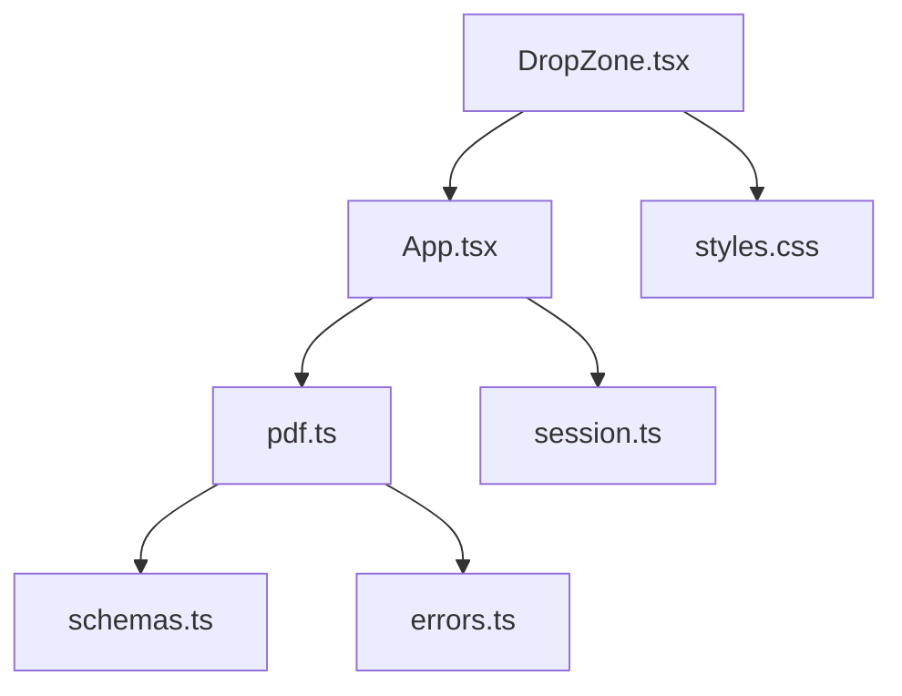
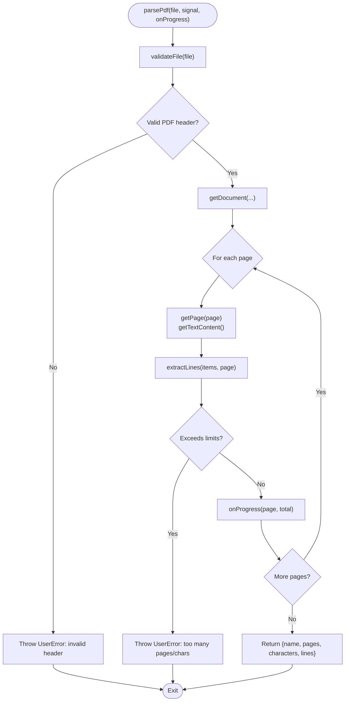
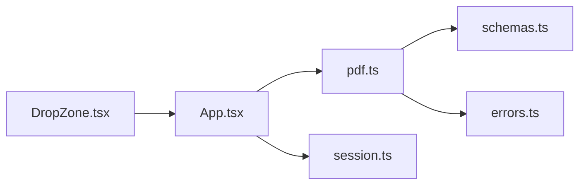

# File Upload & Drop Zone

<cite>
**Referenced Files in This Document**
- [DropZone.tsx](file://src/sidepanel/components/DropZone.tsx)
- [App.tsx](file://src/sidepanel/App.tsx)
- [pdf.ts](file://src/parsers/pdf.ts)
- [schemas.ts](file://src/shared/schemas.ts)
- [errors.ts](file://src/shared/errors.ts)
- [session.ts](file://src/sidepanel/session.ts)
- [styles.css](file://src/sidepanel/styles.css)
</cite>

## Table of Contents
1. [Introduction](#introduction)
2. [Project Structure](#project-structure)
3. [Core Components](#core-components)
4. [Architecture Overview](#architecture-overview)
5. [Detailed Component Analysis](#detailed-component-analysis)
6. [Dependency Analysis](#dependency-analysis)
7. [Performance Considerations](#performance-considerations)
8. [Troubleshooting Guide](#troubleshooting-guide)
9. [Conclusion](#conclusion)
10. [Appendices](#appendices)

## Introduction
This document explains the file upload and drop zone component used to accept PDFs, validate them, parse their text locally, and integrate with the main application’s workflow. It covers drag-and-drop behavior, validation rules, error handling, progress tracking during parsing, accessibility and keyboard support, visual feedback for drag states, and guidance for customizing behavior or extending validation.

## Project Structure
The upload flow spans a small set of focused modules:
- UI layer: DropZone component renders the drop area and delegates file selection to the parent.
- Application controller: App orchestrates state transitions, invokes parsing, and updates progress.
- Parser: pdf.ts validates and extracts text from PDFs using a local library, enforcing size, page, and character limits.
- Shared schemas and errors: Centralized limits and user-facing error utilities.
- Session management: Tracks phases, progress messages, and cancellation via AbortController.
- Styles: Visual feedback for drag states and general UI styling.



**Diagram sources**
- [DropZone.tsx:1-21](file://src/sidepanel/components/DropZone.tsx#L1-L21)
- [App.tsx:1-127](file://src/sidepanel/App.tsx#L1-L127)
- [pdf.ts:1-87](file://src/parsers/pdf.ts#L1-L87)
- [schemas.ts:1-39](file://src/shared/schemas.ts#L1-L39)
- [errors.ts:1-10](file://src/shared/errors.ts#L1-L10)
- [session.ts:1-86](file://src/sidepanel/session.ts#L1-L86)
- [styles.css:1-73](file://src/sidepanel/styles.css#L1-L73)

**Section sources**
- [DropZone.tsx:1-21](file://src/sidepanel/components/DropZone.tsx#L1-L21)
- [App.tsx:1-127](file://src/sidepanel/App.tsx#L1-L127)
- [pdf.ts:1-87](file://src/parsers/pdf.ts#L1-L87)
- [schemas.ts:1-39](file://src/shared/schemas.ts#L1-L39)
- [errors.ts:1-10](file://src/shared/errors.ts#L1-L10)
- [session.ts:1-86](file://src/sidepanel/session.ts#L1-L86)
- [styles.css:1-73](file://src/sidepanel/styles.css#L1-L73)

## Core Components
- DropZone: A React component that exposes a drag-and-drop surface and an accessible file input. It enforces single-file selection and calls back to the parent with the chosen file or an error message.
- App: The side panel root that wires DropZone into the session lifecycle. It starts parsing when a file is provided, updates progress as pages are read, and surfaces errors to the user.
- pdf parser: Validates the file type and size, checks the PDF header, parses pages, enforces page and character limits, and emits per-page progress callbacks.
- Shared utilities: Centralized limits (bytes, pages, characters) and error helpers that normalize user-facing messages and abort signals.

Key responsibilities:
- Drag-and-drop: Prevent default behaviors, track dragging state, and handle drops.
- Validation: Ensure exactly one PDF, within size limits, with a valid header.
- Parsing: Extract text line-by-line, enforce limits, and report progress per page.
- Integration: Connect UI state changes to session phases and progress messages.

**Section sources**
- [DropZone.tsx:1-21](file://src/sidepanel/components/DropZone.tsx#L1-L21)
- [App.tsx:64-68](file://src/sidepanel/App.tsx#L64-L68)
- [pdf.ts:7-13](file://src/parsers/pdf.ts#L7-L13)
- [pdf.ts:40-86](file://src/parsers/pdf.ts#L40-L86)
- [schemas.ts:3](file://src/shared/schemas.ts#L3)
- [errors.ts:1-10](file://src/shared/errors.ts#L1-L10)

## Architecture Overview
The end-to-end flow from user action to parsed document:

```mermaid
sequenceDiagram
participant U as "User"
participant DZ as "DropZone.tsx"
participant APP as "App.tsx"
participant PAR as "pdf.ts"
participant SCH as "schemas.ts"
participant ERR as "errors.ts"
participant SES as "session.ts"
U->>DZ : Drag over / Drop PDF
DZ->>DZ : Validate single file<br/>Set dragging state
DZ-->>APP : onFile(file) or onError(text)
APP->>SES : dispatch START('parsing')
APP->>PAR : parsePdf(file, signal, onProgress)
PAR->>SCH : read LIMITS
PAR->>ERR : throwIfAborted(signal)
PAR->>PAR : validateFile(file)
PAR->>PAR : getDocument(...) and iterate pages
PAR-->>APP : onProgress(page, total)
APP->>SES : dispatch PROGRESS(text)
PAR-->>APP : return { name, pages, characters, lines }
APP->>SES : dispatch DOCUMENT(document)
```

**Diagram sources**
- [DropZone.tsx:4-18](file://src/sidepanel/components/DropZone.tsx#L4-L18)
- [App.tsx:50-68](file://src/sidepanel/App.tsx#L50-L68)
- [pdf.ts:7-13](file://src/parsers/pdf.ts#L7-L13)
- [pdf.ts:40-86](file://src/parsers/pdf.ts#L40-L86)
- [schemas.ts:3](file://src/shared/schemas.ts#L3)
- [errors.ts:7-9](file://src/shared/errors.ts#L7-L9)
- [session.ts:26-42](file://src/sidepanel/session.ts#L26-L42)

## Detailed Component Analysis

### DropZone Component
- Drag-and-drop:
  - Prevents default browser behavior on dragover and drop to ensure files are handled by the app.
  - Toggles a dragging state to apply visual emphasis while hovering.
- File selection:
  - Accepts only one file; otherwise reports an error message.
  - Provides a hidden file input with accept constraints for PDFs and an explicit button to trigger it.
- Accessibility:
  - Uses aria-label for the section and the file input to describe purpose.
  - Hides decorative elements from assistive tech with aria-hidden.
- Keyboard navigation:
  - The visible “Choose PDF” button is focusable and operable via keyboard.
  - The hidden file input is programmatically triggered by the button click.
- Visual feedback:
  - CSS class toggles between normal and dragging states to change background and border color.

Customization tips:
- To allow multiple files or different types, adjust the select logic and accept attribute accordingly.
- To add custom validation before calling onFile, insert checks in the select function and call onError for invalid cases.

**Section sources**
- [DropZone.tsx:1-21](file://src/sidepanel/components/DropZone.tsx#L1-L21)
- [styles.css:36-44](file://src/sidepanel/styles.css#L36-L44)

### App Integration and Progress Tracking
- When a file is received, App resets the session and starts the parsing phase.
- It passes an AbortSignal to the parser so work can be canceled mid-parse.
- Per-page progress is reported via a callback that updates session progress text.
- Errors are normalized through errorMessage and dispatched to show user-friendly messages.

Progress details:
- During parsing, progress messages indicate which page is being read out of the total.
- Cancellation clears ongoing work and informs the user that partial results may remain.

**Section sources**
- [App.tsx:50-68](file://src/sidepanel/App.tsx#L50-L68)
- [App.tsx:96-101](file://src/sidepanel/App.tsx#L96-L101)
- [session.ts:26-42](file://src/sidepanel/session.ts#L26-L42)

### PDF Parser: Validation and Extraction
Validation:
- Ensures the file is a PDF by name and MIME type.
- Rejects empty files and files exceeding configured byte limits.
- Verifies the PDF header to guard against mislabeled files.

Parsing:
- Loads the PDF with a local worker and reads each page’s text content.
- Groups text items into logical lines based on vertical spacing and horizontal gaps.
- Enforces maximum page count and total character limit.
- Emits per-page progress to the caller.

Error handling:
- Throws user-facing errors for unsupported formats, password protection, excessive size/pages/characters, missing text, and unreadable files.
- Honors AbortSignal to cancel operations cleanly.



**Diagram sources**
- [pdf.ts:7-13](file://src/parsers/pdf.ts#L7-L13)
- [pdf.ts:15-38](file://src/parsers/pdf.ts#L15-L38)
- [pdf.ts:40-86](file://src/parsers/pdf.ts#L40-L86)
- [schemas.ts:3](file://src/shared/schemas.ts#L3)

**Section sources**
- [pdf.ts:7-13](file://src/parsers/pdf.ts#L7-L13)
- [pdf.ts:15-38](file://src/parsers/pdf.ts#L15-L38)
- [pdf.ts:40-86](file://src/parsers/pdf.ts#L40-L86)
- [schemas.ts:3](file://src/shared/schemas.ts#L3)
- [errors.ts:1-10](file://src/shared/errors.ts#L1-L10)

### Error Handling Strategy
- UserError: Represents expected failures with clear messages (e.g., wrong file type, size limits, password-protected PDF).
- AbortError: Normalized to a friendly “Canceled” message when the user cancels or the tab changes.
- Generic fallback: For unexpected errors, a consistent message guides users to reset and retry.

Integration points:
- DropZone.onError surfaces validation errors immediately.
- App catches errors from parsing and maps them to user-friendly messages via errorMessage.
- Session state reflects errors without losing context where appropriate.

**Section sources**
- [errors.ts:1-10](file://src/shared/errors.ts#L1-L10)
- [App.tsx:58-62](file://src/sidepanel/App.tsx#L58-L62)
- [DropZone.tsx:4-8](file://src/sidepanel/components/DropZone.tsx#L4-L8)

### Accessibility and Keyboard Navigation
- DropZone uses semantic landmarks and labels:
  - Section has an aria-label describing its role.
  - Hidden decorative icon is marked aria-hidden.
  - File input has an explicit aria-label for screen readers.
- Keyboard support:
  - Users can focus and activate the “Choose PDF” button to open the native file picker.
  - Focus styles are defined globally for visibility.
- Reduced motion:
  - Animations respect prefers-reduced-motion to minimize motion for sensitive users.

Best practices observed:
- Clear labeling and minimal reliance on mouse-only interactions.
- Visual cues for drag state complemented by standard focus outlines.

**Section sources**
- [DropZone.tsx:9-18](file://src/sidepanel/components/DropZone.tsx#L9-L18)
- [styles.css:35-37](file://src/sidepanel/styles.css#L35-L37)
- [styles.css:72](file://src/sidepanel/styles.css#L72)

### Visual Feedback for Drag States
- While dragging over the drop zone, the component toggles a CSS class that changes background and border color to highlight the active area.
- On drag leave or drop, the state resets to normal appearance.

Implementation highlights:
- State-driven class binding ensures consistent visuals.
- CSS transition smooths the state change.

**Section sources**
- [DropZone.tsx:3-12](file://src/sidepanel/components/DropZone.tsx#L3-L12)
- [styles.css:36-37](file://src/sidepanel/styles.css#L36-L37)

## Dependency Analysis
- DropZone depends on:
  - React hooks for state and refs.
  - CSS classes for visual feedback.
  - Parent-provided callbacks for file handling and error reporting.
- App depends on:
  - DropZone for file intake.
  - pdf parser for extraction and validation.
  - session reducer for state transitions and progress messaging.
  - shared errors for message normalization.
- pdf parser depends on:
  - Shared schemas for limits.
  - Shared errors for abort signaling and user errors.
  - Local PDF library for reading and extracting text.

Coupling and cohesion:
- DropZone is cohesive and loosely coupled to the rest of the app via simple callbacks.
- App centralizes orchestration, keeping business logic separate from UI.
- Parser encapsulates all PDF-specific concerns, making it reusable and testable.

Potential circular dependencies:
- None detected; dependencies flow downward from UI to services.

External integrations:
- Chrome APIs for tabs, permissions, and runtime URLs used elsewhere in the app.
- Local PDF worker resources loaded via runtime URLs.



**Diagram sources**
- [DropZone.tsx:1-21](file://src/sidepanel/components/DropZone.tsx#L1-L21)
- [App.tsx:1-127](file://src/sidepanel/App.tsx#L1-L127)
- [pdf.ts:1-87](file://src/parsers/pdf.ts#L1-L87)
- [schemas.ts:1-39](file://src/shared/schemas.ts#L1-L39)
- [errors.ts:1-10](file://src/shared/errors.ts#L1-L10)
- [session.ts:1-86](file://src/sidepanel/session.ts#L1-L86)

**Section sources**
- [DropZone.tsx:1-21](file://src/sidepanel/components/DropZone.tsx#L1-L21)
- [App.tsx:1-127](file://src/sidepanel/App.tsx#L1-L127)
- [pdf.ts:1-87](file://src/parsers/pdf.ts#L1-L87)
- [schemas.ts:1-39](file://src/shared/schemas.ts#L1-L39)
- [errors.ts:1-10](file://src/shared/errors.ts#L1-L10)
- [session.ts:1-86](file://src/sidepanel/session.ts#L1-L86)

## Performance Considerations
- Local parsing: PDF text extraction runs in-process, avoiding network overhead and preserving privacy.
- Streaming-like progress: Per-page callbacks keep the UI responsive and informative.
- Resource cleanup: Pages are cleaned up after processing; the document task is destroyed in finally blocks.
- Limits: Byte, page, and character caps prevent runaway memory usage and long-running tasks.
- Cancellation: AbortSignal allows immediate halting of parsing when the user cancels or navigates away.

Optimization opportunities:
- If supporting larger documents, consider chunked processing or virtualized previews.
- Cache parsed results if re-scanning frequently.
- Debounce rapid UI updates if needed for very large outputs.

[No sources needed since this section provides general guidance]

## Troubleshooting Guide
Common issues and resolutions:
- Wrong file type:
  - Symptom: Error indicating non-PDF or unsupported format.
  - Cause: File extension or MIME type mismatch.
  - Resolution: Choose a PDF file; Word/Excel/Markdown/OCR are not supported in this prototype.
- Empty or oversized file:
  - Symptom: Error about empty file or exceeding size limit.
  - Cause: Zero bytes or file larger than configured limit.
  - Resolution: Provide a non-empty PDF under the allowed size.
- Invalid PDF header:
  - Symptom: Error stating the file does not contain a valid PDF header.
  - Cause: Mislabelled file or corrupted data.
  - Resolution: Re-export or obtain a valid PDF.
- Password-protected PDF:
  - Symptom: Error indicating password protection is not supported.
  - Cause: Encrypted document.
  - Resolution: Use an unprotected PDF.
- Too many pages or characters:
  - Symptom: Error about exceeding page or character limits.
  - Cause: Document exceeds configured thresholds.
  - Resolution: Shorten the document or split into smaller files.
- No extractable text:
  - Symptom: Error indicating no text was found.
  - Cause: Scanned/image-only PDF requiring OCR.
  - Resolution: Provide a text-based PDF or enable OCR in a future version.
- Canceled operation:
  - Symptom: Message indicating cancellation with no new request started.
  - Cause: User canceled or target tab changed.
  - Resolution: Retry the operation after ensuring the correct tab is active.

Where these are implemented:
- Validation and limits enforced in the parser.
- Error messages normalized via shared error utilities.
- Session state updated to reflect errors and progress.

**Section sources**
- [pdf.ts:7-13](file://src/parsers/pdf.ts#L7-L13)
- [pdf.ts:40-86](file://src/parsers/pdf.ts#L40-L86)
- [errors.ts:1-10](file://src/shared/errors.ts#L1-L10)
- [App.tsx:58-62](file://src/sidepanel/App.tsx#L58-L62)

## Conclusion
The file upload and drop zone component provides a robust, accessible, and user-friendly way to accept and process PDFs. It combines clear validation, local parsing with progress feedback, and thoughtful error handling. The design keeps UI concerns separate from parsing logic, enabling customization and future enhancements such as additional file types or OCR support.

[No sources needed since this section summarizes without analyzing specific files]

## Appendices

### Customizing Drop Zone Behavior
- Allow multiple files:
  - Modify the select logic to handle arrays of files and update validation accordingly.
- Different file types:
  - Change the accept attribute and validation checks to include other formats.
- Custom validation rules:
  - Insert checks in the select function and call onError for invalid inputs.
  - Example rule ideas: minimum/maximum file size, naming conventions, metadata checks.

**Section sources**
- [DropZone.tsx:4-8](file://src/sidepanel/components/DropZone.tsx#L4-L8)
- [DropZone.tsx:16-18](file://src/sidepanel/components/DropZone.tsx#L16-L18)

### Handling Different File Types
- Update accept attribute to include desired MIME types or extensions.
- Extend validation in the select function to enforce type-specific rules.
- Route different types to appropriate handlers or parsers.

**Section sources**
- [DropZone.tsx:16-18](file://src/sidepanel/components/DropZone.tsx#L16-L18)

### Implementing Custom Validation Rules
- Add checks for file properties (size, name patterns, MIME types).
- Call onError with descriptive messages for invalid cases.
- Optionally disable the drop zone until prerequisites are met.

**Section sources**
- [DropZone.tsx:4-8](file://src/sidepanel/components/DropZone.tsx#L4-L8)

### Integrating with the Main Application’s Upload Handler
- Pass the selected file to the parent handler (upload function).
- The parent should reset state, start the appropriate phase, and invoke the parser with an AbortSignal.
- Use progress callbacks to update UI status and allow cancellation.

**Section sources**
- [App.tsx:64-68](file://src/sidepanel/App.tsx#L64-L68)
- [App.tsx:50-62](file://src/sidepanel/App.tsx#L50-L62)

### Progress Tracking During PDF Parsing
- The parser emits per-page progress via a callback.
- The app translates these into user-visible progress messages.
- Cancellation is supported via AbortSignal to stop parsing early.

**Section sources**
- [pdf.ts:40-86](file://src/parsers/pdf.ts#L40-L86)
- [App.tsx:64-68](file://src/sidepanel/App.tsx#L64-L68)