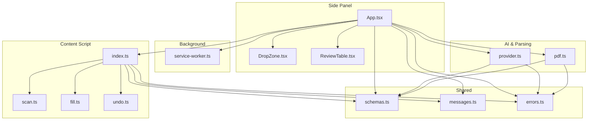
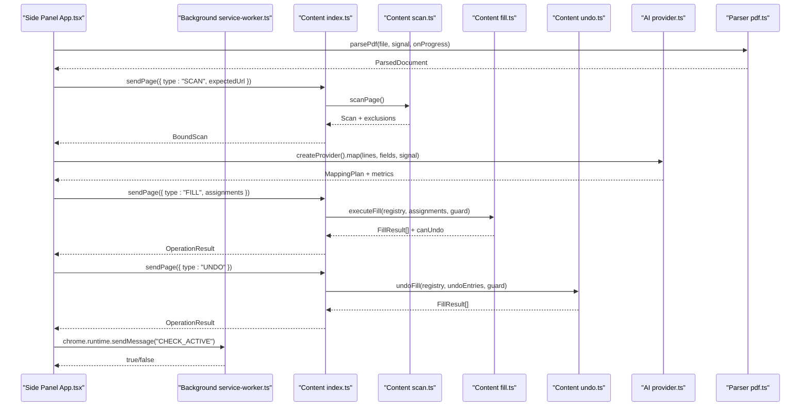
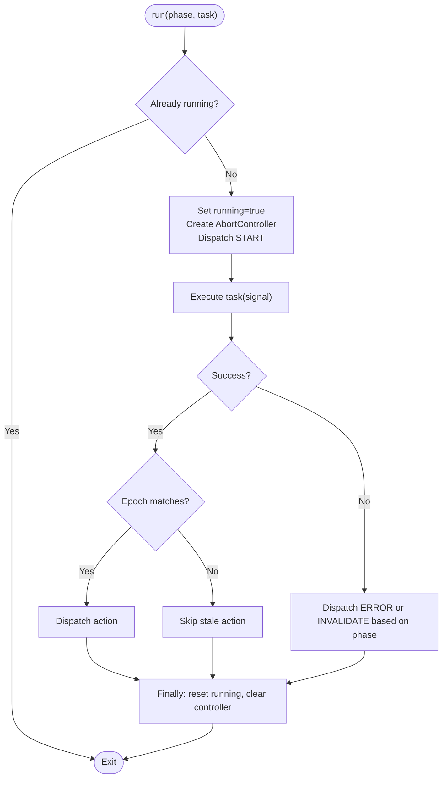
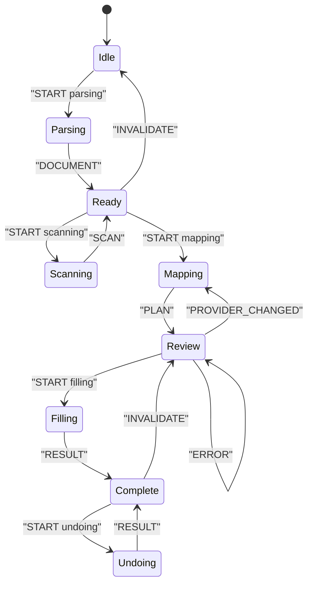
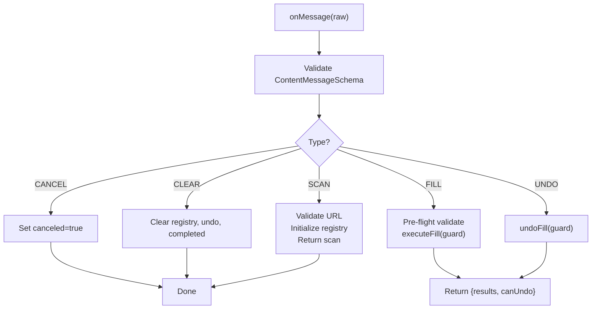
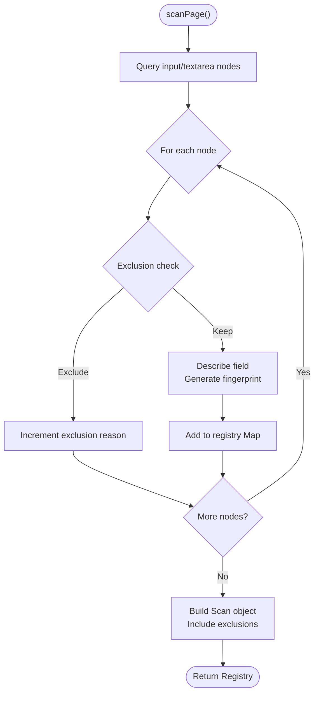
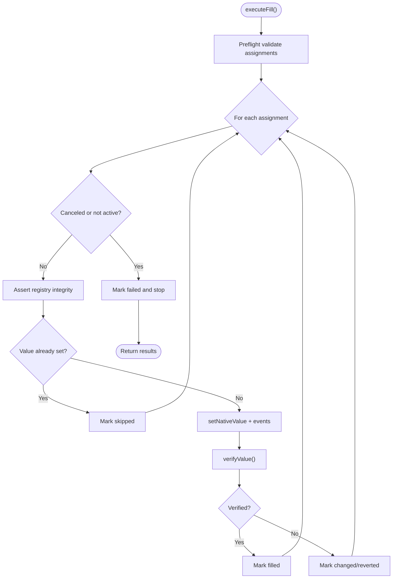
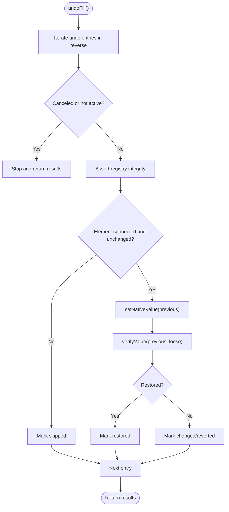
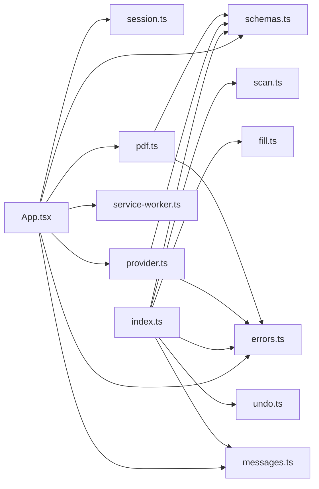

# Main Application

<cite>
**Referenced Files in This Document**
- [App.tsx](file://src/sidepanel/App.tsx)
- [session.ts](file://src/sidepanel/session.ts)
- [index.ts](file://src/content/index.ts)
- [scan.ts](file://src/content/scan.ts)
- [fill.ts](file://src/content/fill.ts)
- [undo.ts](file://src/content/undo.ts)
- [service-worker.ts](file://src/background/service-worker.ts)
- [messages.ts](file://src/shared/messages.ts)
- [schemas.ts](file://src/shared/schemas.ts)
- [errors.ts](file://src/shared/errors.ts)
- [provider.ts](file://src/ai/provider.ts)
- [pdf.ts](file://src/parsers/pdf.ts)
- [DropZone.tsx](file://src/sidepanel/components/DropZone.tsx)
- [ReviewTable.tsx](file://src/sidepanel/components/ReviewTable.tsx)
</cite>

## Table of Contents
1. Introduction
2. Project Structure
3. Core Components
4. Architecture Overview
5. Detailed Component Analysis
6. Dependency Analysis
7. Performance Considerations
8. Troubleshooting Guide
9. Conclusion

## Introduction
This document explains the main Help Me Fill application component: a React side panel that orchestrates PDF parsing, form scanning, AI-driven mapping, field filling, and undo operations across extension contexts (background service worker, content script, and side panel). It details state management with useReducer and a session reducer, lifecycle management, event handling for tab changes and page updates, abort controller patterns for canceling operations, error handling strategies, and end-to-end workflows from file upload to field filling.

## Project Structure
The application is organized into distinct extension contexts:
- Side panel (React UI): App.tsx manages user interactions, state, and workflow orchestration; components handle uploads, previews, review tables, and results.
- Content script: index.ts routes messages to scan, fill, and undo logic; it maintains per-page state and guards execution.
- Background service worker: service-worker.ts configures storage access levels and provides short-lived authorization checks.
- Shared layer: schemas.ts defines data contracts; messages.ts defines typed cross-context messages; errors.ts centralizes error formatting and abort handling.
- AI provider: provider.ts builds requests and validates responses for multiple LLM providers.
- Parser: pdf.ts extracts text lines locally from PDFs with progress reporting and safety limits.

**Diagram sources**
- [App.tsx:15-126](file://src/sidepanel/App.tsx#L15-L126)
- [session.ts:26-85](file://src/sidepanel/session.ts#L26-L85)
- [index.ts:22-69](file://src/content/index.ts#L22-L69)
- [scan.ts:62-87](file://src/content/scan.ts#L62-L87)
- [fill.ts:42-81](file://src/content/fill.ts#L42-L81)
- [undo.ts:6-28](file://src/content/undo.ts#L6-L28)
- [service-worker.ts:1-29](file://src/background/service-worker.ts#L1-L29)
- [schemas.ts:1-39](file://src/shared/schemas.ts#L1-L39)
- [messages.ts:1-20](file://src/shared/messages.ts#L1-L20)
- [errors.ts:1-10](file://src/shared/errors.ts#L1-L10)
- [provider.ts:52-106](file://src/ai/provider.ts#L52-L106)
- [pdf.ts:40-86](file://src/parsers/pdf.ts#L40-L86)

**Section sources**
- [App.tsx:15-126](file://src/sidepanel/App.tsx#L15-L126)
- [session.ts:26-85](file://src/sidepanel/session.ts#L26-L85)
- [index.ts:22-69](file://src/content/index.ts#L22-L69)
- [service-worker.ts:1-29](file://src/background/service-worker.ts#L1-L29)
- [schemas.ts:1-39](file://src/shared/schemas.ts#L1-L39)
- [messages.ts:1-20](file://src/shared/messages.ts#L1-L20)
- [errors.ts:1-10](file://src/shared/errors.ts#L1-L10)
- [provider.ts:52-106](file://src/ai/provider.ts#L52-L106)
- [pdf.ts:40-86](file://src/parsers/pdf.ts#L40-L86)

## Core Components
- Side panel App: Orchestrates phases using useReducer with a session reducer; manages AbortController lifecycle; handles tab/page events; coordinates between background and content scripts via messaging and ports.
- Session reducer: Defines phases and actions; transitions state through parsing, scanning, mapping, review, filling, completing, and undoing; resets or invalidates on context changes.
- Content script: Validates and executes SCAN, FILL, UNDO, CLEAR, CANCEL; maintains registry, undo entries, busy flags, and connection tracking; enforces target stability and cancellation.
- Background service worker: Configures storage access and provides active-tab authorization checks for security-sensitive operations.
- AI provider: Builds transport-specific requests, enforces timeouts, bounds response size, validates mapping output, and supports retry with repair prompts.
- PDF parser: Extracts text lines locally with progress callbacks, enforces size and page limits, and supports abort during parsing.

Key responsibilities:
- State machine: idle → parsing → ready → scanning → ready → mapping → review → filling → complete → undoing → review or complete.
- Cross-context coordination: messages for SCAN/FILL/UNDO/CLEAR/CANCEL; port-based review panel readiness handshake; background CHECK_ACTIVE for authorization.
- Safety and validation: schema validation for all cross-context payloads; field exclusion rules; value normalization checks; registry integrity verification before writes.

**Section sources**
- [App.tsx:15-126](file://src/sidepanel/App.tsx#L15-L126)
- [session.ts:26-85](file://src/sidepanel/session.ts#L26-L85)
- [index.ts:22-69](file://src/content/index.ts#L22-L69)
- [service-worker.ts:1-29](file://src/background/service-worker.ts#L1-L29)
- [provider.ts:52-106](file://src/ai/provider.ts#L52-L106)
- [pdf.ts:40-86](file://src/parsers/pdf.ts#L40-L86)

## Architecture Overview
The main app coordinates three extension contexts:
- Side panel: User-facing React UI; uses useReducer for session state; triggers workflows; listens to tab/page events; cancels ongoing work via AbortController.
- Content script: Executes scanning and filling on the target page; maintains per-page registry and undo history; enforces cancellation and target stability.
- Background service worker: Grants short-lived authorization by verifying active tab and URL; ensures only trusted side panel connections can execute sensitive operations.

**Diagram sources**
- [App.tsx:64-95](file://src/sidepanel/App.tsx#L64-L95)
- [session.ts:55-85](file://src/sidepanel/session.ts#L55-L85)
- [index.ts:22-69](file://src/content/index.ts#L22-L69)
- [scan.ts:62-87](file://src/content/scan.ts#L62-L87)
- [fill.ts:42-81](file://src/content/fill.ts#L42-L81)
- [undo.ts:6-28](file://src/content/undo.ts#L6-L28)
- [provider.ts:52-106](file://src/ai/provider.ts#L52-L106)
- [pdf.ts:40-86](file://src/parsers/pdf.ts#L40-L86)
- [service-worker.ts:18-28](file://src/background/service-worker.ts#L18-L28)

## Detailed Component Analysis

### Side Panel App: State Machine and Lifecycle
- State management: useReducer with sessionReducer drives phase transitions and row selection state; initialSession sets idle state; actions include RESET, START, PROGRESS, DOCUMENT, SCAN, PLAN, ROW, SELECT_ALL, RESULT, ERROR, INVALIDATE, PROVIDER_CHANGED.
- Lifecycle: useEffect registers tab listeners for activation, update, removal; window pagehide listener clears resources; cleanup removes listeners and aborts controllers.
- Workflow orchestration: run(phase, task) wraps each operation with an epoch counter and AbortController; dispatches START, then either action result or error; finally resets running flag and controller.
- Event handling:
  - Tab activated: if active tab differs from stored target, invalidates session with guidance to rescan.
  - Tab updated: if status loading or URL changed, invalidates session.
  - Tab removed: invalidates session when target tab closes.
- Aborts and cancellation: clearPage sends CLEAR to content; cancel aborts current controller and notifies content; run respects epoch to avoid stale dispatches.
- Error handling: errorMessage normalizes UserError and AbortError; INVALIDATE preserves partial state where appropriate; ERROR resets to prior phase.

**Diagram sources**
- [App.tsx:50-63](file://src/sidepanel/App.tsx#L50-L63)
- [errors.ts:1-10](file://src/shared/errors.ts#L1-L10)

**Section sources**
- [App.tsx:15-126](file://src/sidepanel/App.tsx#L15-L126)
- [session.ts:26-42](file://src/sidepanel/session.ts#L26-L42)
- [errors.ts:1-10](file://src/shared/errors.ts#L1-L10)

### Session Reducer: Phases and Actions
- Phase definitions: idle, parsing, scanning, ready, mapping, review, filling, complete, undoing.
- Action handlers:
  - RESET: returns initialSession.
  - START: sets phase and clears progress/error.
  - PROGRESS: updates progress text.
  - DOCUMENT: sets parsed document and moves to ready.
  - SCAN: binds scan with target and moves to ready.
  - PLAN: creates review rows from plan assignments and moves to review.
  - ROW: patches individual row attributes.
  - SELECT_ALL: bulk selects supported suggestions respecting overwrite constraints.
  - RESULT: sets operation result and moves to complete.
  - ERROR: resets to prior phase based on context.
  - INVALIDATE: resets rows and moves to ready/idle depending on document presence.
  - PROVIDER_CHANGED: clears plan and rows when settings change.
- Busy detection: isBusy includes parsing, scanning, mapping, filling, undoing.

**Diagram sources**
- [session.ts:26-42](file://src/sidepanel/session.ts#L26-L42)

**Section sources**
- [session.ts:26-42](file://src/sidepanel/session.ts#L26-L42)

### Content Script: Message Routing and Execution Guards
- Trusted connections: only side panel origins with specific port names are accepted; tracks active connections per requestId.
- Message handling:
  - CANCEL: sets canceled flag to stop ongoing operations.
  - CLEAR: resets registry, undo entries, completed tasks.
  - SCAN: validates URL, initializes registry, returns scan.
  - FILL/UNDO: requires registry and active connection; executes with guard functions for cancellation and authorization.
- Busy gating: prevents overlapping operations; ensures single-threaded execution within content script.
- Completion cache: caches tasks by requestId to deduplicate concurrent calls; bounded to prevent memory growth.

**Diagram sources**
- [index.ts:22-69](file://src/content/index.ts#L22-L69)

**Section sources**
- [index.ts:22-69](file://src/content/index.ts#L22-L69)

### Scanning: Field Discovery and Exclusions
- Visibility checks: excludes hidden, inert, aria-hidden, display:none, visibility:hidden, collapsed, opacity:0 controls.
- Label extraction: gathers aria-labelledby, aria-label, label elements, and contextual headings; trims whitespace and caps length.
- Exclusion rules: unsupported input types, disabled/read-only, authentication/payment autocomplete tokens, sensitive keywords, oversized values/patterns.
- Registry: maps field IDs to descriptors and signatures; counts unsupported elements; enforces field limits.
- Integrity assertion: verifies scanId, URL, element connectivity, exclusions, fingerprints, and structural changes before operations.

**Diagram sources**
- [scan.ts:10-87](file://src/content/scan.ts#L10-L87)

**Section sources**
- [scan.ts:10-87](file://src/content/scan.ts#L10-L87)

### Filling: Safe Writes and Verification
- Preflight validation: checks field existence, duplicates, expected values, overwrite permissions, and control constraints; aborts early on invalid inputs.
- Native value setting: uses native setter to trigger framework-aware updates; dispatches input/change events and blurs to ensure side effects.
- Verification loop: waits for DOM stabilization and rechecks value and validity; marks results as filled, skipped, changed/reverted, or failed.
- Guard integration: checks cancellation and active tab authorization before each write; asserts registry integrity repeatedly to detect changes.

**Diagram sources**
- [fill.ts:8-81](file://src/content/fill.ts#L8-L81)

**Section sources**
- [fill.ts:8-81](file://src/content/fill.ts#L8-L81)

### Undo: Restoring Previous Values
- Reverse iteration: restores values in reverse order to minimize interference.
- Integrity checks: ensures elements remain connected and unchanged since writing; skips if user or page edits occurred.
- Restoration: focuses element, sets previous value via native setter, verifies persistence without strict validity checks.
- Guard integration: checks cancellation and active tab authorization; asserts registry integrity before restoration.

**Diagram sources**
- [undo.ts:6-28](file://src/content/undo.ts#L6-L28)

**Section sources**
- [undo.ts:6-28](file://src/content/undo.ts#L6-L28)

### Background Authorization: Active Tab Checks
- Storage configuration: sets access levels for session/local storage to trusted contexts.
- Action click: opens side panel explicitly to grant activeTab consistently.
- Message handler: validates sender identity, frame, tab, and documentId; compares expected URL with active tab; responds with boolean authorization.

**Section sources**
- [service-worker.ts:1-29](file://src/background/service-worker.ts#L1-L29)

### AI Provider: Mapping Generation and Validation
- Request building: selects transport based on provider; constructs system/user prompts; enforces input limits.
- Network safety: bounds response size; handles timeouts; retries once with repair prompt on validation failure.
- Response processing: extracts text payload; validates mapping against schema; reports usage metrics and elapsed time.
- Error handling: distinguishes auth failures, rate limits, model support issues, and network errors; surfaces user-friendly messages.

**Section sources**
- [provider.ts:15-106](file://src/ai/provider.ts#L15-L106)

### PDF Parser: Local Extraction with Progress
- File validation: enforces PDF format, non-empty, size limit.
- Worker setup: configures pdfjs-dist worker and cmaps/fonts URLs.
- Page iteration: reads pages, extracts text lines, accumulates characters, enforces page and character limits; reports progress.
- Abort handling: destroys task on abort; rejects password-protected documents; cleans up resources.

**Section sources**
- [pdf.ts:7-86](file://src/parsers/pdf.ts#L7-L86)

## Dependency Analysis
- Side panel depends on:
  - session.ts for state machine and cross-context helpers.
  - parsers/pdf.ts for local document parsing.
  - ai/provider.ts for AI mapping generation.
  - shared schemas and messages for validation and typing.
  - background service-worker.ts for authorization checks.
- Content script depends on:
  - scan.ts for field discovery and registry management.
  - fill.ts and undo.ts for safe writes and restoration.
  - shared messages and schemas for message validation and data contracts.
  - shared errors for consistent error formatting.
- Background depends on:
  - Chrome APIs for storage, side panel behavior, and tab queries.

**Diagram sources**
- [App.tsx:15-126](file://src/sidepanel/App.tsx#L15-L126)
- [session.ts:26-85](file://src/sidepanel/session.ts#L26-L85)
- [index.ts:22-69](file://src/content/index.ts#L22-L69)
- [scan.ts:62-87](file://src/content/scan.ts#L62-L87)
- [fill.ts:42-81](file://src/content/fill.ts#L42-L81)
- [undo.ts:6-28](file://src/content/undo.ts#L6-L28)
- [provider.ts:52-106](file://src/ai/provider.ts#L52-L106)
- [pdf.ts:40-86](file://src/parsers/pdf.ts#L40-L86)
- [schemas.ts:1-39](file://src/shared/schemas.ts#L1-L39)
- [messages.ts:1-20](file://src/shared/messages.ts#L1-L20)
- [errors.ts:1-10](file://src/shared/errors.ts#L1-L10)
- [service-worker.ts:1-29](file://src/background/service-worker.ts#L1-L29)

**Section sources**
- [App.tsx:15-126](file://src/sidepanel/App.tsx#L15-L126)
- [session.ts:26-85](file://src/sidepanel/session.ts#L26-L85)
- [index.ts:22-69](file://src/content/index.ts#L22-L69)
- [provider.ts:52-106](file://src/ai/provider.ts#L52-L106)
- [pdf.ts:40-86](file://src/parsers/pdf.ts#L40-L86)
- [schemas.ts:1-39](file://src/shared/schemas.ts#L1-L39)
- [messages.ts:1-20](file://src/shared/messages.ts#L1-L20)
- [errors.ts:1-10](file://src/shared/errors.ts#L1-L10)
- [service-worker.ts:1-29](file://src/background/service-worker.ts#L1-L29)

## Performance Considerations
- Local PDF parsing avoids network overhead and respects page and character limits; progress callbacks keep users informed.
- AI mapping requests are bounded in size and duration; timeouts prevent long hangs; response size limits protect memory.
- Content script execution is single-threaded per page; busy flags prevent overlapping operations; completion cache prevents duplicate work.
- Field scanning enforces maximum field count and excludes heavy or sensitive controls to maintain responsiveness.
- Verification loops use requestAnimationFrame and short sleeps to balance accuracy and performance.

[No sources needed since this section provides general guidance]

## Troubleshooting Guide
Common issues and resolutions:
- Target tab changed or closed: session invalidation guides users to rescan; assertActive ensures target stability before operations.
- Page connection lost: sendPage throws user-friendly errors; content script disconnects gracefully on pagehide.
- Provider errors: distinguish auth failures, rate limits, model support issues; provide actionable messages and explicit retry guidance.
- Overwrite protection: existing values require explicit allowOverwrite; manual overrides are flagged for careful review.
- Abort handling: AbortError normalized to user-friendly cancellation messages; epoch counters prevent stale dispatches.

**Section sources**
- [session.ts:44-54](file://src/sidepanel/session.ts#L44-L54)
- [errors.ts:1-10](file://src/shared/errors.ts#L1-L10)
- [provider.ts:77-100](file://src/ai/provider.ts#L77-L100)
- [index.ts:22-69](file://src/content/index.ts#L22-L69)

## Conclusion
The main Help Me Fill application component implements a robust, multi-context workflow that safely parses PDFs locally, scans form fields, generates AI-backed mappings, fills selected fields with verification, and supports undoing changes. State management via useReducer and a session reducer provides clear phase transitions and resilient error handling. Event listeners manage tab and page lifecycle changes, while AbortController patterns enable responsive cancellation. Cross-context messaging and background authorization ensure secure and reliable operations across extension boundaries.

[No sources needed since this section summarizes without analyzing specific files]