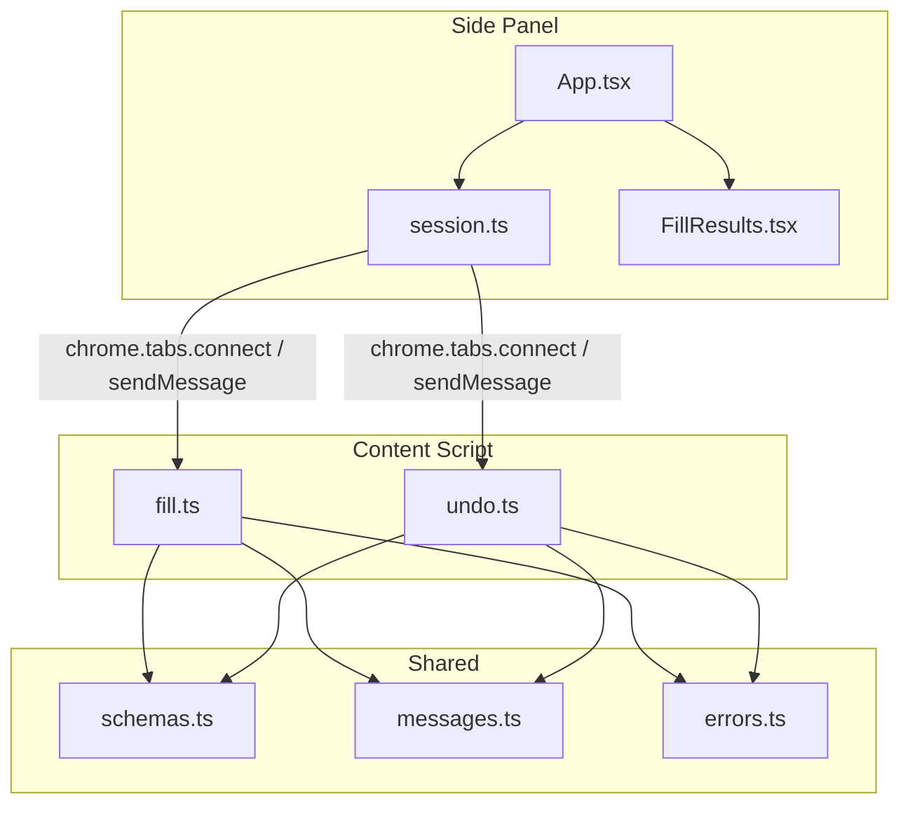
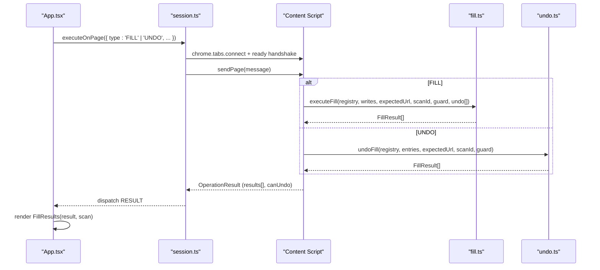
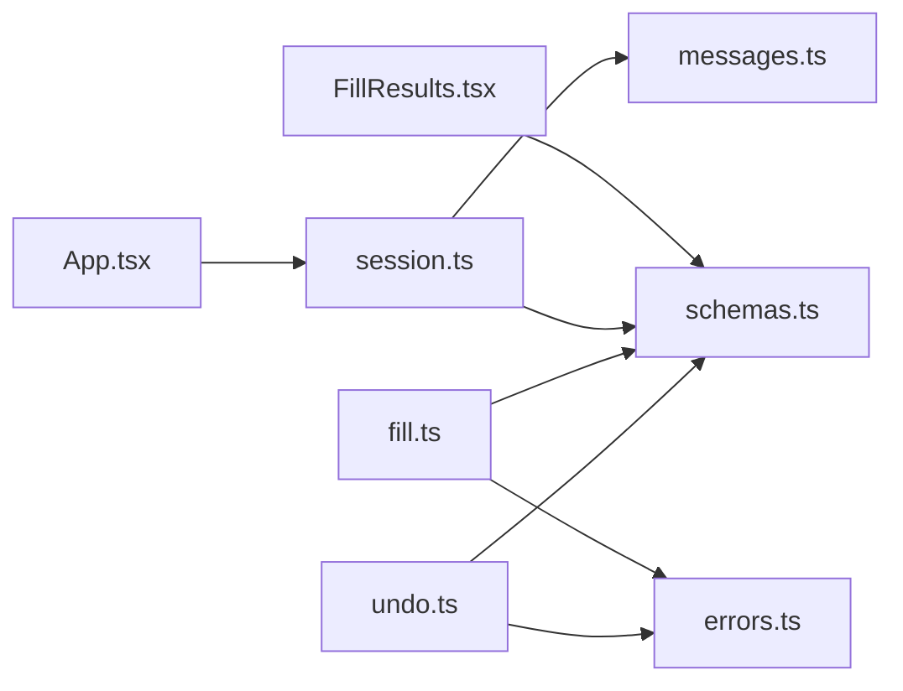

# Results Display

<cite>
**Referenced Files in This Document**
- [FillResults.tsx](file://src/sidepanel/components/FillResults.tsx)
- [App.tsx](file://src/sidepanel/App.tsx)
- [session.ts](file://src/sidepanel/session.ts)
- [fill.ts](file://src/content/fill.ts)
- [undo.ts](file://src/content/undo.ts)
- [schemas.ts](file://src/shared/schemas.ts)
- [messages.ts](file://src/shared/messages.ts)
- [errors.ts](file://src/shared/errors.ts)
</cite>

## Table of Contents
1. [Introduction](#introduction)
2. [Project Structure](#project-structure)
3. [Core Components](#core-components)
4. [Architecture Overview](#architecture-overview)
5. [Detailed Component Analysis](#detailed-component-analysis)
6. [Dependency Analysis](#dependency-analysis)
7. [Performance Considerations](#performance-considerations)
8. [Troubleshooting Guide](#troubleshooting-guide)
9. [Conclusion](#conclusion)

## Introduction
This document explains the fill results component that displays completion status and undo capabilities for form filling operations. It covers how successful fills, failed attempts, and skipped or reverted changes are shown to users, and how undo functionality restores previous values when safe. It also documents the integration between the side panel UI and the content script execution pipeline, including error reporting, success indicators, and user feedback patterns across different outcome scenarios.

## Project Structure
The fill results feature spans the side panel UI and the page’s content script:
- Side panel UI renders the results and triggers fill/undo actions.
- The session layer coordinates messaging with the active tab and validates responses.
- The content script executes field writes and undo operations, returning structured results.
- Shared schemas define the result types and constraints.

**Diagram sources**
- [App.tsx:84-95](file://src/sidepanel/App.tsx#L84-L95)
- [session.ts:71-85](file://src/sidepanel/session.ts#L71-L85)
- [fill.ts:42-81](file://src/content/fill.ts#L42-L81)
- [undo.ts:6-28](file://src/content/undo.ts#L6-L28)
- [schemas.ts:33-38](file://src/shared/schemas.ts#L33-L38)
- [messages.ts:11-17](file://src/shared/messages.ts#L11-L17)
- [errors.ts:1-10](file://src/shared/errors.ts#L1-L10)

**Section sources**
- [App.tsx:84-95](file://src/sidepanel/App.tsx#L84-L95)
- [session.ts:71-85](file://src/sidepanel/session.ts#L71-L85)
- [fill.ts:42-81](file://src/content/fill.ts#L42-L81)
- [undo.ts:6-28](file://src/content/undo.ts#L6-L28)
- [schemas.ts:33-38](file://src/shared/schemas.ts#L33-L38)
- [messages.ts:11-17](file://src/shared/messages.ts#L11-L17)
- [errors.ts:1-10](file://src/shared/errors.ts#L1-L10)

## Core Components
- FillResults component: Renders per-field outcomes, highlights statuses, and exposes an undo button gated by availability and busy state.
- App orchestrator: Initiates fill and undo flows, handles progress and errors, and passes results into FillResults.
- Session manager: Establishes a connection to the content script, enforces timeouts, and validates operation results against shared schemas.
- Content fill executor: Validates assignments, writes values safely, verifies persistence, and returns per-field results.
- Content undo executor: Reverses previously written values when unchanged, preserving later edits, and returns per-field results.
- Shared schemas and messages: Define the shape of scan data, write assignments, operation results, and message contracts.

Key responsibilities:
- Show clear success, failure, skip, and revert statuses.
- Provide undo only when safe and available.
- Communicate errors and cancellation clearly to users.
- Maintain consistency between UI state and actual page state.

**Section sources**
- [FillResults.tsx:1-13](file://src/sidepanel/components/FillResults.tsx#L1-L13)
- [App.tsx:84-95](file://src/sidepanel/App.tsx#L84-L95)
- [session.ts:71-85](file://src/sidepanel/session.ts#L71-L85)
- [fill.ts:42-81](file://src/content/fill.ts#L42-L81)
- [undo.ts:6-28](file://src/content/undo.ts#L6-L28)
- [schemas.ts:33-38](file://src/shared/schemas.ts#L33-L38)
- [messages.ts:11-17](file://src/shared/messages.ts#L11-L17)

## Architecture Overview
The fill flow connects the side panel to the content script via a long-lived port and typed messages. The content script performs preflight validation, writes values using native setters, and verifies persistence before reporting results. Undo reverses entries in reverse order while preserving subsequent edits.

**Diagram sources**
- [App.tsx:84-95](file://src/sidepanel/App.tsx#L84-L95)
- [session.ts:71-85](file://src/sidepanel/session.ts#L71-L85)
- [fill.ts:42-81](file://src/content/fill.ts#L42-L81)
- [undo.ts:6-28](file://src/content/undo.ts#L6-L28)

## Detailed Component Analysis

### FillResults Component
- Displays a list of per-field results with labels derived from the scan metadata.
- Shows a status badge per item; non-successful statuses are highlighted as warnings.
- Provides an “Undo last fill” button disabled when the operation is busy or no undo is available.
- Includes hints clarifying verification scope and undo limitations.

User feedback patterns:
- Success: status indicates filled/restored.
- Failure: status indicates failed with detail explaining the cause.
- Skip/revert: status indicates skipped or changed/reverted with context.
- Undo availability: controlled by result.canUndo and busy state.

**Section sources**
- [FillResults.tsx:1-13](file://src/sidepanel/components/FillResults.tsx#L1-L13)
- [schemas.ts:33-38](file://src/shared/schemas.ts#L33-L38)

### Fill Execution Flow
- Preflight validation ensures all fields exist, are not duplicated, have not changed since review, and meet length/type constraints.
- Writes use native value setters and dispatch input/change events to ensure compatibility with page logic.
- Verification waits briefly and checks both value equality and validity to confirm persistence.
- On any failure, remaining fields are marked skipped and the process stops early.

Outcome mapping:
- filled: value persisted and valid after verification.
- skipped: already contained the selected value or stopped due to earlier failure.
- changed/reverted: page rejected or replaced the value during/after writing.
- failed: validation or runtime error occurred; includes user-friendly message.

Undo tracking:
- Each successful write records an undo entry with previous and written values, enabling precise restoration.

**Section sources**
- [fill.ts:8-16](file://src/content/fill.ts#L8-L16)
- [fill.ts:17-26](file://src/content/fill.ts#L17-L26)
- [fill.ts:27-41](file://src/content/fill.ts#L27-L41)
- [fill.ts:42-81](file://src/content/fill.ts#L42-L81)

### Undo Execution Flow
- Reverses entries in reverse order to restore original values where still present.
- Preserves subsequent user edits by skipping entries whose current value differs from the written value.
- Verifies restoration without strict validity checks to accommodate page-side behavior.
- Stops on failure and reports the failing field with an error message.

Outcome mapping:
- restored: previous value successfully restored.
- skipped: preserved a subsequent edit or target changed.
- failed: encountered an error during restoration.

**Section sources**
- [undo.ts:6-28](file://src/content/undo.ts#L6-L28)

### Side Panel Integration
- App initiates fill or undo based on user action and current phase.
- Uses a session helper to connect to the content script, wait for readiness, and parse results.
- Updates UI state with RESULT, moving to complete phase and rendering FillResults.
- Handles errors and invalidation by showing messages and resetting state as needed.

**Section sources**
- [App.tsx:84-95](file://src/sidepanel/App.tsx#L84-L95)
- [session.ts:71-85](file://src/sidepanel/session.ts#L71-L85)

### Data Contracts and Validation
- Write assignments include field identifiers, desired values, expected prior values, and overwrite permissions.
- Operation results contain per-field statuses and details, plus a flag indicating whether undo is possible.
- Messages enforce request IDs, scan contexts, and limits to prevent abuse and ensure safety.

**Section sources**
- [messages.ts:4-17](file://src/shared/messages.ts#L4-L17)
- [schemas.ts:33-38](file://src/shared/schemas.ts#L33-L38)

## Dependency Analysis
- FillResults depends on OperationResult and BoundScan to render accurate per-field information.
- App depends on session helpers to coordinate messaging and state transitions.
- Content scripts depend on registry assertions and shared error utilities to maintain consistency and provide user-friendly messages.
- Shared schemas centralize validation rules used across components.

**Diagram sources**
- [FillResults.tsx:1-13](file://src/sidepanel/components/FillResults.tsx#L1-L13)
- [App.tsx:84-95](file://src/sidepanel/App.tsx#L84-L95)
- [session.ts:71-85](file://src/sidepanel/session.ts#L71-L85)
- [fill.ts:42-81](file://src/content/fill.ts#L42-L81)
- [undo.ts:6-28](file://src/content/undo.ts#L6-L28)
- [schemas.ts:33-38](file://src/shared/schemas.ts#L33-L38)
- [messages.ts:11-17](file://src/shared/messages.ts#L11-L17)
- [errors.ts:1-10](file://src/shared/errors.ts#L1-L10)

**Section sources**
- [FillResults.tsx:1-13](file://src/sidepanel/components/FillResults.tsx#L1-L13)
- [App.tsx:84-95](file://src/sidepanel/App.tsx#L84-L95)
- [session.ts:71-85](file://src/sidepanel/session.ts#L71-L85)
- [fill.ts:42-81](file://src/content/fill.ts#L42-L81)
- [undo.ts:6-28](file://src/content/undo.ts#L6-L28)
- [schemas.ts:33-38](file://src/shared/schemas.ts#L33-L38)
- [messages.ts:11-17](file://src/shared/messages.ts#L11-L17)
- [errors.ts:1-10](file://src/shared/errors.ts#L1-L10)

## Performance Considerations
- Preflight validation prevents unnecessary writes and reduces round-trips.
- Native value setting with input/change events minimizes reflows and ensures consistent behavior across frameworks.
- Short verification delays balance responsiveness with reliability, avoiding premature success reporting.
- Undo operates in reverse order to minimize interference between fields.

[No sources needed since this section provides general guidance]

## Troubleshooting Guide
Common issues and their indicators:
- Target change during operation:
  - Error messages indicate the tab or URL changed; prompt to rescan and review again.
  - Result items may be skipped after a failure point.
- Value normalization or constraint violations:
  - Skipped or failed statuses with details about length, pattern, or required constraints.
- Page rejection or replacement:
  - Status changed/reverted suggests the page did not retain the written value; manual inspection recommended.
- Cancellation:
  - Abort signals produce concise cancellation messages; partial fills may remain.
- Connection loss:
  - Timeouts or disconnects instruct to reconnect by scanning again.

Error handling strategy:
- User-facing errors are normalized to friendly messages.
- Abort errors are treated distinctly to avoid misleading prompts.
- Invalid or unexpected responses trigger reset instructions.

**Section sources**
- [errors.ts:1-10](file://src/shared/errors.ts#L1-L10)
- [fill.ts:42-81](file://src/content/fill.ts#L42-L81)
- [undo.ts:6-28](file://src/content/undo.ts#L6-L28)
- [session.ts:71-85](file://src/sidepanel/session.ts#L71-L85)

## Conclusion
The fill results component provides clear, actionable feedback for each field after filling or undoing. It integrates tightly with the content script to validate, write, verify, and reverse changes safely. Users receive immediate status indicators, detailed reasons for failures or skips, and a reliable undo mechanism that preserves later edits. The architecture emphasizes safety through preflight checks, robust verification, and explicit error messaging, ensuring a predictable and user-friendly form-filling experience.