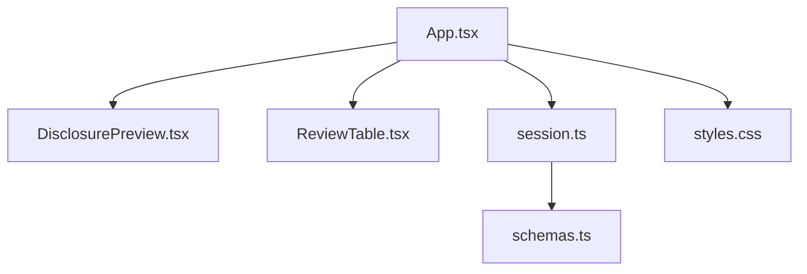
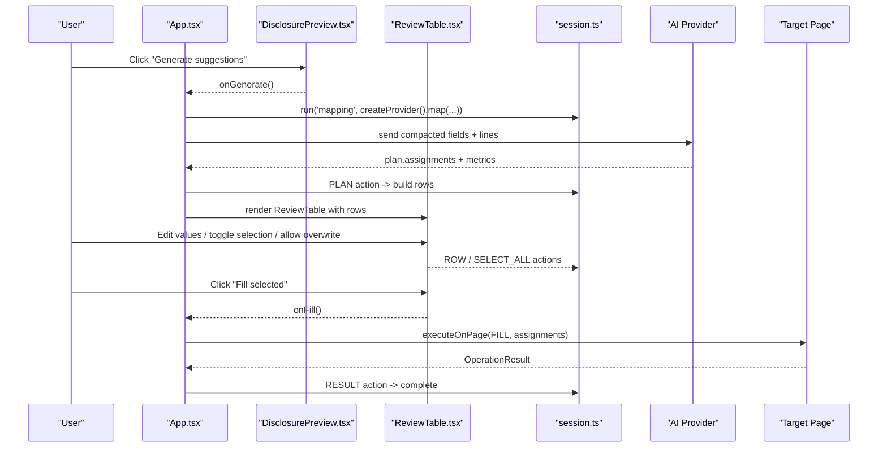
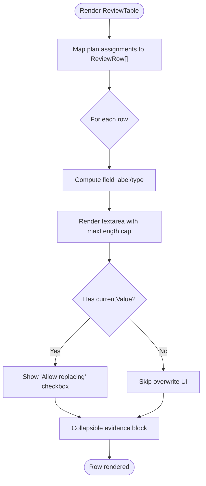
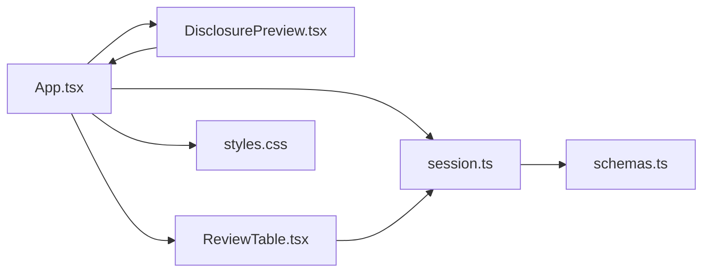

# Review Interface

<cite>
**Referenced Files in This Document**
- [ReviewTable.tsx](file://src/sidepanel/components/ReviewTable.tsx)
- [DisclosurePreview.tsx](file://src/sidepanel/components/DisclosurePreview.tsx)
- [App.tsx](file://src/sidepanel/App.tsx)
- [session.ts](file://src/sidepanel/session.ts)
- [schemas.ts](file://src/shared/schemas.ts)
- [styles.css](file://src/sidepanel/styles.css)
</cite>

## Table of Contents
1. [Introduction](#introduction)
2. [Project Structure](#project-structure)
3. [Core Components](#core-components)
4. [Architecture Overview](#architecture-overview)
5. [Detailed Component Analysis](#detailed-component-analysis)
6. [Dependency Analysis](#dependency-analysis)
7. [Performance Considerations](#performance-considerations)
8. [Troubleshooting Guide](#troubleshooting-guide)
9. [Conclusion](#conclusion)

## Introduction
This document explains the review interface used to validate and adjust AI-generated field mappings before filling a web form. It focuses on two key components:
- ReviewTable: an interactive table for reviewing, selecting, editing, and overriding suggested values per field.
- DisclosurePreview: a consent and transparency panel that previews what data will be sent to the AI provider and shows mapping instructions.

The documentation covers selection mechanisms, manual overrides, bulk operations, user interaction patterns (editing values, adjusting confidence via manual flags), accessibility features, keyboard navigation, and responsive design considerations.

## Project Structure
The review workflow is orchestrated by the side panel application:
- App coordinates phases (parsing, scanning, mapping, review, filling, undoing).
- DisclosurePreview appears after scanning and before generating suggestions; it shows outgoing data preview and mapping instructions.
- ReviewTable appears after mapping; it renders each suggested assignment with evidence, editable value, overwrite controls, and selection toggles.
- Session state and actions manage rows, selection, and phase transitions.

**Diagram sources**
- [App.tsx:108-123](file://src/sidepanel/App.tsx#L108-L123)
- [DisclosurePreview.tsx:6-17](file://src/sidepanel/components/DisclosurePreview.tsx#L6-L17)
- [ReviewTable.tsx:3-29](file://src/sidepanel/components/ReviewTable.tsx#L3-L29)
- [session.ts:6-41](file://src/sidepanel/session.ts#L6-L41)
- [schemas.ts:1-39](file://src/shared/schemas.ts#L1-L39)
- [styles.css:1-73](file://src/sidepanel/styles.css#L1-L73)

**Section sources**
- [App.tsx:108-123](file://src/sidepanel/App.tsx#L108-L123)
- [session.ts:6-41](file://src/sidepanel/session.ts#L6-L41)

## Core Components
- ReviewTable: Renders per-field assignments with checkboxes, editable text areas, overwrite controls, source evidence, unmapped fields summary, and bulk selection buttons. It dispatches row-level updates and supports “select all” and “clear selection.”
- DisclosurePreview: Shows provider destination, model, and a JSON preview of the payload built from extracted lines and scanned fields. Also exposes mapping instructions and a call-to-action to generate suggestions.

Key behaviors:
- Selection: Each row has a checkbox; bulk select/clear supported.
- Editing: Values are editable; edits mark the row as manually overridden.
- Overwrite: If a field already has a current value, users can opt-in to allow replacing it.
- Evidence: Collapsible section showing quotes and reasons for each suggestion.
- Unmapped: Lists fields not mapped with reasons.
- Fill: Submit selected assignments to fill the page.

**Section sources**
- [ReviewTable.tsx:3-29](file://src/sidepanel/components/ReviewTable.tsx#L3-L29)
- [DisclosurePreview.tsx:6-17](file://src/sidepanel/components/DisclosurePreview.tsx#L6-L17)
- [session.ts:6-41](file://src/sidepanel/session.ts#L6-L41)
- [schemas.ts:15-23](file://src/shared/schemas.ts#L15-L23)

## Architecture Overview
The review flow connects UI components to session state and background/page interactions.

**Diagram sources**
- [App.tsx:73-95](file://src/sidepanel/App.tsx#L73-L95)
- [session.ts:55-85](file://src/sidepanel/session.ts#L55-L85)
- [ReviewTable.tsx:10-25](file://src/sidepanel/components/ReviewTable.tsx#L10-L25)
- [DisclosurePreview.tsx:12-16](file://src/sidepanel/components/DisclosurePreview.tsx#L12-L16)

## Detailed Component Analysis

### ReviewTable
Responsibilities:
- Display each suggested assignment with field label/type, proposed value, and evidence.
- Allow editing values and marking them as manual overrides.
- Handle overwrite permissions when fields already contain values.
- Provide bulk selection and clear selection.
- Show unmapped fields and their reasons.
- Trigger filling of selected assignments.

Data model and complexity:
- Rows are derived from MappingPlan.assignments and extended with selection, overwrite, and manual flags.
- Time complexity for rendering is O(n) where n is number of assignments.
- Bulk selection updates all rows in O(n).

Selection and override logic:
- Select All respects existing values: if a field already has a current value, it only selects rows where allowOverwrite is true.
- Manual override: editing a value sets manual flag; a warning badge indicates manual changes.
- Overwrite control: when currentValue is non-empty, users must explicitly allow replacement; selecting the checkbox clears the row’s selection until allowed.

Evidence and unmapped:
- Collapsible “Source evidence” shows quotes and line IDs plus reason text.
- Unmapped list shows fields not assigned with reasons.

Bulk operations:
- “Select all supported suggestions” and “Clear selection” buttons update all rows at once.
- “Fill selected” button sends only selected rows to the page.

Accessibility and keyboard navigation:
- Inputs and buttons are standard HTML elements, enabling native keyboard focus and activation.
- Focus-visible outlines are provided globally for keyboard users.
- The component uses semantic labels and headings; screen readers can navigate via standard DOM order.

Responsive behavior:
- Uses CSS classes for layout; cards and lists adapt to narrow widths.
- Textareas resize vertically; long text wraps safely.

Error handling and safety:
- Disables controls during busy phases or when no selections exist.
- Warns about potential site-side effects (validation, autosave, network requests).

**Diagram sources**
- [ReviewTable.tsx:11-21](file://src/sidepanel/components/ReviewTable.tsx#L11-L21)
- [schemas.ts:15-23](file://src/shared/schemas.ts#L15-L23)

**Section sources**
- [ReviewTable.tsx:3-29](file://src/sidepanel/components/ReviewTable.tsx#L3-L29)
- [session.ts:26-41](file://src/sidepanel/session.ts#L26-L41)
- [schemas.ts:15-23](file://src/shared/schemas.ts#L15-L23)
- [styles.css:25-35](file://src/sidepanel/styles.css#L25-L35)
- [styles.css:61-67](file://src/sidepanel/styles.css#L61-L67)

### DisclosurePreview
Responsibilities:
- Inform users about data sent to the provider (extracted lines and field metadata).
- Preview the exact payload structure.
- Show mapping instructions (system prompt).
- Enable generation of suggestions with a single action.

Behavior:
- Displays provider name and endpoint origin, and model if configured.
- Builds payload using extracted lines and scanned fields; shows JSON preview.
- Button disabled unless settings and fields are present.

Accessibility:
- Uses semantic headings and descriptive text.
- Collapsible details expose additional content without blocking primary actions.

Responsive behavior:
- Preformatted blocks scroll horizontally if needed; text wraps appropriately.

**Section sources**
- [DisclosurePreview.tsx:6-17](file://src/sidepanel/components/DisclosurePreview.tsx#L6-L17)
- [App.tsx:73-82](file://src/sidepanel/App.tsx#L73-L82)
- [schemas.ts:1-3](file://src/shared/schemas.ts#L1-L3)

### Session State and Actions
State shape:
- Phase tracks workflow stage.
- Rows array holds assignments with selection, overwrite, and manual flags.
- Plan contains assignments and unmapped fields.
- Result stores operation outcomes.

Actions:
- ROW: patch individual row fields (value, selected, allowOverwrite, manual).
- SELECT_ALL: bulk select/clear with constraints based on existing values.
- PLAN: initialize rows from mapping results.
- RESULT: transition to completion with results.

Constraints and limits:
- Field count, response size, and value length are enforced by schemas and UI caps.

**Section sources**
- [session.ts:6-41](file://src/sidepanel/session.ts#L6-L41)
- [schemas.ts:1-39](file://src/shared/schemas.ts#L1-L39)

## Dependency Analysis
Component relationships and data flow:

- App orchestrates lifecycle and composes components.
- ReviewTable depends on session state and dispatch to update rows and trigger fills.
- DisclosurePreview reads settings and scan to build payload preview.
- Session enforces types and limits via shared schemas.
- Styles provide consistent UX across devices.

**Diagram sources**
- [App.tsx:108-123](file://src/sidepanel/App.tsx#L108-L123)
- [ReviewTable.tsx:3-29](file://src/sidepanel/components/ReviewTable.tsx#L3-L29)
- [DisclosurePreview.tsx:6-17](file://src/sidepanel/components/DisclosurePreview.tsx#L6-L17)
- [session.ts:6-41](file://src/sidepanel/session.ts#L6-L41)
- [schemas.ts:1-39](file://src/shared/schemas.ts#L1-L39)
- [styles.css:1-73](file://src/sidepanel/styles.css#L1-L73)

**Section sources**
- [App.tsx:108-123](file://src/sidepanel/App.tsx#L108-L123)
- [session.ts:6-41](file://src/sidepanel/session.ts#L6-L41)

## Performance Considerations
- Rendering: ReviewTable maps over assignments; keep assignment counts within schema limits to avoid heavy re-renders.
- Input handling: Value edits dispatch per-row updates; consider debouncing if many rapid edits occur.
- Payload size: Limits enforce maximum bytes, pages, characters, fields, and response sizes to prevent large payloads.
- Network calls: One request plus at most one validation-repair request per provider; ensure cancellation support to avoid redundant work.

[No sources needed since this section provides general guidance]

## Troubleshooting Guide
Common issues and resolutions:
- Target tab changed or closed: The app invalidates the session and prompts rescanning.
- Page connection lost: Re-scan to re-establish communication with the target page.
- Missing provider permission: Enable provider permissions before generating suggestions.
- No supported fields found: Ensure you are on a supported HTTP(S) form page and rescan.
- Partial fills due to cancellation: Inspect the page for partial changes after canceling; use undo if available.

Operational notes:
- Filling may trigger site-side validation, autosave, or network requests; the extension does not submit forms automatically.
- Undo restores unchanged values when possible; server-side effects cannot be reversed.

**Section sources**
- [App.tsx:34-48](file://src/sidepanel/App.tsx#L34-L48)
- [App.tsx:73-95](file://src/sidepanel/App.tsx#L73-L95)
- [session.ts:44-85](file://src/sidepanel/session.ts#L44-L85)
- [ReviewTable.tsx:24-25](file://src/sidepanel/components/ReviewTable.tsx#L24-L25)

## Conclusion
The review interface provides a transparent, user-controlled workflow for validating AI-generated field mappings. Users can inspect evidence, edit values, manage overwrite permissions, and perform bulk operations before committing changes. The disclosure system ensures informed consent by previewing outgoing data and mapping instructions. Accessibility and responsive design support inclusive and flexible usage across devices.

[No sources needed since this section summarizes without analyzing specific files]