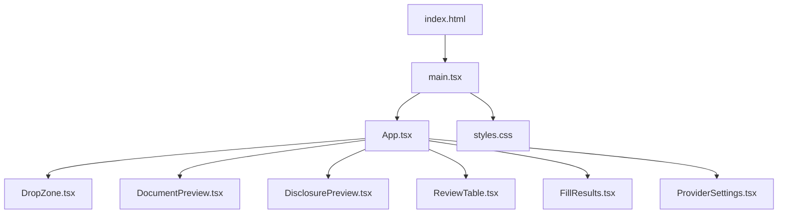
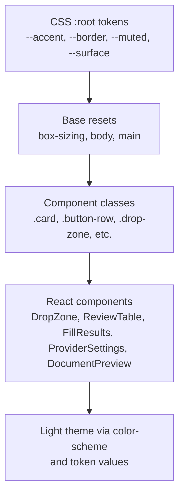
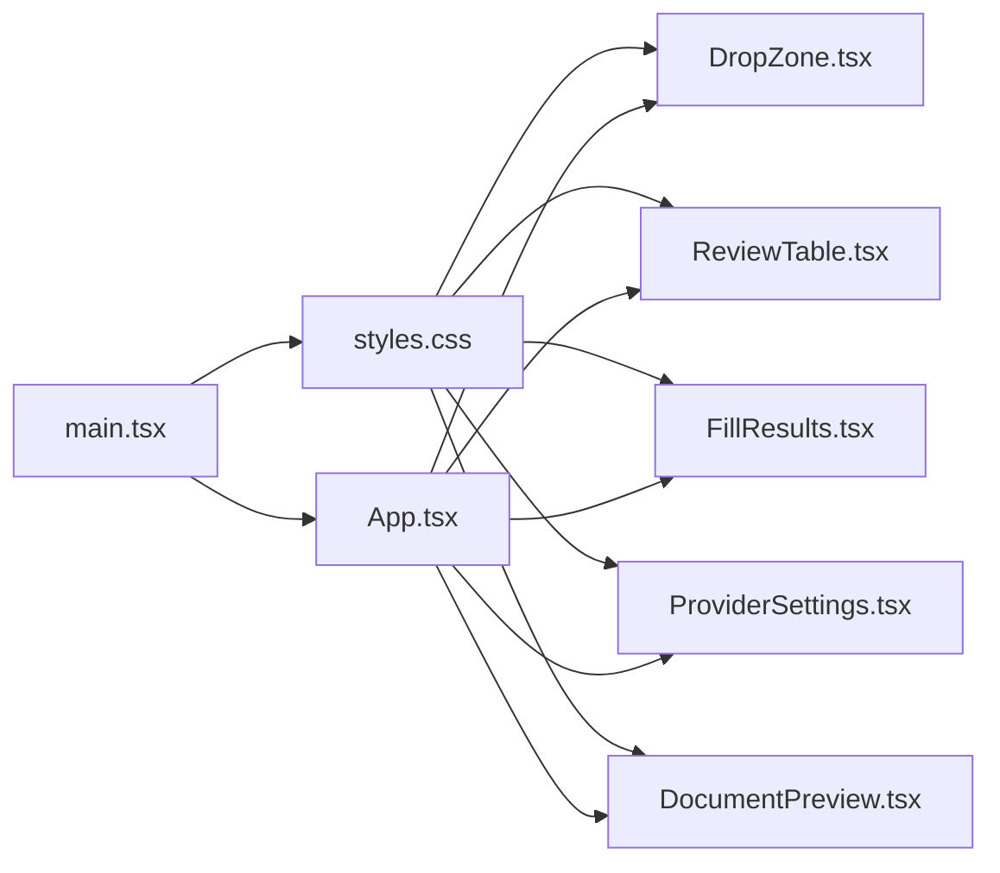

# Styling & Theming

<cite>
**Referenced Files in This Document**
- [styles.css](file://src/sidepanel/styles.css)
- [App.tsx](file://src/sidepanel/App.tsx)
- [main.tsx](file://src/sidepanel/main.tsx)
- [index.html](file://src/sidepanel/index.html)
- [DropZone.tsx](file://src/sidepanel/components/DropZone.tsx)
- [ReviewTable.tsx](file://src/sidepanel/components/ReviewTable.tsx)
- [FillResults.tsx](file://src/sidepanel/components/FillResults.tsx)
- [ProviderSettings.tsx](file://src/sidepanel/components/ProviderSettings.tsx)
- [DocumentPreview.tsx](file://src/sidepanel/components/DocumentPreview.tsx)
</cite>

## Table of Contents
1. [Introduction](#introduction)
2. [Project Structure](#project-structure)
3. [Core Components](#core-components)
4. [Architecture Overview](#architecture-overview)
5. [Detailed Component Analysis](#detailed-component-analysis)
6. [Dependency Analysis](#dependency-analysis)
7. [Performance Considerations](#performance-considerations)
8. [Troubleshooting Guide](#troubleshooting-guide)
9. [Conclusion](#conclusion)
10. [Appendices](#appendices)

## Introduction
This document explains the styling system and theming approach used by the Help Me Fill side panel. It covers CSS architecture, design tokens, color schemes, responsive breakpoints, component-specific styles, customization guidelines, cross-screen-size consistency, browser compatibility, and accessibility considerations such as focus indicators, contrast ratios, and screen reader support.

## Project Structure
The side panel is a React application with a single global stylesheet that defines design tokens, base styles, component classes, and media queries. The entry point loads the stylesheet and renders the app shell.

**Diagram sources**
- [index.html:1-10](file://src/sidepanel/index.html#L1-L10)
- [main.tsx:1-15](file://src/sidepanel/main.tsx#L1-L15)
- [App.tsx:1-127](file://src/sidepanel/App.tsx#L1-L127)

**Section sources**
- [index.html:1-10](file://src/sidepanel/index.html#L1-L10)
- [main.tsx:1-15](file://src/sidepanel/main.tsx#L1-L15)
- [App.tsx:1-127](file://src/sidepanel/App.tsx#L1-L127)

## Core Components
The side panel uses a small set of semantic class names to style reusable UI patterns. These classes are defined once in the global stylesheet and composed across components for consistent appearance and behavior.

Key classes and their roles:
- Layout and typography
  - main, header, brand, intro, steps, footer
  - h1, h2, p, subtle, hint, eyebrow
- Surfaces and cards
  - card, section-top, button-row
- Inputs and controls
  - label, input, select, textarea, button, link-button, secondary, wide
- Feedback and status
  - error, notice, progress, spinner, badge, warning
- Data display
  - results, review-row, text-preview, line-tag, origin, preserve, blockquote, ul
- Drop zone and file handling
  - drop-zone, dragging, document-mark
- Accessibility helpers
  - visually-hidden

These classes are applied consistently across components like DropZone, ReviewTable, FillResults, ProviderSettings, and DocumentPreview.

**Section sources**
- [styles.css:1-73](file://src/sidepanel/styles.css#L1-L73)
- [DropZone.tsx:1-21](file://src/sidepanel/components/DropZone.tsx#L1-L21)
- [ReviewTable.tsx:1-30](file://src/sidepanel/components/ReviewTable.tsx#L1-L30)
- [FillResults.tsx:1-13](file://src/sidepanel/components/FillResults.tsx#L1-L13)
- [ProviderSettings.tsx:1-70](file://src/sidepanel/components/ProviderSettings.tsx#L1-L70)
- [DocumentPreview.tsx:1-9](file://src/sidepanel/components/DocumentPreview.tsx#L1-L9)

## Architecture Overview
The styling architecture follows a flat, utility-like approach with explicit class names and CSS custom properties (design tokens). There is no CSS-in-JS or per-component scoped styles; instead, a single stylesheet centralizes tokens and shared patterns.

**Diagram sources**
- [styles.css:1-73](file://src/sidepanel/styles.css#L1-L73)
- [App.tsx:1-127](file://src/sidepanel/App.tsx#L1-L127)

## Detailed Component Analysis

### Design Tokens and Color Scheme
- Tokens
  - Accent: primary interactive color used for buttons, active states, and highlights.
  - Border: subtle borders for cards, inputs, and dividers.
  - Muted: secondary text color for hints and descriptions.
  - Surface: background for cards and inputs.
- Theme
  - Light theme is declared at the root level using a color scheme declaration and light palette values.
- Typography
  - Font stack prioritizes Inter, Segoe UI, system-ui, sans-serif.
  - Headings use tight letter-spacing for compactness; body text uses comfortable line-height.
- Spacing and sizing
  - Consistent padding/margins around cards, lists, and sections.
  - Buttons and inputs have uniform height and border-radius for visual cohesion.

Customization tips:
- Change the accent color to rebrand interactive elements globally.
- Adjust border and muted colors to alter contrast and hierarchy.
- Modify surface color to change card/input backgrounds.
- Update font-family to match your product’s type system.

**Section sources**
- [styles.css:1-73](file://src/sidepanel/styles.css#L1-L73)

### Responsive Breakpoints and Layout
- Minimum width
  - Body enforces a minimum width to ensure usability on narrow panels.
- Mobile breakpoint
  - A small-screen breakpoint reduces padding, adjusts card padding, wraps section headers, and slightly scales down the intro heading.
- Motion preferences
  - Respects reduced motion preferences by disabling animations and transitions when requested.

Guidelines:
- Keep content within the max-width container for readability.
- Avoid relying on fixed widths; use flexible layouts and wrap-friendly structures.
- Test interactions at the smallest supported width to ensure touch targets remain usable.

**Section sources**
- [styles.css:3-4](file://src/sidepanel/styles.css#L3-L4)
- [styles.css:71-72](file://src/sidepanel/styles.css#L71-L72)

### Component-Specific Styles

#### Drop Zone
- Visuals
  - Dashed border and soft background indicate a drag-and-drop area.
  - Dragging state changes background and border color to provide immediate feedback.
- Semantics
  - Uses an accessible label and hidden file input for keyboard users.
- Interaction
  - Prevents default drag behavior and toggles dragging state on enter/leave/drop.

**Section sources**
- [styles.css:36-40](file://src/sidepanel/styles.css#L36-L40)
- [DropZone.tsx:1-21](file://src/sidepanel/components/DropZone.tsx#L1-L21)

#### Review Table
- Visuals
  - Card-based layout with eyebrow labels and hints.
  - Rows highlight selection and show badges for warnings.
- Controls
  - Checkboxes styled with accent color; manual overrides flagged with a warning badge.
- Evidence display
  - Collapsible details with line tags and quoted evidence blocks.

**Section sources**
- [styles.css:19-20](file://src/sidepanel/styles.css#L19-L20)
- [styles.css:45-48](file://src/sidepanel/styles.css#L45-L48)
- [styles.css:52-53](file://src/sidepanel/styles.css#L52-L53)
- [styles.css:61-65](file://src/sidepanel/styles.css#L61-L65)
- [ReviewTable.tsx:1-30](file://src/sidepanel/components/ReviewTable.tsx#L1-L30)

#### Fill Results
- Visuals
  - List of results with status badges; warning badge for non-successful statuses.
- Actions
  - Undo button styled as a wide secondary action.

**Section sources**
- [styles.css:45-46](file://src/sidepanel/styles.css#L45-L46)
- [styles.css:68-70](file://src/sidepanel/styles.css#L68-L70)
- [FillResults.tsx:1-13](file://src/sidepanel/components/FillResults.tsx#L1-L13)

#### Provider Settings
- Visuals
  - Collapsible settings card with labeled inputs and a button row.
- States
  - Disabled fieldset during saving; status messages displayed as hints.

**Section sources**
- [styles.css:20-26](file://src/sidepanel/styles.css#L20-L26)
- [styles.css:31-34](file://src/sidepanel/styles.css#L31-L34)
- [ProviderSettings.tsx:1-70](file://src/sidepanel/components/ProviderSettings.tsx#L1-L70)

#### Document Preview
- Visuals
  - Card with filename and parsed metadata; collapsible text preview with line tags.

**Section sources**
- [styles.css:47-52](file://src/sidepanel/styles.css#L47-L52)
- [DocumentPreview.tsx:1-9](file://src/sidepanel/components/DocumentPreview.tsx#L1-L9)

### Button System and Input Conventions
- Primary buttons use the accent color with white text.
- Secondary buttons invert colors with surface background and accent text.
- Link-style buttons remove borders and reduce padding for inline actions.
- Wide buttons span full width for prominent calls-to-action.
- Inputs, selects, and textareas share consistent padding, border, radius, and inherit font settings.
- Focus visibility is enforced with a visible outline for keyboard navigation.

**Section sources**
- [styles.css:25-35](file://src/sidepanel/styles.css#L25-L35)

### Accessibility Considerations
- Focus indicators
  - Visible focus ring ensures keyboard users can track focus across all interactive elements.
- Screen reader support
  - aria-label attributes on regions and inputs improve context for assistive technologies.
  - role="alert" and role="status" communicate dynamic messages appropriately.
  - aria-hidden="true" decorates decorative icons so they are ignored by screen readers.
- Contrast and readability
  - Text colors are chosen to maintain sufficient contrast against backgrounds.
  - Hints and muted text use a lighter color for lower emphasis without sacrificing legibility.
- Reduced motion
  - Animations and transitions are disabled when the user prefers reduced motion.

**Section sources**
- [styles.css:35-36](file://src/sidepanel/styles.css#L35-L36)
- [styles.css:44-46](file://src/sidepanel/styles.css#L44-L46)
- [styles.css:72-72](file://src/sidepanel/styles.css#L72-L72)
- [DropZone.tsx:9-18](file://src/sidepanel/components/DropZone.tsx#L9-L18)
- [ReviewTable.tsx:6-25](file://src/sidepanel/components/ReviewTable.tsx#L6-L25)
- [FillResults.tsx:3-10](file://src/sidepanel/components/FillResults.tsx#L3-L10)
- [ProviderSettings.tsx:53-68](file://src/sidepanel/components/ProviderSettings.tsx#L53-L68)
- [App.tsx:108-125](file://src/sidepanel/App.tsx#L108-L125)

## Dependency Analysis
Styling dependencies flow from the global stylesheet into React components through class names. Components do not import styles directly; they rely on the global stylesheet loaded by the entry module.

**Diagram sources**
- [styles.css:1-73](file://src/sidepanel/styles.css#L1-L73)
- [main.tsx:1-15](file://src/sidepanel/main.tsx#L1-L15)
- [App.tsx:1-127](file://src/sidepanel/App.tsx#L1-L127)
- [DropZone.tsx:1-21](file://src/sidepanel/components/DropZone.tsx#L1-L21)
- [ReviewTable.tsx:1-30](file://src/sidepanel/components/ReviewTable.tsx#L1-L30)
- [FillResults.tsx:1-13](file://src/sidepanel/components/FillResults.tsx#L1-L13)
- [ProviderSettings.tsx:1-70](file://src/sidepanel/components/ProviderSettings.tsx#L1-L70)
- [DocumentPreview.tsx:1-9](file://src/sidepanel/components/DocumentPreview.tsx#L1-L9)

**Section sources**
- [main.tsx:1-15](file://src/sidepanel/main.tsx#L1-L15)
- [App.tsx:1-127](file://src/sidepanel/App.tsx#L1-L127)

## Performance Considerations
- Minimal CSS footprint
  - A single stylesheet avoids multiple network requests and keeps rendering fast.
- No heavy animations
  - Only a lightweight spinner animation is used; it respects reduced motion preferences.
- Efficient selectors
  - Class-based selectors keep style calculations predictable and fast.
- Content constraints
  - Previews and long text areas limit maximum heights to avoid excessive scrolling and layout thrash.

[No sources needed since this section provides general guidance]

## Troubleshooting Guide
Common issues and how to address them:
- Missing extension APIs
  - If the panel detects missing runtime APIs, it shows a message instructing how to build and load the extension.
- Panel errors
  - An error boundary catches render errors and displays a friendly message prompting a fresh session.
- Dynamic messages
  - Errors, notices, and progress messages are rendered with appropriate roles for accessibility.

**Section sources**
- [main.tsx:6-14](file://src/sidepanel/main.tsx#L6-L14)
- [App.tsx:113-115](file://src/sidepanel/App.tsx#L113-L115)

## Conclusion
The Help Me Fill side panel uses a simple, maintainable styling system centered on CSS custom properties and a cohesive set of component classes. The design tokens define a clear visual language, while responsive rules and accessibility features ensure broad compatibility and inclusive usage. Customization is straightforward by adjusting tokens and adding targeted overrides where necessary.

[No sources needed since this section summarizes without analyzing specific files]

## Appendices

### How to Customize Appearance
- Change theme colors
  - Update the accent, border, muted, and surface tokens to rebrand the panel.
- Adjust typography
  - Modify the font stack and heading sizes to align with your product’s design system.
- Extend components
  - Add new classes in the global stylesheet and apply them in components as needed.
- Respect user preferences
  - Ensure any new animations honor reduced motion preferences.

[No sources needed since this section provides general guidance]