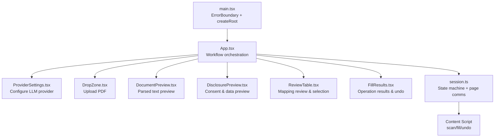
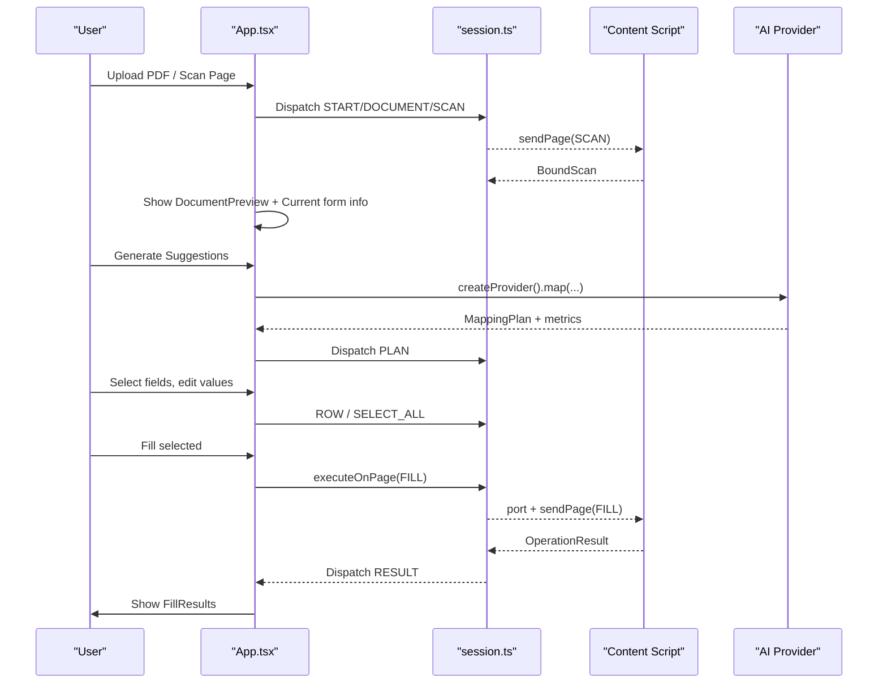
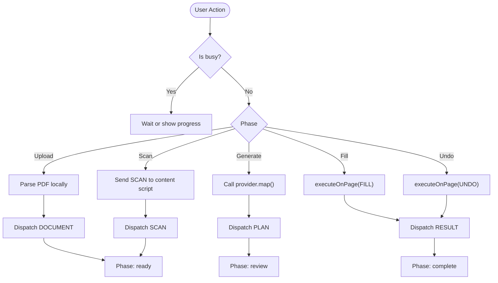
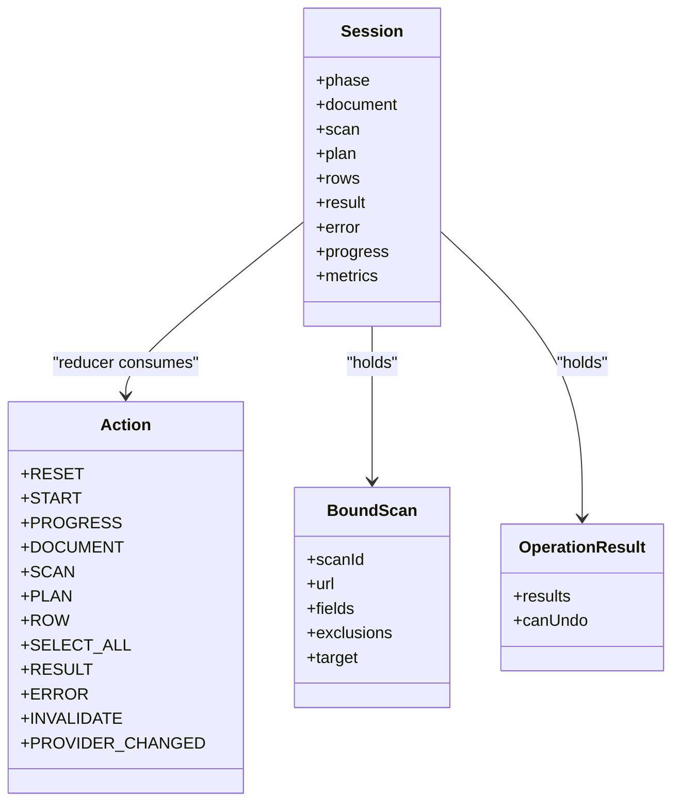
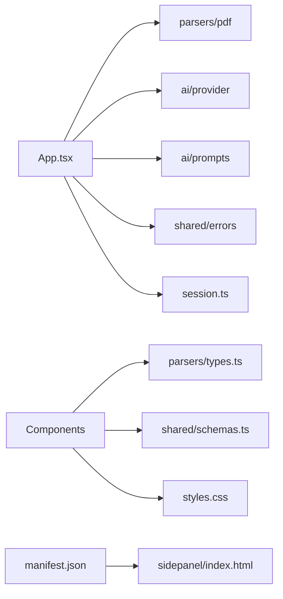

# User Interface

<cite>
**Referenced Files in This Document**
- [App.tsx](file://src/sidepanel/App.tsx)
- [main.tsx](file://src/sidepanel/main.tsx)
- [session.ts](file://src/sidepanel/session.ts)
- [styles.css](file://src/sidepanel/styles.css)
- [DropZone.tsx](file://src/sidepanel/components/DropZone.tsx)
- [DocumentPreview.tsx](file://src/sidepanel/components/DocumentPreview.tsx)
- [DisclosurePreview.tsx](file://src/sidepanel/components/DisclosurePreview.tsx)
- [ReviewTable.tsx](file://src/sidepanel/components/ReviewTable.tsx)
- [FillResults.tsx](file://src/sidepanel/components/FillResults.tsx)
- [ProviderSettings.tsx](file://src/sidepanel/components/ProviderSettings.tsx)
- [types.ts](file://src/parsers/types.ts)
- [schemas.ts](file://src/shared/schemas.ts)
- [manifest.json](file://src/manifest.json)
</cite>

## Table of Contents
1. Introduction
2. Project Structure
3. Core Components
4. Architecture Overview
5. Detailed Component Analysis
6. Dependency Analysis
7. Performance Considerations
8. Troubleshooting Guide
9. Conclusion

## Introduction
This document describes the Help Me Fill side panel user interface built with React. It explains the application structure, component hierarchy, and state management via a session reducer. It documents each UI component: DropZone for file uploads, DocumentPreview for parsed PDF text, DisclosurePreview for consent and data preview, ReviewTable for mapping review and selection, and FillResults for completion status and undo. It also covers user interaction patterns, accessibility considerations, responsive design, styling and theme customization, cross-browser compatibility, and guidelines for extending or modifying behavior.

## Project Structure
The side panel is a React application rendered into an extension side panel page. The entry point initializes an error boundary and renders App when Chrome extension APIs are available. App orchestrates the workflow using a local session store (useReducer), integrates with the content script to scan forms, parses PDFs locally, and optionally calls an AI provider after explicit consent.

**Diagram sources**
- [main.tsx:6-14](file://src/sidepanel/main.tsx#L6-L14)
- [App.tsx:15-126](file://src/sidepanel/App.tsx#L15-L126)
- [session.ts:26-85](file://src/sidepanel/session.ts#L26-L85)

**Section sources**
- [main.tsx:1-15](file://src/sidepanel/main.tsx#L1-L15)
- [App.tsx:1-127](file://src/sidepanel/App.tsx#L1-L127)
- [session.ts:1-86](file://src/sidepanel/session.ts#L1-L86)

## Core Components
- App: Central controller that manages phases, dispatches actions, coordinates scanning, parsing, AI mapping, filling, and undoing. It also listens for tab changes and invalidates sessions when needed.
- ProviderSettings: Manages provider selection, model ID, API key storage in session storage, and optional host permissions.
- DropZone: Accepts drag-and-drop or file picker input for a single PDF; enforces constraints and triggers parsing.
- DocumentPreview: Displays parsed document metadata and extracted lines for inspection.
- DisclosurePreview: Shows what will be sent to the provider and exposes system prompt; requires explicit consent before generation.
- ReviewTable: Presents AI suggestions with evidence, allows manual edits, selective assignment, and overwrite control for existing values.
- FillResults: Summarizes per-field outcomes and offers undo if supported by the page.

**Section sources**
- [App.tsx:15-126](file://src/sidepanel/App.tsx#L15-L126)
- [ProviderSettings.tsx:1-70](file://src/sidepanel/components/ProviderSettings.tsx#L1-L70)
- [DropZone.tsx:1-21](file://src/sidepanel/components/DropZone.tsx#L1-L21)
- [DocumentPreview.tsx:1-9](file://src/sidepanel/components/DocumentPreview.tsx#L1-L9)
- [DisclosurePreview.tsx:1-19](file://src/sidepanel/components/DisclosurePreview.tsx#L1-L19)
- [ReviewTable.tsx:1-30](file://src/sidepanel/components/ReviewTable.tsx#L1-L30)
- [FillResults.tsx:1-13](file://src/sidepanel/components/FillResults.tsx#L1-L13)

## Architecture Overview
The UI follows a unidirectional data flow driven by a session reducer. Actions transition the app through phases: idle → parsing → ready → scanning → ready → mapping → review → filling → complete (or undoing). External interactions include:
- Local PDF parsing
- Content script communication to scan and fill
- Optional AI provider calls after explicit consent

**Diagram sources**
- [App.tsx:50-95](file://src/sidepanel/App.tsx#L50-L95)
- [session.ts:44-85](file://src/sidepanel/session.ts#L44-L85)

## Detailed Component Analysis

### App (Workflow Orchestrator)
- State: Uses useReducer with sessionReducer from session.ts to manage phase, document, scan, plan, rows, result, error, progress, and metrics.
- Lifecycle: Listens to tab activation, updates, and removal to invalidate sessions when the target changes. Clears page state on reset or cancel.
- Workflow methods:
  - upload(file): Parses PDF locally and sets document.
  - scan(): Scans active page via content script and stores BoundScan.
  - generate(): Validates permissions, calls provider mapping, and transitions to review.
  - fill(): Sends assignments to the page and shows results.
  - undo(): Restores previous values if supported.
  - cancel/reset: Aborts ongoing work and clears state.

**Diagram sources**
- [App.tsx:50-107](file://src/sidepanel/App.tsx#L50-L107)
- [session.ts:26-41](file://src/sidepanel/session.ts#L26-L41)

**Section sources**
- [App.tsx:15-126](file://src/sidepanel/App.tsx#L15-L126)
- [session.ts:26-41](file://src/sidepanel/session.ts#L26-L41)

### DropZone
- Purpose: Accepts a single PDF via drag-and-drop or file picker.
- Behavior: Prevents multiple files, validates one PDF, triggers upload callback, and provides visual feedback during drag.
- Accessibility: Uses aria-label and visually hidden input for screen readers.

**Section sources**
- [DropZone.tsx:1-21](file://src/sidepanel/components/DropZone.tsx#L1-L21)

### DocumentPreview
- Purpose: Displays parsed document name, page count, character count, and extracted lines for verification.
- Interaction: Collapsible details to inspect raw text lines with line IDs.

**Section sources**
- [DocumentPreview.tsx:1-9](file://src/sidepanel/components/DocumentPreview.tsx#L1-L9)

### DisclosurePreview
- Purpose: Informs users about data leaving the browser and previews outgoing payload and system prompt.
- Consent: Requires provider settings and at least one scanned field before enabling generation.

**Section sources**
- [DisclosurePreview.tsx:1-19](file://src/sidepanel/components/DisclosurePreview.tsx#L1-L19)

### ReviewTable
- Purpose: Presents AI-generated mapping suggestions with evidence, supports editing values, selecting fields, and controlling overwrites for existing values.
- Interactions:
  - Select all/clear selection
  - Edit proposed values (manual override flagged)
  - Allow overwrite for fields with current values
  - View source evidence and unmapped fields
- Output: Triggers fill with selected assignments.

**Section sources**
- [ReviewTable.tsx:1-30](file://src/sidepanel/components/ReviewTable.tsx#L1-L30)

### FillResults
- Purpose: Shows per-field operation results and whether undo is available.
- Interaction: Offers undo action when supported by the page.

**Section sources**
- [FillResults.tsx:1-13](file://src/sidepanel/components/FillResults.tsx#L1-L13)

### ProviderSettings
- Purpose: Configure LLM provider, model ID, and API key; manage session-scoped keys and host permissions.
- Behavior: Loads saved preferences, requests permissions, persists keys in session storage, and reports status.

**Section sources**
- [ProviderSettings.tsx:1-70](file://src/sidepanel/components/ProviderSettings.tsx#L1-L70)

### Session Manager (session.ts)
- State machine: Defines phases and actions; reducer handles transitions and resets.
- Utilities:
  - assertActive: Ensures target tab/url remains unchanged.
  - sendPage: Sends messages to content script with validation.
  - scanActivePage: Injects content script, retrieves BoundScan.
  - executeOnPage: Establishes port, waits for readiness, sends FILL/UNDO, returns validated OperationResult.
- Limits and schemas: Enforce size and shape of payloads and responses.

**Diagram sources**
- [session.ts:6-41](file://src/sidepanel/session.ts#L6-L41)
- [schemas.ts:25-39](file://src/shared/schemas.ts#L25-L39)

**Section sources**
- [session.ts:1-86](file://src/sidepanel/session.ts#L1-L86)
- [schemas.ts:1-39](file://src/shared/schemas.ts#L1-L39)

## Dependency Analysis
- App depends on:
  - parsers/pdf for local PDF parsing
  - ai/provider and ai/prompts for mapping
  - shared/errors for user-facing errors
  - session for state and page communication
- Components depend on:
  - types.ts for parsed document structure
  - schemas.ts for shared types and limits
  - styles.css for layout and theming
- Manifest declares required permissions and side panel path.

**Diagram sources**
- [App.tsx:1-13](file://src/sidepanel/App.tsx#L1-L13)
- [manifest.json:1-19](file://src/manifest.json#L1-L19)

**Section sources**
- [App.tsx:1-13](file://src/sidepanel/App.tsx#L1-L13)
- [manifest.json:1-19](file://src/manifest.json#L1-L19)

## Performance Considerations
- Local parsing: PDF parsing runs in the extension context to avoid network overhead and preserve privacy.
- AbortController: Long-running tasks can be aborted on cancel or reset to prevent wasted work.
- Limits: Payload sizes and response bytes are bounded to reduce latency and costs.
- Minimal re-renders: useReducer centralizes state; components receive derived props to minimize unnecessary updates.
- Reduced motion: Respects prefers-reduced-motion for animations.

[No sources needed since this section provides general guidance]

## Troubleshooting Guide
Common issues and resolutions:
- Target tab changed: The session is invalidated; rescan and review again.
- Page connection lost: Reopen the toolbar icon on the form page and rescan.
- Restricted pages: Extension stores and certain hosts cannot be filled; open a normal form page.
- Permission denied: Grant access by clicking the toolbar icon on the intended tab.
- Missing API host permission: Enable the provider again to request origin permission.
- Undo not available: Some pages do not support undo; resetting or rescanning clears undo state.

**Section sources**
- [App.tsx:34-48](file://src/sidepanel/App.tsx#L34-L48)
- [session.ts:44-69](file://src/sidepanel/session.ts#L44-L69)
- [FillResults.tsx:1-13](file://src/sidepanel/components/FillResults.tsx#L1-L13)

## Conclusion
The Help Me Fill side panel provides a clear, consent-driven workflow: parse locally, review AI suggestions with evidence, and selectively fill fields on the target page. It emphasizes safety, transparency, and user control while integrating tightly with extension APIs and content scripts. The modular component design and centralized session state make it straightforward to extend or customize behavior.

[No sources needed since this section summarizes without analyzing specific files]

## Appendices

### Styling and Theme Customization
- CSS custom properties define colors and tokens:
  - Accent color, border, muted text, surface background
  - Light color scheme enforced
- Responsive breakpoints adjust padding and layout for narrow widths.
- Focus-visible outlines ensure keyboard navigation clarity.
- Reduced motion media query disables animations for accessibility.

To customize:
- Override CSS variables in styles.css or inject a stylesheet.
- Adjust spacing and typography via existing classes or add new utility classes.
- Respect focus-visible and reduced-motion behaviors for accessibility.

**Section sources**
- [styles.css:1-73](file://src/sidepanel/styles.css#L1-L73)

### Accessibility Considerations
- Semantic HTML elements (header, main, section, details, summary) provide structure.
- ARIA labels on interactive regions (e.g., drop zone) aid screen readers.
- Visually hidden inputs maintain native file picker semantics without visual clutter.
- Error and progress states use roles (alert, status) for announcements.
- Keyboard-friendly buttons and controls with visible focus indicators.

**Section sources**
- [DropZone.tsx:9-18](file://src/sidepanel/components/DropZone.tsx#L9-L18)
- [App.tsx:108-125](file://src/sidepanel/App.tsx#L108-L125)
- [styles.css:35-35](file://src/sidepanel/styles.css#L35-L35)

### Cross-Browser Compatibility
- Built for Chromium-based browsers using Manifest V3 and side panel APIs.
- Content script injection and messaging rely on chrome.* APIs.
- Ensure the extension is loaded unpacked and the toolbar icon is used to grant permissions.

**Section sources**
- [manifest.json:1-19](file://src/manifest.json#L1-L19)
- [main.tsx:13-14](file://src/sidepanel/main.tsx#L13-L14)

### Extending the UI
Guidelines for adding or modifying components:
- Add new component under src/sidepanel/components with clear props and minimal side effects.
- Integrate via App by importing and rendering conditionally based on session state.
- Use session actions to update state; keep business logic in session.ts or dedicated modules.
- Validate external payloads with schemas from shared/schemas.ts.
- Follow existing patterns for error handling, progress reporting, and cancellation.
- Update styles.css with reusable classes or CSS variables for consistency.
- Test with unit/integration tests and e2e workflows where applicable.

**Section sources**
- [App.tsx:1-13](file://src/sidepanel/App.tsx#L1-L13)
- [session.ts:13-41](file://src/sidepanel/session.ts#L13-L41)
- [schemas.ts:1-39](file://src/shared/schemas.ts#L1-L39)
- [styles.css:1-73](file://src/sidepanel/styles.css#L1-L73)